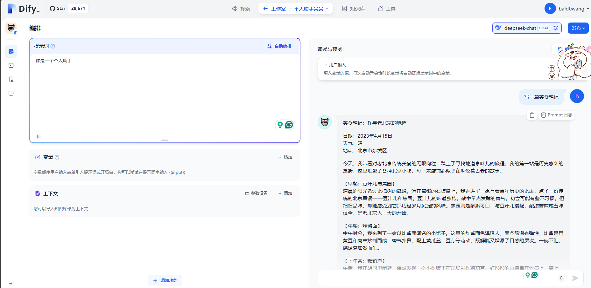
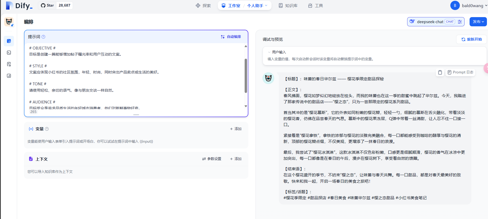
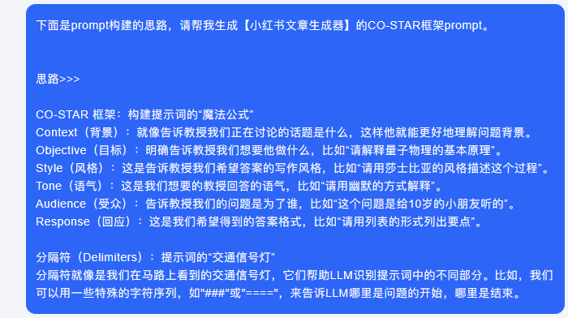
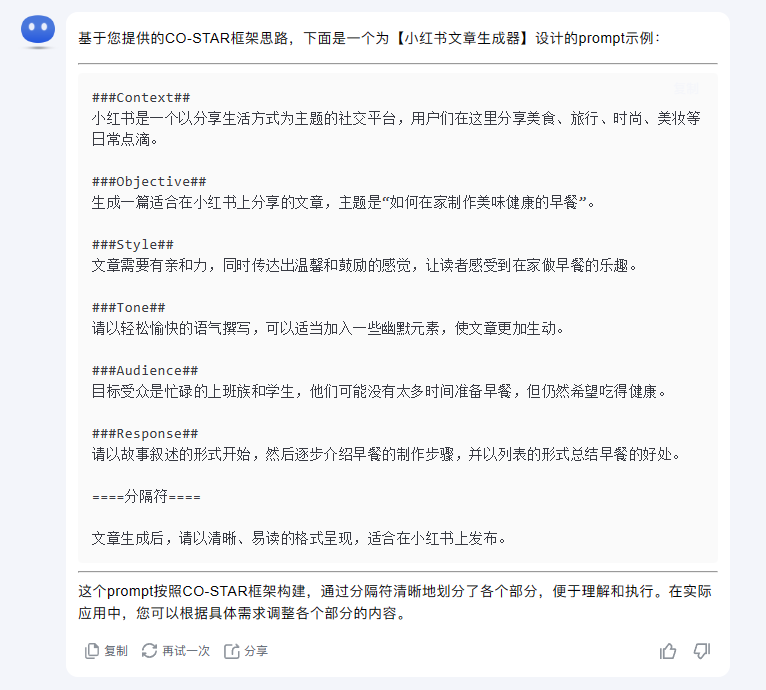
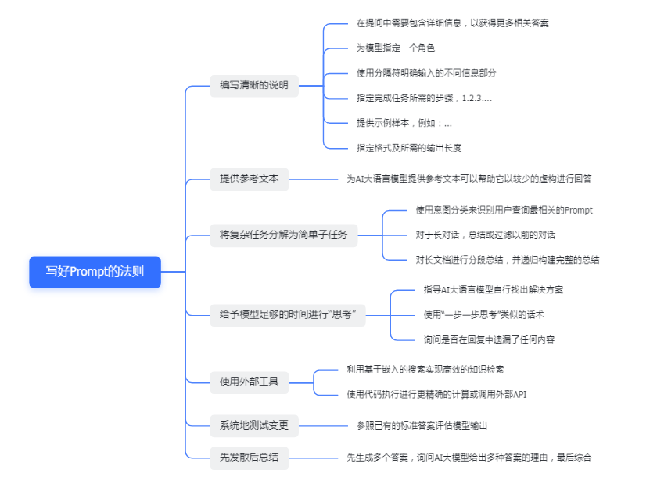
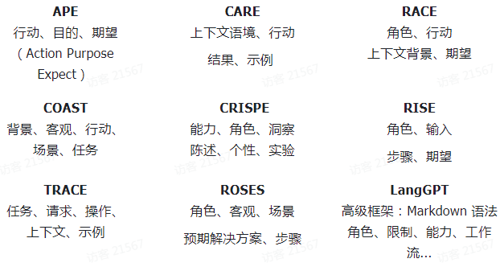

# 2.1 prompt

本节目录：

# 1. 提示工程是什么？

## 1.1 介绍

```
 好的，让我们来聊聊“提示工程”这个概念，不过这次我们换个方式，让它听起来不那么“技术宅”。


想象一下，你面前有一个巨大的魔法盒子，这个盒子里住着一个超级聪明的巨人，它的名字叫做“大型语言模型”（LLM）。这个巨人知道很多事情，而且特别擅长回答问题，比如“天空为什么是蓝色的？”或者“23乘以37等于多少？”。但是，巨人也有一个小小的问题：它有时候不太明白你的问题到底想问什么，或者你想要什么样的答案。


这时候，“提示工程”就派上用场了。它就像是给巨人的一张便签，上面写着“嘿，巨人，这个问题是这么回事...”，然后巨人就能更准确地理解你的问题，并给出你想要的答案。


研究人员就像是训练巨人的教练，他们通过“提示工程”让巨人变得更聪明，能处理更复杂的问题。而开发人员则像是巨人的助手，他们设计出各种工具，让巨人能更好地和我们交流。


“提示工程”不仅仅是写便签那么简单，它还包括了很多技巧和方法，帮助我们更好地和巨人对话。而且，通过这些技巧，我们还能确保巨人给出的答案既安全又准确。

现在，我们有一份全新的指南，就像是一张宝藏图，上面标出了巨人的喜好、它擅长的事情，以及如何和它更好地交流。这份指南不仅包含了巨人的故事，还有许多有用的资源，比如巨人的研究报告、学习资料、模型介绍，甚至是巨人的讲座和参考资料。


所以，下次当你需要巨人帮忙解决问题时，记得带上你的“提示工程”便签，这样巨人就能更好地理解你，给你一个满意的答案了！
```

## 1.2 简单的 prompt 是什么？

```
如果直接问你，新手如何写好prompt，你可能没法回答。但是我问你如何让领导布置一个明确的任务，这个问题可能大家会回答的很好。其实道理一样~
```

简单版：指定角色扮演，明确分配任务，控制输出结果。

例如： 我想你扮演一个英语老师，请你给我写一篇 120 字左右的英语作文，主题是小明买菜记。

# 2. 如何快速成为提示工程大师？

## 2.1 CO-STAR 框架：构建提示词的“魔法公式”

1. Context（背景）：就像告诉教授我们正在讨论的话题是什么，这样他就能更好地理解问题背景。
2. Objective（目标）：明确告诉教授我们想要他做什么，比如“请解释量子物理的基本原理”。
3. Style（风格）：这是告诉教授我们希望答案的写作风格，比如“请用莎士比亚的风格描述这个过程”。
4. Tone（语气）：这是我们想要的教授回答的语气，比如“请用幽默的方式解释”。
5. Audience（受众）：告诉教授我们的问题是为了谁，比如“这个问题是给 10 岁的小朋友听的”。
6. Response（回应）：这是我们希望得到的答案格式，比如“请用列表的形式列出要点”。

## 2.2 分隔符（Delimiters）：提示词的“交通信号灯”

分隔符就像是我们在马路上看到的交通信号灯，它们帮助 LLM 识别提示词中的不同部分。比如，我们可以用一些特殊的字符序列，如"###"或"===="，来告诉 LLM 哪里是问题的开始，哪里是结束。

## 2.3 实战案例

通过构建提示词的“魔法公式”，我们可以快速地成为提示工程大师。下面是一些实战案例：

```
我们以小红书的prompt为例做了以下测试。我们想要一份小红书风格的美食笔记，然后我们构建了一个简单的prompt，得到一份普通的美食笔记。
```



```
接着我们通过CO-STAR的思路构建了prompt：
```

```javascript
# CONTEXT #
小红书是一个分享生活方式的社交平台，我需要撰写能够引起用户共鸣的文案。

# OBJECTIVE #
目标是创建一篇能够增加帖子曝光率和用户互动的文案。

# STYLE #
文案应体现小红书的社区氛围，年轻、时尚，同时突出产品卖点或生活的美好。

# TONE #
请使用轻松、亲切的语气，像与朋友交谈一样自然。

# AUDIENCE #
目标受众是追求品质生活的年轻城市消费者，他们对新鲜事物好奇。

# RESPONSE #
请提供一个完整的文案示例，包括标题、内容和结束语，以及任何增强吸引力的标签或话题。
```



## 2.4 快速通道

可能单纯自己写 CO-STAR 也比较麻烦，我也告诉大家一个偷懒的办法。请打开 KIMI(https://kimi.moonshot.cn)。





通过下面的 prompt 快速生成 **CO-STAR 架构的 prompt**

```javascript
下面是prompt构建的思路，请帮我生成【】的**CO-STAR框架prompt。**


思路>>>

**CO-STAR 框架：构建提示词的“魔法公式”**
**Context（背景）**：就像告诉教授我们正在讨论的话题是什么，这样他就能更好地理解问题背景。
**Objective（目标）**：明确告诉教授我们想要他做什么，比如“请解释量子物理的基本原理”。
**Style（风格）**：这是告诉教授我们希望答案的写作风格，比如“请用莎士比亚的风格描述这个过程”。
**Tone（语气）**：这是我们想要的教授回答的语气，比如“请用幽默的方式解释”。
**Audience（受众）**：告诉教授我们的问题是为了谁，比如“这个问题是给10岁的小朋友听的”。
**Response（回应）**：这是我们希望得到的答案格式，比如“请用列表的形式列出要点”。

**分隔符（Delimiters）：提示词的“交通信号灯”**
分隔符就像是我们在马路上看到的交通信号灯，它们帮助LLM识别提示词中的不同部分。比如，我们可以用一些特殊的字符序列，如"###"或"===="，来告诉LLM哪里是问题的开始，哪里是结束。
```

# prompt 进阶

## 3.1 法则



## 3.2 方法


