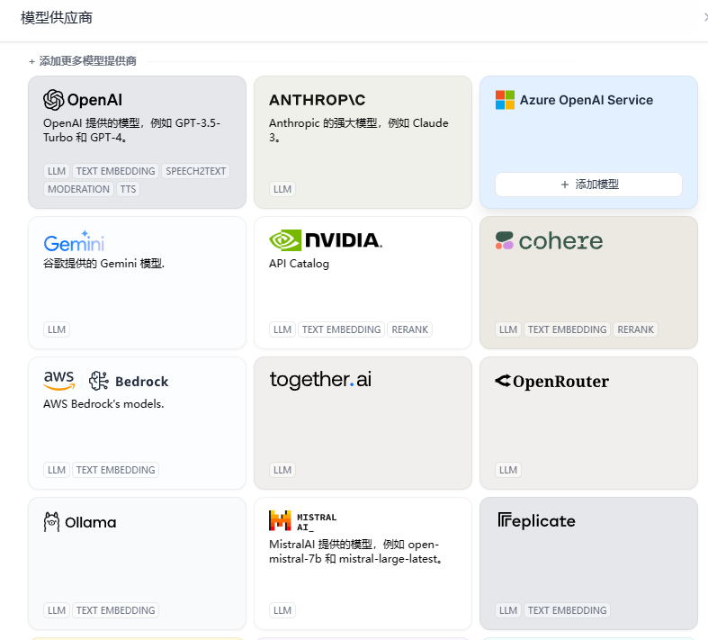
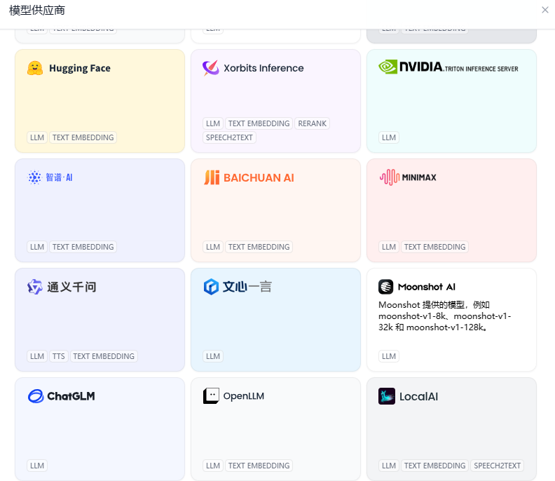
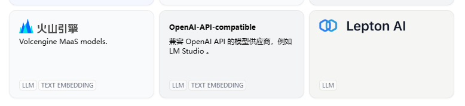
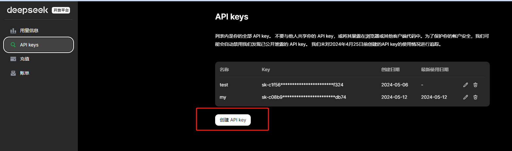
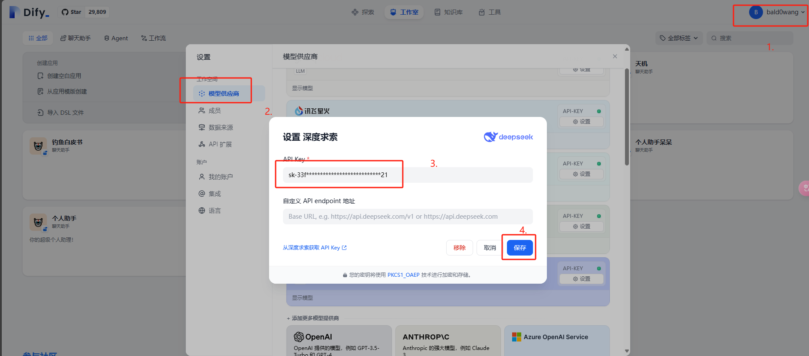
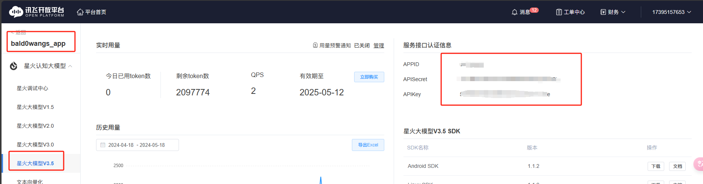

# 2.2 各类模型接入

> 工欲行其事，必先利其器。

# 模型配置介绍

```
dify中接入llm是用好dify的必要条件，你可以通过self-llm项目搭建本地api（强烈建议大家再搭建本地api时符合openai接口规范）、本地模型例如ollama，或者通过web调用在线api如国内优秀的文心一言、智谱ai、deepseek等等的在线模型。可以配置大家的在线api模型或者本地api模型~


这里我们主要介绍在线模型：
```

可以看到市场上大部分模型都能在下面找到。







# 模型接入

第一期先给大家写出国内部分模型的配置，后续会放更多配置方案。

这里我们给出一些国内比较常用的 api 申请及相关信息~

## 2.1 deepseek

1. 目前我们最推荐的是 Deepseek（性能较高，价格优势明显）【20 元/MBtoken】
2. 首先请到：[https://platform.deepseek.com/api_keys](https://platform.deepseek.com/api_keys) 下注册账号，
3. 接着创建 api keys，可以参考下图，创建好后记得复制 key。



1. 接着打开 dify（网页版、本地版都可），按照下图进行配置。



## 2.2 星火 3.5

1. 目前（2024.05）最新版本的星火 api 最新版本号是 3.5，在多项能力近乎与 gpt4.0 齐平。而且在注册时会赠送 200 万 token（一年）的免费使用量。【300 元/MBtoken】
2. [https://console.xfyun.cn/sale/buy?wareId=9108&packageId=9108001&serviceName=%E6%98%9F%E7%81%AB%E8%AE%A4%E7%9F%A5%E5%A4%A7%E6%A8%A1%E5%9E%8BV3.5&businessId=bm35](https://console.xfyun.cn/sale/buy?wareId=9108&packageId=9108001&serviceName=%E6%98%9F%E7%81%AB%E8%AE%A4%E7%9F%A5%E5%A4%A7%E6%A8%A1%E5%9E%8BV3.5&businessId=bm35)
   通过本链接领取~
3. 领取后请到对应应用下，进入 3.5 模型获取 APPID、APISecret、APIKey



4.接着打开 dify（网页版、本地版都可），进行配置即可。【参考 deepseek】

## 2.3 智谱 ai

申请地址（赠送 20 元）[https://open.bigmodel.cn/usercenter/apikeys](https://open.bigmodel.cn/usercenter/apikeys)

【glm4  5 元/MBtoken 3.5tube 0.5 元/MBtokens】

## 2.4 01 万物

申请地址（赠送 36 元）[https://platform.lingyiwanwu.com/apikeys](https://platform.lingyiwanwu.com/apikeys)

## 2.5 月之暗面（KIMI）

申请地址（赠送 10 元）[https://platform.moonshot.cn/console/api-keys](https://platform.moonshot.cn/console/api-keys)

## 2.6 文心一言

申请地址 [https://console.bce.baidu.com/qianfan/ais/console/applicationConsole/application](https://console.bce.baidu.com/qianfan/ais/console/applicationConsole/application)

## 2.7 Qwen 系列

申请地址（不定时免费）：[https://dashscope.console.aliyun.com/apiKey](https://dashscope.console.aliyun.com/apiKey)

## 2.8 Groq【国外】

目前速度最快的在线 api，秒级反应。免费试用中。（搭载 llama3-70b 等模型~）

申请地址： [https://console.groq.com/keys](https://console.groq.com/keys)

# 本地模型

(后续补充)

如果您想接入本地模型可以看看这部分：

## 3.1 使用 ollama

[https://github.com/ollama/ollama](https://github.com/ollama/ollama)

## 3.2 使用 LocalAI

[https://github.com/mudler/LocalAI](https://github.com/mudler/LocalAI)
