# 2.3 聊天助手

# 创建一个聊天助手

聊天助手是最基础的应用类型，但是麻雀虽小五脏俱全。通过这个教程你会学习到关于 dify 的基本入门技巧。

## 1.1 我们先了解一下大语言模型~

其实在学 prompt 中我们已经掌握了如何让大模型听懂我们的话，让大模型更好为我们服务。那我们可以看看大模型具体指什么吧~

🌟 **大语言模型是什么？** 大语言模型就像一个超级聪明的语言天才，它可以理解和生成几乎任何语言的文本。它们是由很多小小的数学函数（我们叫它们神经元）组成的，就像人脑中的神经元一样。这些神经元通过一种叫做“连接”的东西相互沟通，通过调整它们之间的“权重”来学习如何更好地理解和生成语言。

🤖 **它们是如何工作的？** 想象一下，如果你要学习一门新语言，你可能会通过阅读书籍、听音频和与人交流来学习。大语言模型也是这么做的！它们通过阅读大量的文本（这个过程叫做“训练”）来学习语言的规则和模式。然后，它们就可以用这些知识来生成自己的文本，就像你在聊天时一样自然。

🎨 **它们能做什么？** 大语言模型可以做很多有趣的事情，比如帮你写邮件、生成故事、甚至是编写代码！但是，它们也有自己的局限性，比如它们生成的文本可能不总是 100% 准确，因为它们只能根据它们学到的东西来生成文本。

👀 **它们是如何学习的？** 就像你学习新知识一样，大语言模型通过不断的练习和试错来提高自己的能力。它们会生成文本，然后与它们学到的文本进行比较，看看自己做得怎么样。如果做得好，它们就会记住这个方法；如果做得不好，它们就会尝试不同的方法，直到找到更好的答案。

🚀 **未来的可能性** 大语言模型的未来非常令人兴奋！随着技术的发展，它们可能会变得更加智能，能够更好地理解和生成语言。想象一下，如果你有一个可以帮你写论文、解决问题，甚至是陪你聊天的智能助手，那会是多么酷的一件事啊！

所以，这就是大语言模型的可爱介绍啦！希望你喜欢这个小小的科技魔法展示。如果你想了解更多，记得问我哦！😄👍

## 1.2 一个最简单的大语言模型应用——聊天助手【万能小助手】

1. 首先请在线（https://cloud.dify.ai/apps）或本地（http://localhost/apps）打开你的 dify 应用。
2. 点击左侧创建空白应用
3. 点击聊天助手，填写图标 & 名称输入【万能小助手】，描述的信息输入【万能小帮手，解决我的一切困难】。
4. 点击创建。
   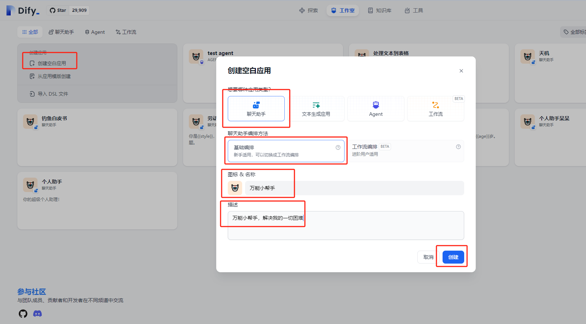
5. 回想一下我们学过的 prompt，使用 CO-STAR 框架快速构建一个 prompt。注意，这里的提示词就是一般的 system prompt。

```javascript
**Context（背景）：你是一个万能生活小帮手，我遇到了一些生活上的小难题，需要你的智慧来帮我解决。
Objective（目标）：请帮助我找到解决[具体问题]的方法。
Style（风格）：请用简单明了的语言来解释，就像在给一个好朋友建议一样。
Tone（语气）：我希望得到的建议是友好、积极和鼓励的，请以萝莉的口吻与我沟通。
Audience（受众）：这个问题是给我自己的，我希望通过你的帮助，能够更加自信和有效地解决问题。
****Response（回应）：请以步骤列表的形式提供解决方案，并解释每一步的重要性。**
```

1. 接下来将 prompt 写入提示词框内。
2. 在右侧选择一个大语言模型，这里面我们选择了星火模型。

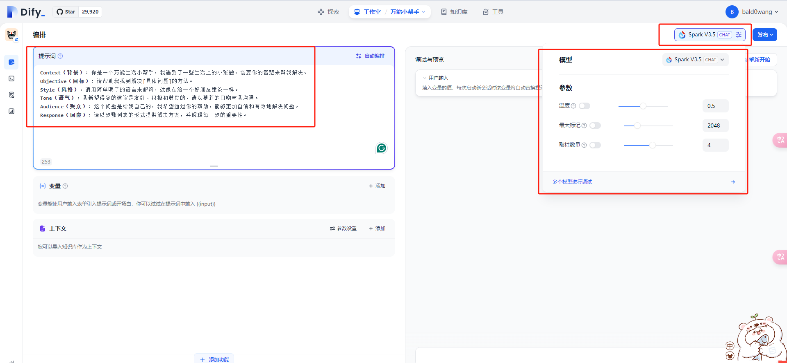

1. 测试：告诉我如何学习自由泳

这里是我们使用 prompt 编辑好的内容：

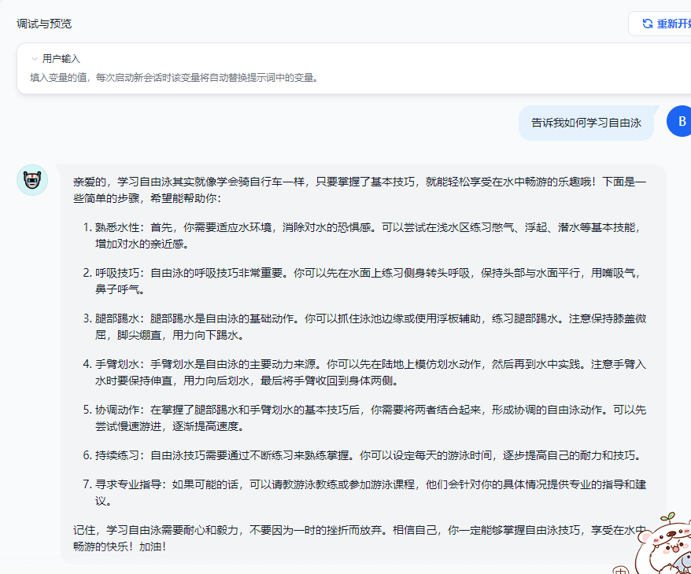

对比：这是没有使用 prompt 的内容。

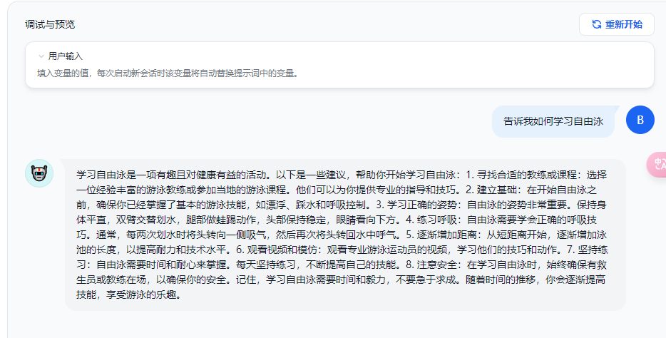

可以看到回答有一定的区别<u>恭喜你，到这里你已经可以实现一个简单的 dify 聊天助手啦</u>

备注：

肯定有小伙伴想问温度、最大标记、取样数量都是什么意思。一般温度指回答的随机性，最大标记是回复长度，取样数量是回答结果中生成的随机数量的总量（只抽取一个）。

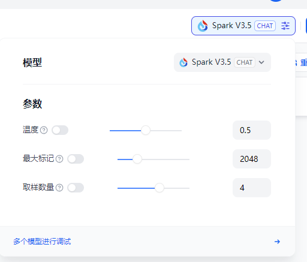

## 1.3 应用发布

1. 点击右上角发布，点击运行即可到页面访问。

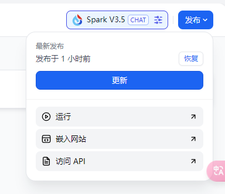

1. 运行界面~

你可以像访问自己的 app 一样随意提问，并且支持多轮对话和记忆。你的万能小助手就建好啦。

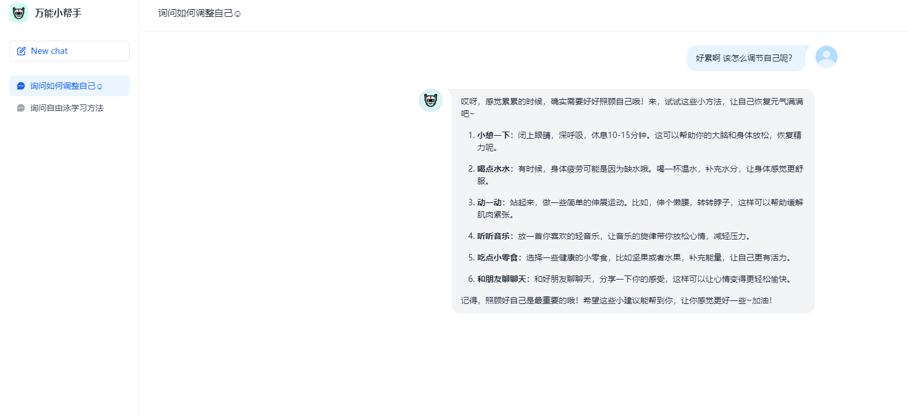

## 1.4 api 接入

对话应用支持会话持久化，可将之前的聊天记录作为上下进行回答，可适用于聊天/客服 AI 等。

点击你的访问 apikey~即可进入 api 界面。

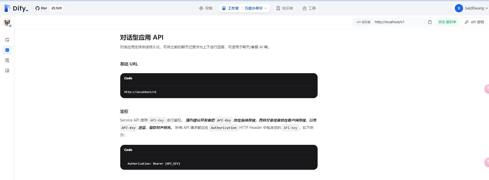

请生成你的 api 密钥。

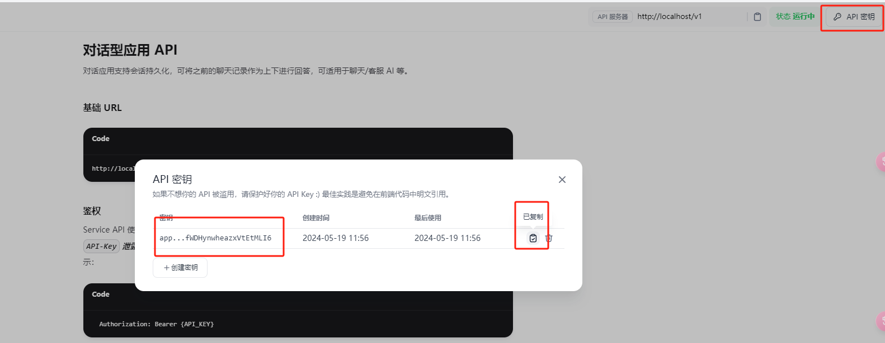

你可以通过下面的脚本快速实现你的 api 应用~

```python
import requests
import json

url = **'**http://localhost/v1/chat-messages**'**
api_key = **'' # 请输入你的api_key**
headers = {
    **'**Authorization**'**: f**'**Bearer {api_key}**'**,
    **'**Content-Type**'**: **'**application/json**'**
}

input_data = **"**你好，我饿了怎么办~**"**

data = {
    **"**query**"**: input_data,
    **"**inputs**"**: {},
    **"**response_mode**"**: **"**streaming**"**,
    **"**user**"**: **"**abc-123**"**
}

response = requests.post(url, headers=headers, json=data)

print(response.status_code)
if response.status_code == 200:
    if response.headers[**'**content-type**'**] == **'**application/json**'**:
        print(response.json())
    else:
        decoded_str = response.content.decode(**'**utf-8**'**)
        **# 将转换后的字符串按行分割，并解析为字典**
        data_list = decoded_str.split(**'**\n\n**'**)
        result = **''**
        for data in data_list:
            if data.startswith(**'**data:**'**) and (**'**"event": "message"**'**) in data:
                json_data = data[5:]
                print(json_data)
                result+=json.loads(json_data)[**'**answer**'**]

else:
    print(**'**Request failed with status code:**'**, response.status_code)
    
    
# result
#'你好呀~ 饿了的话，我们可以一起来做点简单又美味的食物哦！这里有几个小步骤，跟着做就可以啦：\n\n1. **检查冰箱和食品柜**：\n   - 先看看家里有什么食材，这样可以决定做什么食物。比如有面条、鸡蛋、蔬菜的话，就可以做个简单的炒面或者蛋炒饭哦。\n\n2. **选择简单的食谱**：\n   - 根据找到的食材，选一个简单的食谱。比如有鸡蛋和面包，就可以做个快速的三明治。\n\n3. **开始烹饪**：\n   - 按照食谱的步骤来，一步一步做。记得开小火，慢慢来，不要急哦。\n\n4. **享受美食**：\n   - 做好后，找个漂亮的盘子装好，然后就可以开心地享用啦！\n\n这样做不仅可以解决饿的问题，还能享受烹饪的乐趣呢！加油，我相信你可以做得很好哒~'
```

> 这是整理好的回答~
>
> '你好呀~ 饿了的话，我们可以一起来做点简单又美味的食物哦！这里有几个小步骤，跟着做就可以啦：\n\n1. **检查冰箱和食品柜**：\n   - 先看看家里有什么食材，这样可以决定做什么食物。比如有面条、鸡蛋、蔬菜的话，就可以做个简单的炒面或者蛋炒饭哦。\n\n2. **选择简单的食谱**：\n   - 根据找到的食材，选一个简单的食谱。比如有鸡蛋和面包，就可以做个快速的三明治。\n\n3. **开始烹饪**：\n   - 按照食谱的步骤来，一步一步做。记得开小火，慢慢来，不要急哦。\n\n4. **享受美食**：\n   - 做好后，找个漂亮的盘子装好，然后就可以开心地享用啦！\n\n 这样做不仅可以解决饿的问题，还能享受烹饪的乐趣呢！加油，我相信你可以做得很好哒~'

# 应用扩展

## 2.1 prompt 优化器

这里展示一个采用 **CO-STAR 架构的 prompt 优化器实现方案~。**

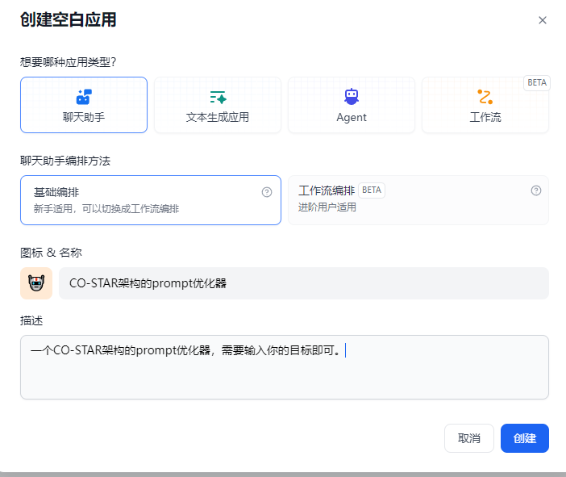

提示词：

```bash
下面是prompt构建的思路，请帮我根据用户输入聊天的主题生成**CO-STAR框架prompt。**


思路>>>

**CO-STAR 框架：构建提示词的“魔法公式”**
**Context（背景）**：就像告诉教授我们正在讨论的话题是什么，这样他就能更好地理解问题背景。
**Objective（目标）**：明确告诉教授我们想要他做什么，比如“请解释量子物理的基本原理”。
**Style（风格）**：这是告诉教授我们希望答案的写作风格，比如“请用莎士比亚的风格描述这个过程”。
**Tone（语气）**：这是我们想要的教授回答的语气，比如“请用幽默的方式解释”。
**Audience（受众）**：告诉教授我们的问题是为了谁，比如“这个问题是给10岁的小朋友听的”。
**Response（回应）**：这是我们希望得到的答案格式，比如“请用列表的形式列出要点”。

**分隔符（Delimiters）：提示词的“交通信号灯”**
分隔符就像是我们在马路上看到的交通信号灯，它们帮助LLM识别提示词中的不同部分。比如，我们可以用一些特殊的字符序列，如"###"或"===="，来告诉LLM哪里是问题的开始，哪里是结束。
```

测试：

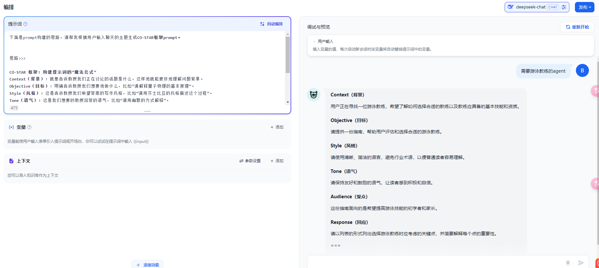

```bash
# 输入
需要游泳教练的agent
# 输出
**Context（背景）**
用户正在寻找一位游泳教练，希望了解如何选择合适的教练以及教练应具备的基本技能和资质。
**Objective（目标）**
请提供一份指南，帮助用户评估和选择合适的游泳教练。
**Style（风格）**
请使用清晰、简洁的语言，避免行业术语，以便普通读者容易理解。
**Tone（语气）**
请保持友好和鼓励的语气，让读者感到积极和自信。
**Audience（受众）**
这份指南面向的是希望提高游泳技能的初学者和家长。
**Response（回应）**
请以列表的形式列出选择游泳教练时应考虑的关键点，并简要解释每个点的重要性。
===
请根据上述CO-STAR框架生成相应的回答。
```

发布效果展示。

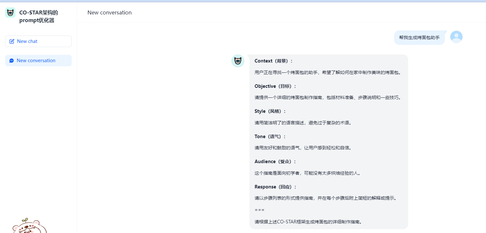
