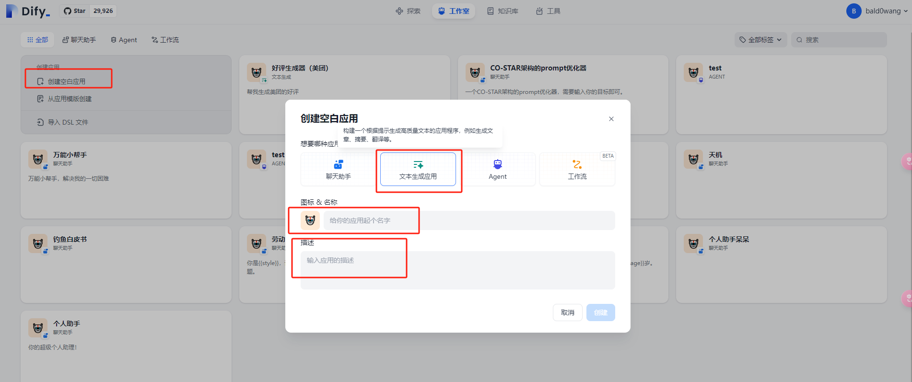
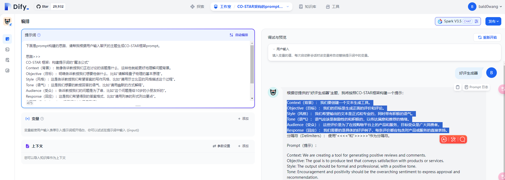
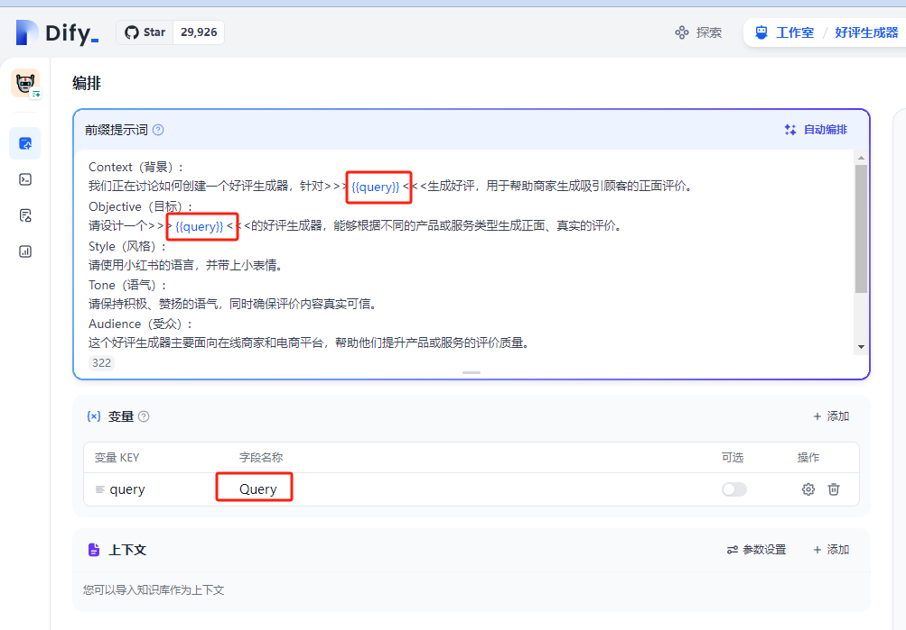
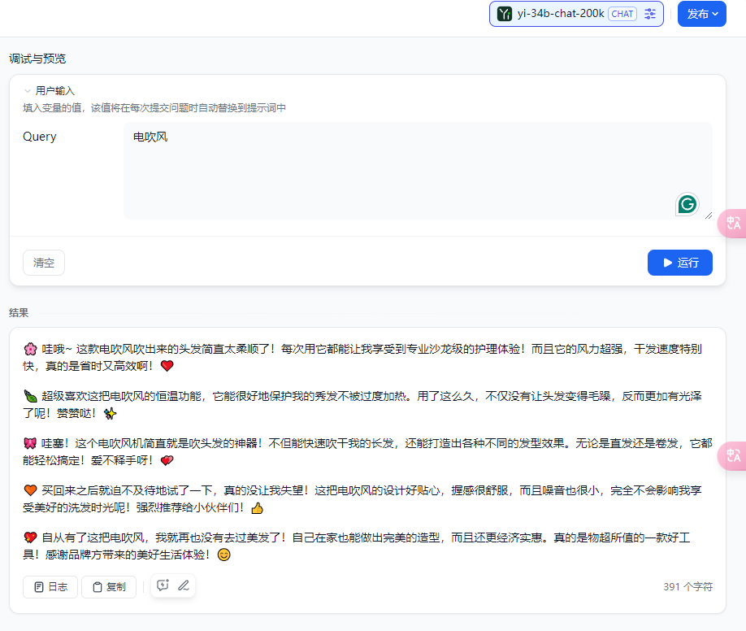
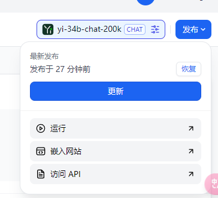
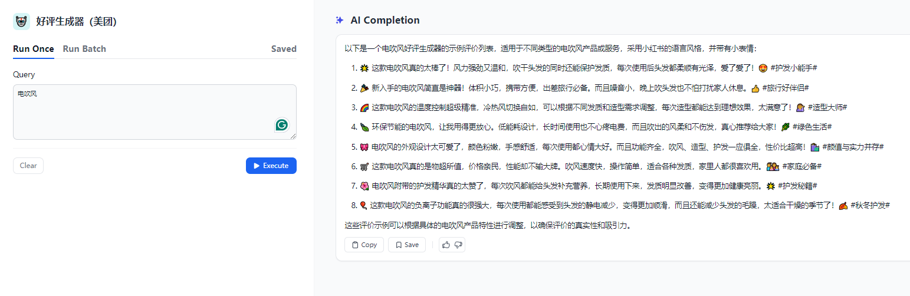
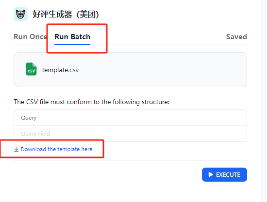
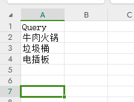
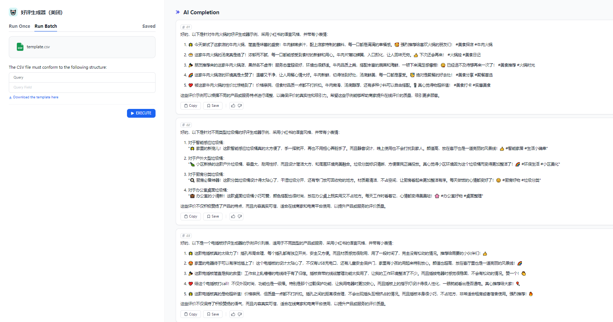

# 2.4 文本生成应用



# 创建一个文本生成应用

## 1.1 【好评生成器】开发

1. 首先请在线（https://cloud.dify.ai/apps）或本地（http://localhost/apps）打开你的 dify 应用。
2. 点击左侧创建空白应用
3. 点击**文本生成应用**，填写图标 & 名称输入【好评生成器】，描述的信息输入【帮我生成好评】。
4. 点击创建。
5. 提示词

这里我们去上节课制作的【CO-STAR 架构的 prompt 优化器】帮助我们写作 prompt，简单修改后生成 prompt。



prompt

```python
Context（背景）:
我们正在讨论如何创建一个好评生成器，针对>>>{{query}}<<<生成好评，用于帮助商家生成吸引顾客的正面评价。
Objective（目标）:
请设计一个>>>{{query}}<<<的好评生成器，能够根据不同的产品或服务类型生成正面、真实的评价。
Style（风格）:
请使用小红书的语言，并带上小表情。
Tone（语气）:
请保持积极、赞扬的语气，同时确保评价内容真实可信。
Audience（受众）:
这个好评生成器主要面向在线商家和电商平台，帮助他们提升产品或服务的评价质量。
Response（回应）:
请提供一个包含几个示例评价的列表，这些评价应适用于不同类型的产品或服务。
===
注意：用中文回答！
```

注意：

这里的 query 是一个输入变量，作为编排 prompt 的一部分。我们可以在右侧输入 query 中的内容作为整体 prompt 的一部分，调整 prompt 的主题。比如我们好评生成器的好评商品{{电吹风}}。



## 1.2 【好评生成器】测试

我们输入电吹风，选择 yi-34b-chat-200k 作为模型，运行后效果如下。



## 1.3 【好评生成器】发布

1. 点击右上角发布



1. 点击运行

你可以输入商品名后点击执行~即可执行。



1. 批量执行

点击 Run Batch 后进入页面，点击 Download the template here 下载模板。



使用 wps 或者 excel 打开，按照下面格式写入需要处理的 query。



将文件保存后拖入网页，点击执行即可看到批量运行结果！


