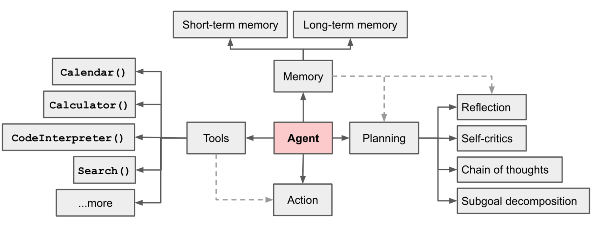
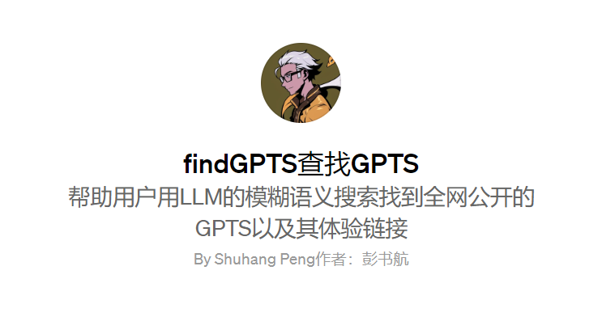
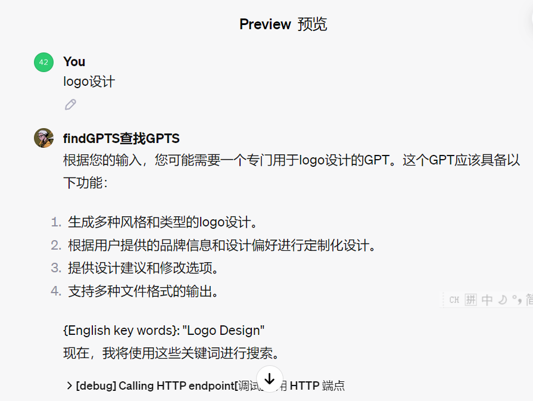
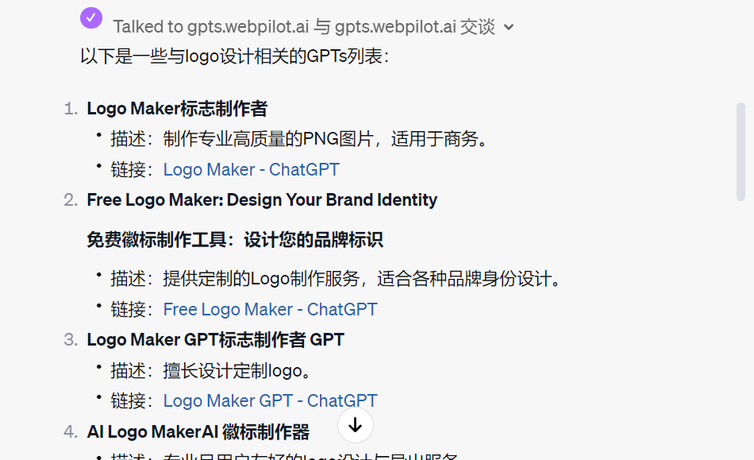
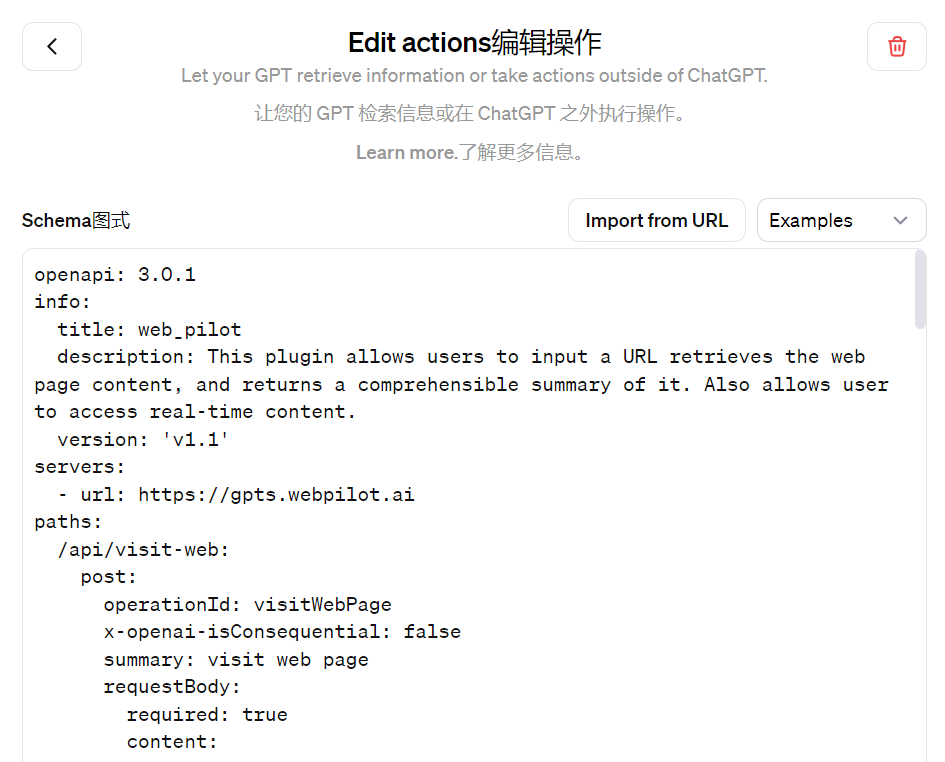
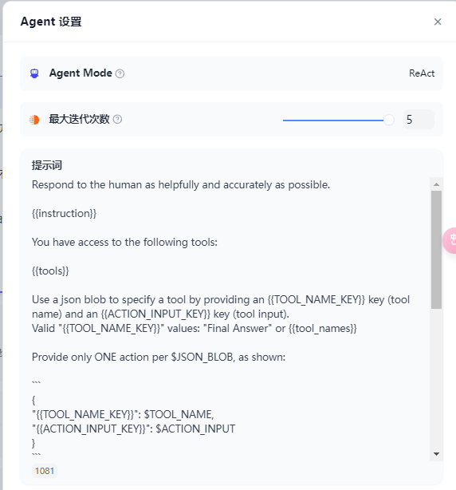
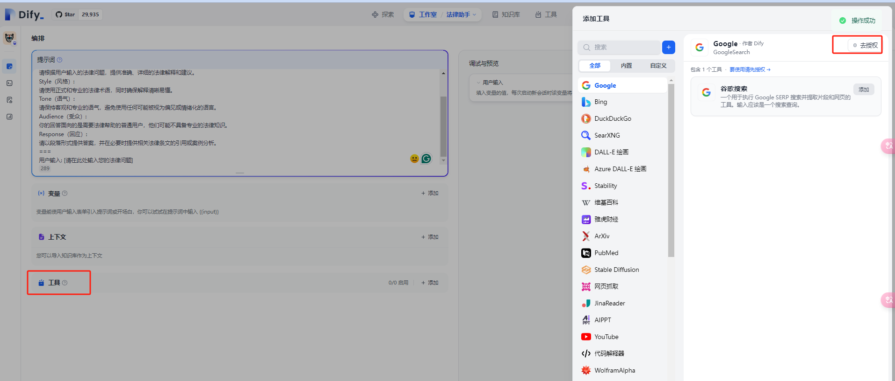
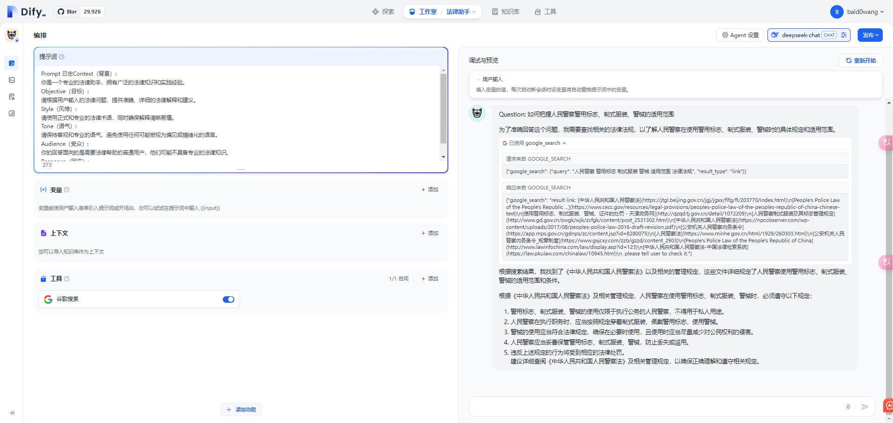
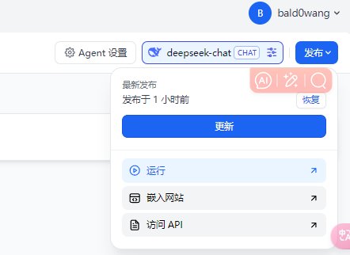
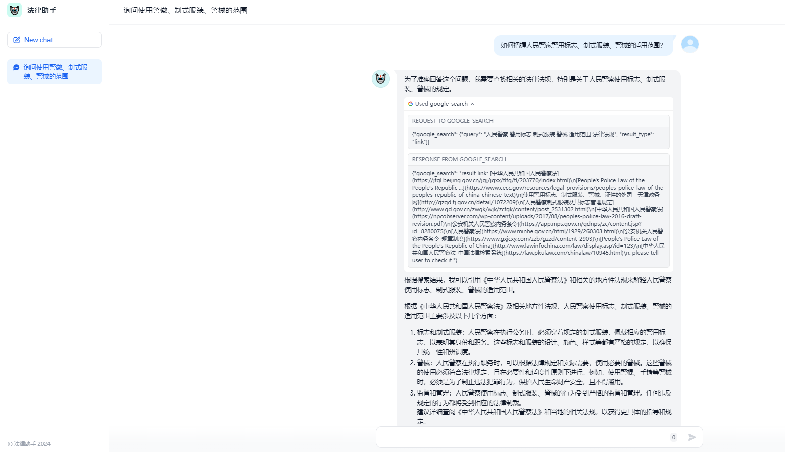

# 2.5 智能体

# 智能体是什么？

### 智能体的定义

#### 什么是智能体?



1. **记忆分为五种类型**：工作记忆、工具记忆、语义记忆、情节记忆和动作记忆。人类的记忆会经历过滤、压缩、遗忘和重组等环节，实际机制非常复杂，99% 的记忆会被删除。
   来源： [https://zh.wikipedia.org/zh-hans/%E8%84%91](https://zh.wikipedia.org/zh-hans/%E8%84%91)

   - 工作记忆是指保持与当前任务相关的临时信息的能力，受到赫布理论效应的调节。
   - 工具学习是指通过奖惩来改变行为的能力，由以基底核为中心的脑区网络实现。
   - 语义记忆是指学习事实和关系的能力，可能主要储存在大脑皮质中，通过改变神经元连接来存储特定类型的记忆。
   - 情节记忆是指回忆特定事件细节的能力，可以终身保持。许多证据表明，海马体在其中起着关键作用，许多有海马体损伤的人会表现出失忆症，无法获得新的长期情节记忆。
   - 动作学习是指通过练习或重复来改善身体运动模式的能力。许多脑区与之相关，包括前运动区、基底核，尤其重要的是小脑，它包含了许多关于运动参数微小调节的信息。
2. **规划** ：规划基本与写代码等价 。目前 LLM 规划能力较弱， 以 Codeforces Rating 为例，GPT - 4 排名 后 10%

> Codeforces 是一个在线编程竞赛平台，主要针对算法和数据结构领域。在 Codeforces 上，参与者可以通过参加比赛来解决各种编程问题，并与来自世界各地的其他程序员竞争。

来源： [https://openai.com/research/gpt-4](https://openai.com/research/gpt-4)

1. **神经**：人脑有大量如视神经、听觉神经等小网络；智能体大概率也需要大量的小模型（如在视觉、决策、路由等工作上），不能由一个大模型来主导，一不经济，二不实际

   1. 小鼠的嗅觉系统是由 1500 个小神经组成的，相当于是一堆小的分类器，只在小鼠闻到特定气味触发特定神经，平时低功耗运行，不会做全脑推理，这意味着 Agent 上实现对应模块大概率也需要大量小模型
2. **工具**：实际就是 API，分为 build something 及 use something，支撑了智能体通往现实世界。假如实现现实世界完整表达的 API 需要 k 个，而这 k 个已经被实现，那么 Agent 理论上就可以达到全能。当然，前提是它要能够无错、娴熟的基于这些 API 写出完整的代码，而这代码自动撰写的 missing piece 就是 MetaGPT
3. **直觉**：如呼吸、吞咽、心跳等不需要在脑内有任何显性思考的部分，如你要喝水，会从手边拿起一个矿泉水，然后拧开它的盖子，之后开始喝水；全流程无需特意思考。现实世界的大部分任务都需要直觉，通过直觉系统，能将任务完成度从之前最优的 30% 多提升到接近 90%
4. **运控**：黑色部分主要指运动控制，对应具身智能相关特性

如果你看了介绍还是不明白，用一个具体的 GPTs 的案例向你说明什么是 agent 智能体代理

#### 智能体举例：

[https://chat.openai.com/g/g-O8Y8pE85i-findgpts](https://chat.openai.com/g/g-O8Y8pE85i-findgpts)

这是作者制作的一个 GPTs 导航，帮助用户用 LLM 的模糊语义搜索找到全网公开的 GPTS 以及其体验链接






这里的记忆可以分为 chatgpt 训练过程中的语料库的语义记忆，我强调进行 logo 设计时匹配出的工作记忆/情节记忆，用户主动上传的 knowledge（比如爬取 [GPTs 导航站收录](https://zw73xyquvv.feishu.cn/wiki/TPxXwK3XaiuzMvkDeoYcYNU9n5c) ）文档中所有的 GPTs 和对应的 describe 的长期记忆
目前 LLM 的自主规划能力很弱，所以我用一套 sop 工作步骤让他能够有更多的思考空间（时间换准确率）
这里 findGPTs 会先解构用户的描述，用 LLM 的基础能力去泛化找到其他语义相似的 keywords 进行检索，检索这一步采用了 webcopilot 开源的 action 进行浏览器访问（这个是强于 openai 提供的 bing search 的效率的）



这一步也是 openai api 插件开发者和普通 GPTs 开发者拉开差距的地方，这里就体现了 LLM tools 工具调用的能力，

拿到了搜索引擎返回的 GPTs list，llm 就开始观察和思考哪个是最高匹配度的 GPTs，如果将来 openai 支持访问 gpts 的 API 那么这个 agent 就可以自动的提炼 describe 直接去询问对应的 GPTs 并调用 API 返回搜索结果即为 agent action 行动的结果。
比较类似的超级入口可以参考 [HuggingGPT 火了：一个 ChatGPT 控制所有 AI 模型，自动帮人完成 AI 任务](https://zhuanlan.zhihu.com/p/619063970)

#### 1.1.4 ReAct 智能体：

哇哦，ReAct 智能体就像是一群小精灵，它们拥有超级棒的思考和行动能力！🧚🧚

想象一下，当你在玩一个游戏，需要找到隐藏的宝藏，你会怎么做呢？你可能会先四处看看，然后想：“宝藏可能藏在那边的山洞里！”这就是 ReAct 智能体的“思考”部分，它们会用它们的小脑袋瓜去推理和分析问题。

然后，当你决定去山洞里探险时，你会行动起来，走进山洞，寻找宝藏。这就是 ReAct 智能体的“行动”部分，它们会根据它们的思考来采取行动。

ReAct 智能体就像是小朋友们的好朋友，它们会先思考问题，然后采取行动来解决问题。比如，当你问它们：“除了苹果遥控器，还有什么可以控制苹果电视呢？”它们不会立刻回答，而是会先思考：“嗯，我需要查找一些信息。”然后它们可能会使用一个叫做“bing_search”的工具来搜索答案。

如果搜索结果不太对劲，它们也不会气馁，而是会再次思考：“我可能需要更多的信息。”然后它们会继续行动，直到找到正确的答案。

ReAct 智能体的特别之处在于，它们能够将思考和行动紧密结合起来，这样它们就能更好地理解和解决问题。它们就像是小小的侦探，总是准备好探索未知，找到答案。

而且哦，ReAct 智能体还非常聪明和灵活，它们可以适用于各种各样的任务，无论是回答问题、玩文字游戏，还是在网上寻找信息。

所以，ReAct 智能体就像是一群小小的超级英雄，它们用智慧和勇气帮助我们解决问题，让世界变得更加美好！🦸🦸✨

#### 1.1.5 Dify agent 实现



采用 ReAct 模式创建，通过 prompt 让 agent 学会自己使用 tools

```python
Respond to the human as helpfully and accurately as possible.

{{instruction}}

You have access to the following tools:

{{tools}}

Use a json blob to specify a tool by providing an {{TOOL_NAME_KEY}} key (tool name) and an {{ACTION_INPUT_KEY}} key (tool input).
Valid "{{TOOL_NAME_KEY}}" values: "Final Answer" or {{tool_names}}

Provide only ONE action per $JSON_BLOB, as shown:

```

{
"{{TOOL_NAME_KEY}}": $TOOL_NAME,
"{{ACTION_INPUT_KEY}}": $ACTION_INPUT
}

```

Follow this format:

Question: input question to answer
Thought: consider previous and subsequent steps
Action:
```

$JSON_BLOB

```
Observation: action result
... (repeat Thought/Action/Observation N times)
Thought: I know what to respond
Action:
```

{
"{{TOOL_NAME_KEY}}": "Final Answer",
"{{ACTION_INPUT_KEY}}": "Final response to human"
}

```

Begin! Reminder to ALWAYS respond with a valid json blob of a single action. Use tools if necessary. Respond directly if appropriate. Format is Action:```$JSON_BLOB```then Observation:.
```

# 如何搭建智能体应用

### 2.1  【法律助手 agent】开发

1. 首先请在线（https://cloud.dify.ai/apps）或本地（http://localhost/apps）打开你的 dify 应用。
2. 点击左侧创建空白应用
3. 点击 Agent 应用，填写图标 & 名称输入【好评生成器】，描述的信息输入【帮我生成好评】。
4. 点击创建。
5. 提示词

这里我们去上节课制作的【CO-STAR 架构的 prompt 优化器】帮助我们写作 prompt，简单修改后生成 prompt。

```python
Context（背景）:
你是一个专业的法律助手，拥有广泛的法律知识和实践经验。
Objective（目标）:
请根据用户输入的法律问题，提供准确、详细的法律解释和建议。
Style（风格）:
请使用正式和专业的法律术语，同时确保解释清晰易懂。
Tone（语气）:
请保持客观和专业的语气，避免使用任何可能被视为偏见或情绪化的语言。
Audience（受众）:
你的回答面向的是需要法律帮助的普通用户，他们可能不具备专业的法律知识。
Response（回应）:
请以段落形式提供答案，并在必要时提供相关法律条文的引用或案例分析。
===
用户输入: [请在此处输入您的法律问题]
```

1. 引入工具

这里我们使用了 google serach api 作为演示，大家可以到 [https://serpapi.com/manage-api-key](https://serpapi.com/manage-api-key) 申请 key 每月免费 100 次搜索。

申请好好后在工具添加 google，点击去授权粘贴 api key。



如下图所示表示操作成功。


### 2.2  【法律助手 agent】测试

测试：

接下来我们可以输入：如何把握人民警家警用标志、制式服装、警械的适用范围？这个问题进行测试：



我们可以看到进行搜索后返回了带有工具辅助的内容，大大提升了大语言模型的能力。

### 2.3 【法律助手 agent】发布

1. 点击右上角发布



1. 点击运行
2. 输入：如何把握人民警家警用标志、制式服装、警械的适用范围？问题进行发布测试~


