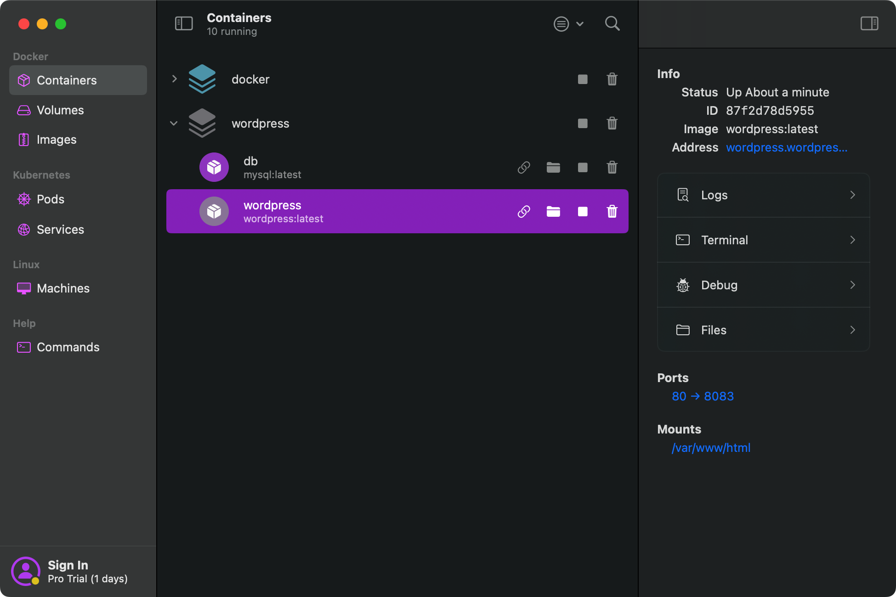
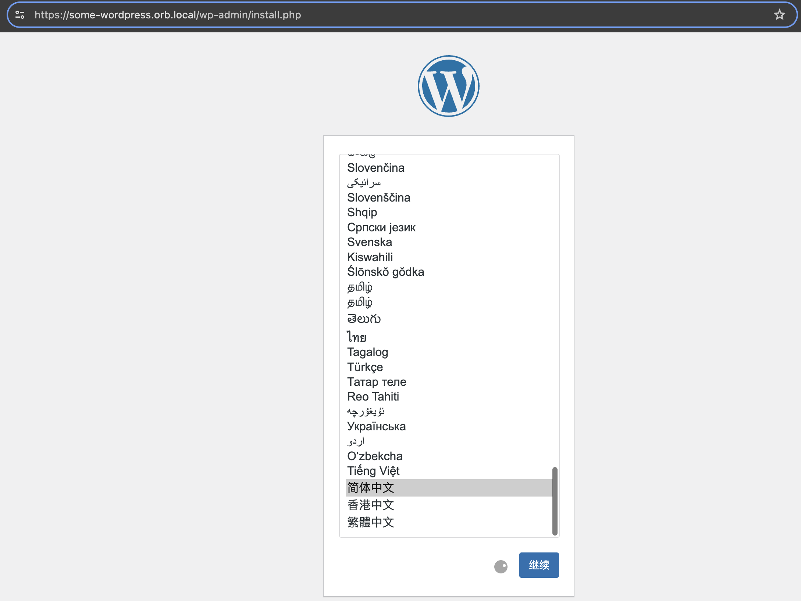
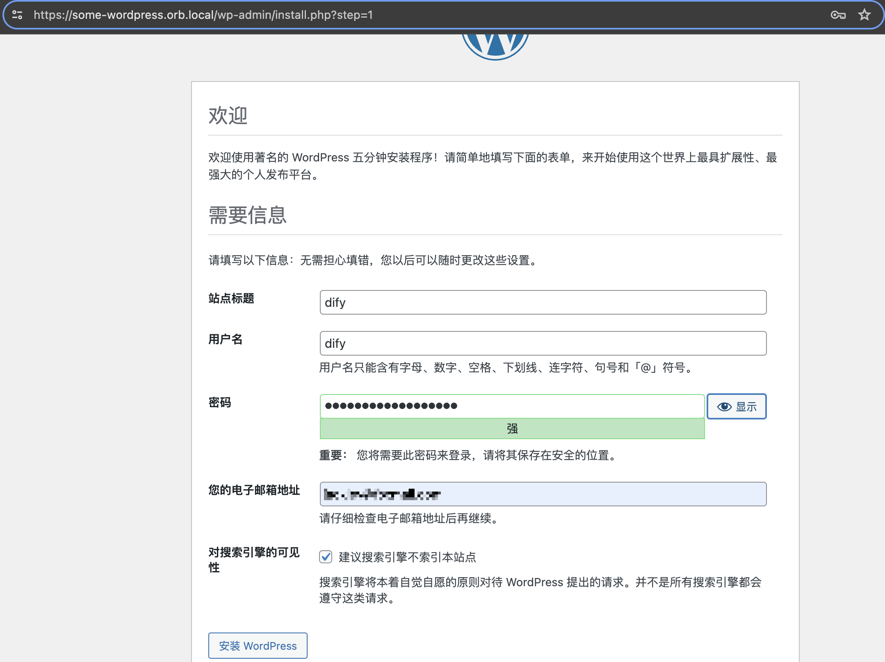
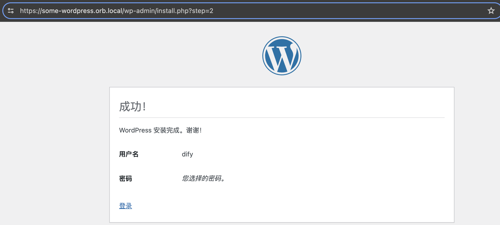
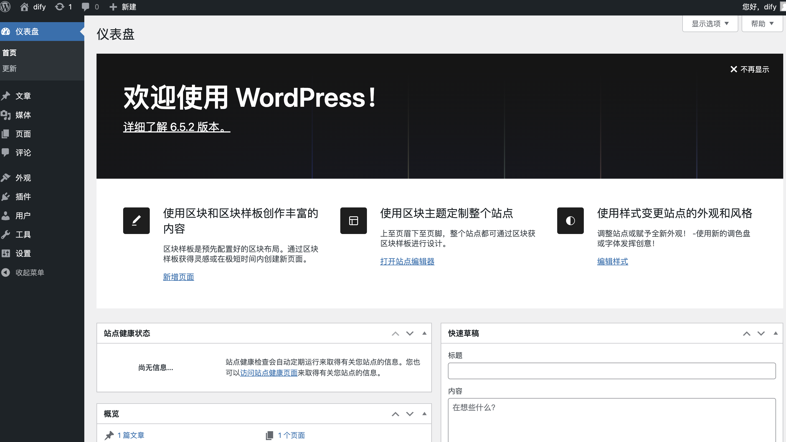
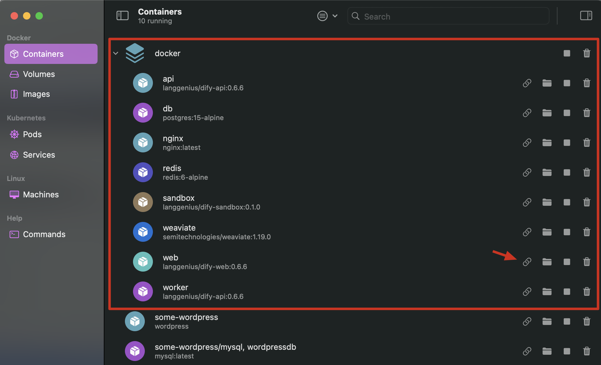

## 3.2 搭建WordPress 环境及 Dify 结合
| 声明：原文来自[苏洋](https://github.com/soulteary)大佬的blog [使用 Dify 和 Moonshot API 构建你的 AI 工作流（一）：让不 AI 的应用 AI 化](https://soulteary.com/2024/04/24/use-dify-and-moonshot-api-to-build-your-ai-workflow-make-non-ai-applications-goto-ai.html) 我们在此之上加了一些解释以及修改。

### 3.2.1 搭建 wordpress 环境

比较简单的方式是使用 docker 来搭建环境，以下是使用 Docker 安装 WordPress 的基本步骤：

**1. 安装 Docker**

在开始之前，请确保已经安装了 Docker。可以从 [Docker 官网](https://www.docker.com/) 下载并安装 Docker Desktop 或 Docker Engine，或者也可以使用 orbstack（https://orbstack.dev/download）。

**Orbstack（类似于 docker 桌面）：**docker 桌面的平替工具，功能和 docker 桌面几乎一样，可无缝迁移 docker 桌面项目，个人感觉更好用一些。

**2. 使用 Docker 安装 wordpress 和 mysql**

安装 wordpress 需要同时安装 mysql（或其它数据库），为了简化安装过程，最好是创建一个 docker-compose.yml 文件，使用 docker compose 工具进行安装，因为 docker compose 擅长处理这种多软件相互依赖的情况。

以下是一个示例的 Docker Compose 文件，用于在 Docker 容器中运行 WordPress 和 MySQL，并将 WordPress 的端口设置为 8083：

```yaml
version: '3'

services:
  db:
    image: mysql:latest
    volumes:
      - db_data:/var/lib/mysql
    restart: always
    environment:
      MYSQL_ROOT_PASSWORD: somewordpress
      MYSQL_DATABASE: wordpress
      MYSQL_USER: wordpress
      MYSQL_PASSWORD: wordpress

  wordpress:
    depends_on:
      - db
    image: wordpress:latest
    ports:
      - "8083:80"
    restart: always
    environment:
      WORDPRESS_DB_HOST: db:3306
      WORDPRESS_DB_USER: wordpress
      WORDPRESS_DB_PASSWORD: wordpress
      WORDPRESS_DB_NAME: wordpress
    volumes:
      - wordpress_data:/var/www/html

volumes:
  db_data: {}
  wordpress_data: {}
```

这个 Docker Compose 文件定义了两个服务：`db` 和 `wordpress`。

- `db` 服务使用 MySQL lastest 镜像，并设置了相关的环境变量来配置 MySQL 的根密码、数据库名称、用户名和密码。数据库的数据将持久化存储在名为 `db_data` 的卷中。
- `wordpress` 服务依赖于 `db` 服务，使用最新的 WordPress 镜像。它将容器的 80 端口映射到主机的 8083 端口，以便可以通过主机的 8083 端口访问 WordPress。同时，它也设置了相关的环境变量，以便 WordPress 可以连接到 MySQL 数据库。WordPress 的数据将持久化存储在名为 `wordpress_data` 的卷中。

将以上内容保存为 `docker-compose.yml`，然后在该文件所在的目录下运行以下命令：

```
docker-compose up -d
```

这将以分离模式启动 WordPress 和 MySQL 容器。启动完成后，就可以通过访问 `http://localhost:8083` 来访问 WordPress 网站。

**3. 完成安装**

在 orbstack（或 docker 桌面）里应该就可以看到成功安装之后的 wordpress 和 mysql。



首次登录 `http://localhost:8083`，需要按照安装向导的指示完成 WordPress 的安装：

- 选择语言。
- 输入网站标题、用户名和密码。
- 完成安装。





**4.管理 WordPress**

现在，可以通过浏览器访问 WordPress 的管理面板，开始创建内容和管理网站。至此，完成 wordpress 的安装。





### 3.2.2 与 dify 环境的结合

前述已经讲过如何搭建 dify 环境，二者的结合主要体现在 wordpress 对于 dify api 的调用。为此，最好是将 dify 的服务端口从 80 映射为 8082 端口，避免潜在的端口冲突可能。

克隆 dify 仓库：

```bash
git clone https://github.com/langgenius/dify
```

启动 Dify 服务器的最简单方法是运行 docker-compose.yml 文件（该文件位于仓库的 docker 子目录下），但是需要编辑更新下此文件的端口信息，以便将 80 端口映射到 8082 端口。

```php
# The nginx reverse proxy.
  # used for reverse proxying the API service and Web service.
  nginx:
    image: nginx:latest
    restart: always
    volumes:
      - ./nginx/nginx.conf:/etc/nginx/nginx.conf
      - ./nginx/proxy.conf:/etc/nginx/proxy.conf
      - ./nginx/conf.d:/etc/nginx/conf.d
      #- ./nginx/ssl:/etc/ssl
    depends_on:
      - api
      - web
    ports:
      - "8082:80"
      #- "443:443"
```

在运行安装命令之前，请确保计算机上安装了 Docker 和 Docker Compose：

```bash
cd docker
docker compose up -d
```

安装完成后，可以在 docker 桌面或者 orbstack 中查看安装情况：dify 及相关组件都已正常运行。



