## 3.3 利用 dify 制作 wordpress 标题生成插件
| 声明：原文来自[苏洋](https://github.com/soulteary)大佬的blog [使用 Dify 和 Moonshot API 构建你的 AI 工作流（一）：让不 AI 的应用 AI 化](https://soulteary.com/2024/04/24/use-dify-and-moonshot-api-to-build-your-ai-workflow-make-non-ai-applications-goto-ai.html) 我们在此之上加了一些解释以及修改。

本节将为 WordPress 开发一个插件功能，可根据文章内容自动生成标题，其中标题自动生成功能由 dify api 提供。

### 3.3.1 dify 创建 AI "文本生成应用"

要求创建一个文本生成应用：可以根据文本内容，生成合适的标题。

#### 1.配置 dify 语言模型

要正常使用 dify，必须先配置好 dify 背后所使用的语言模型，可以根据自己的习惯选择任意语言模型。在 dify 中初始化模型配置的大致步骤如下：

- 登录 dify，点击头像选择“设置”。
- 在左侧菜单选择“模型供应商”，查看可用模型。

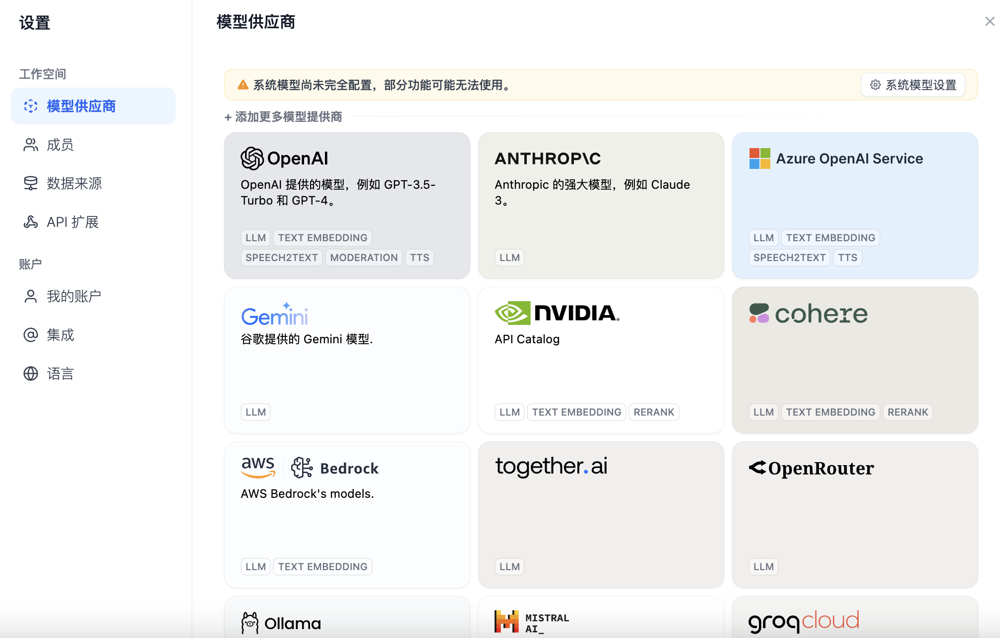

- 下拉后，找到“智谱 AI”，输入模型 API Token（也可使用其它模型）

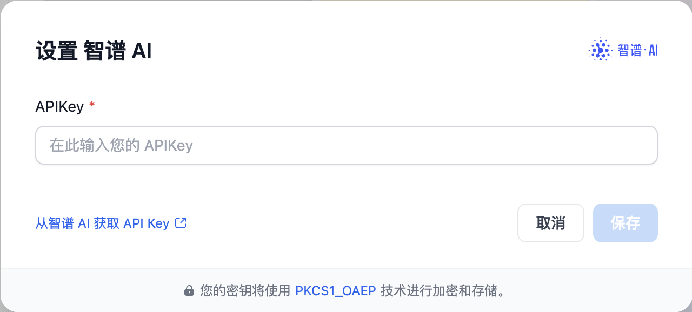

- 设置“系统模型设置”，选择 glm-4 模型作为默认。

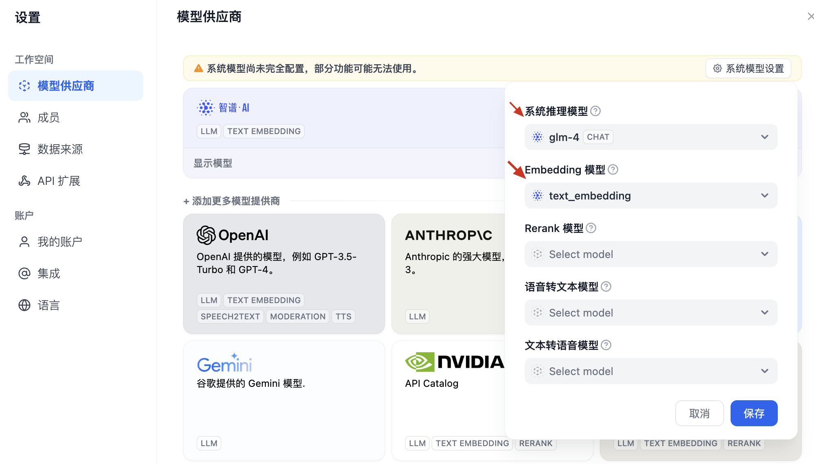

- 完成配置，模型即可在 Dify 中投入使用。

#### 2.创建“文本生成应用”

创建文本生成应用的大致步骤如下：

- 进入“工作室”tab 页，点击“创建空白应用”

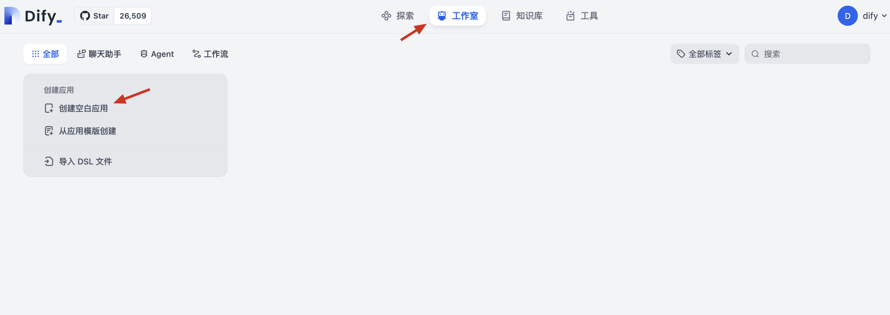

- 填写应用标题和描述：标题生成专家，擅长根据文章内容生成标题

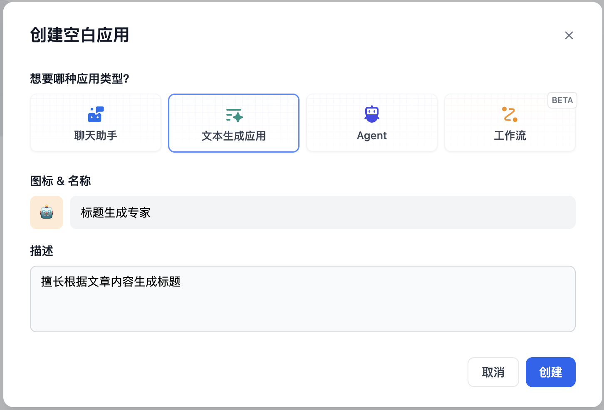

- 单击“创建”按钮，进入编辑界面：编写提示词内容，设定模型角色为“机器之心”记者，要求生成 AI 相关、20 字以内标题。

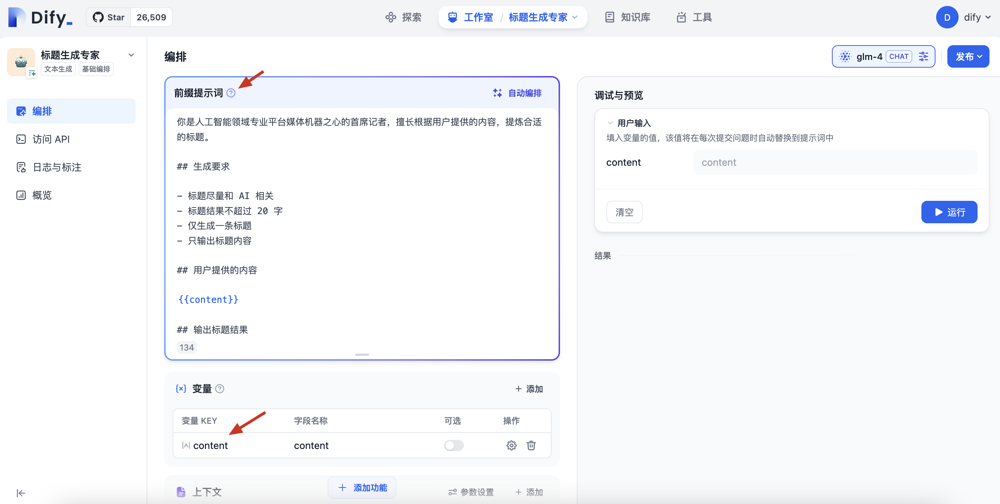

prompt 如下：

```bash
你是人工智能领域专业平台媒体机器之心的首席记者，擅长根据用户提供的内容，提炼合适的标题。
## 生成要求
- 标题尽量和AI相关
- 标题结果不超过20字
- 仅生成一条标题
- 只输出标题内容
## 用户提供的内容
{{content}}
## 输出标题结果
```

- 功能测试：选择测试内容，如“斯坦福李飞飞首次创业：学术休假两年，瞄准「空间智能」”的报道。将文章内容复制下来（链接：[https://www.jiqizhixin.com/articles/2024-05-05-4](https://www.jiqizhixin.com/articles/2024-05-05-4)）

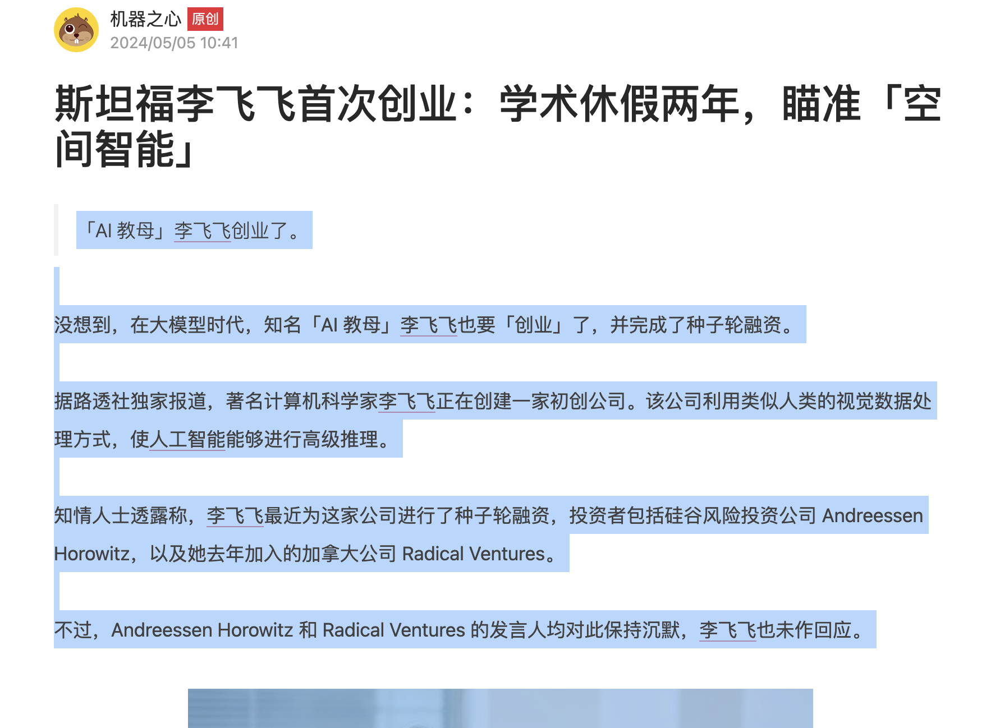

粘贴到测试窗口，点击“运行”，可以在结果栏看到生成的标题。

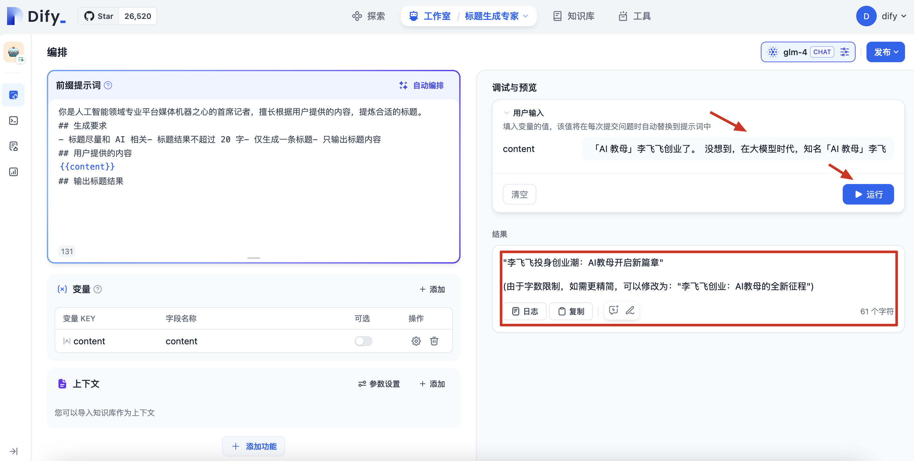

- 调试模型输出，调整 Prompt 提示词以达到最佳效果。
- 上面的输出中还有一些冗余内容，如：括号中的内容就是多余的，我们希望模型只生成标题，而不用生成解释。将 prompt 中的“只输出标题内容”要求调整到最前面，增加“无需解释”的要求后，输出标题终于正常了。

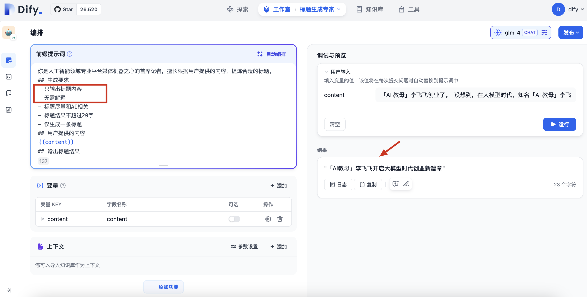

附 prompt 内容：

```bash
你是人工智能领域专业平台媒体机器之心的首席记者，擅长根据用户提供的内容，提炼合适的标题。
## 生成要求
- 只输出标题内容
- 无需解释
- 标题尽量和AI相关
- 标题结果不超过20字
- 仅生成一条标题
## 用户提供的内容
{{content}}
## 输出标题结果
```

- 测试无误，点击发布

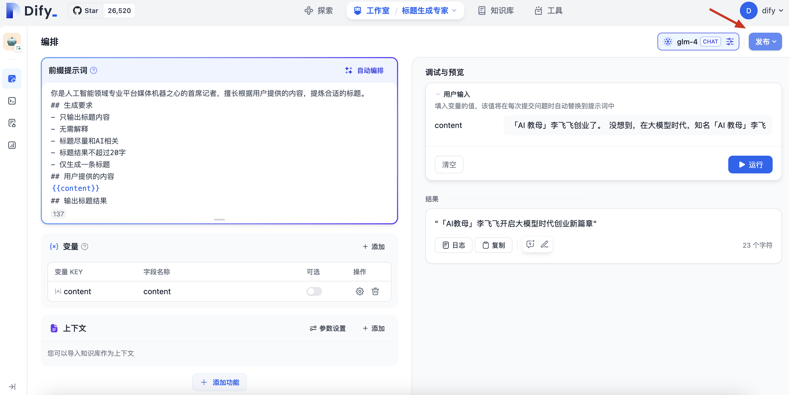

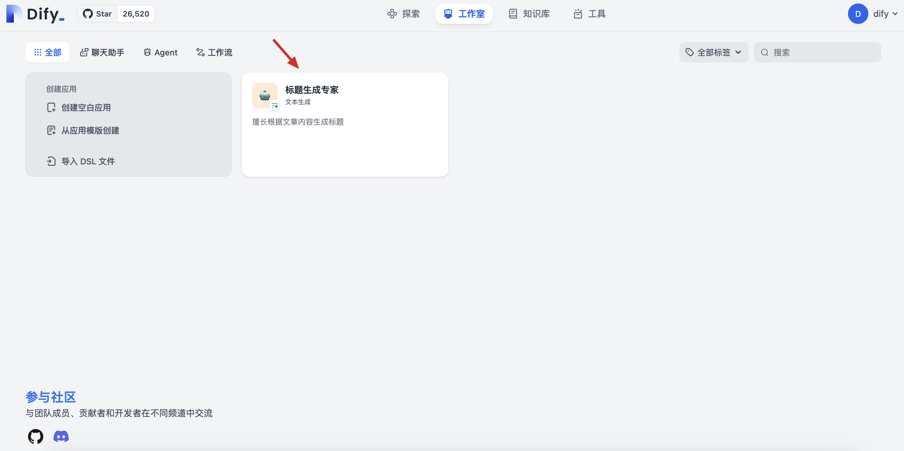

### 3.3.2 制作 WordPress 标题生成插件

#### 1.dify 侧的工作

dify 侧主要是获取 api 的访问密钥，以及熟悉其中的 API 调用方式。

- 在 Dify 的 AI 应用页面，点击“发布”后选择“访问 API”，获取 API 文档。

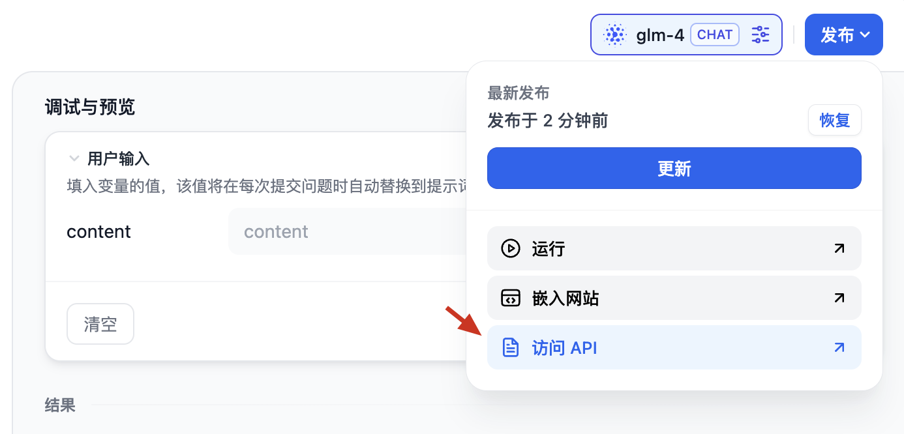

- 发送请求到模型应用，通过 `/completion-messages` 接口，传入 Prompt 中的 content。

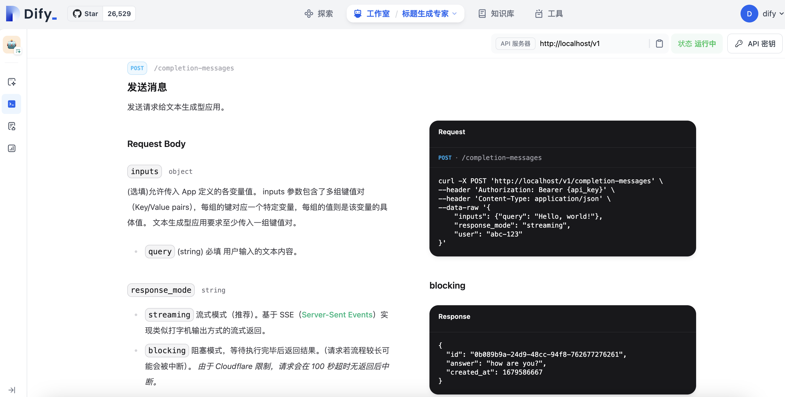

- 获取 API Key，用于调用 Dify API 的身份验证。

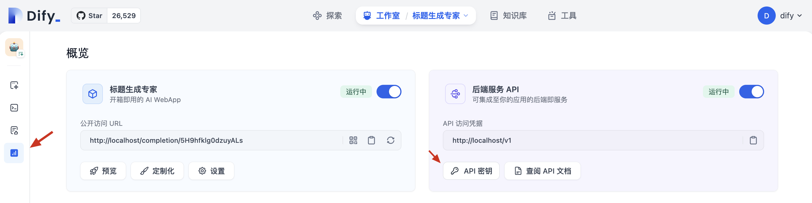

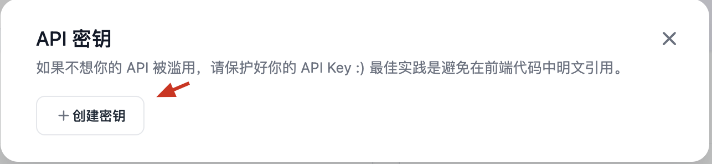

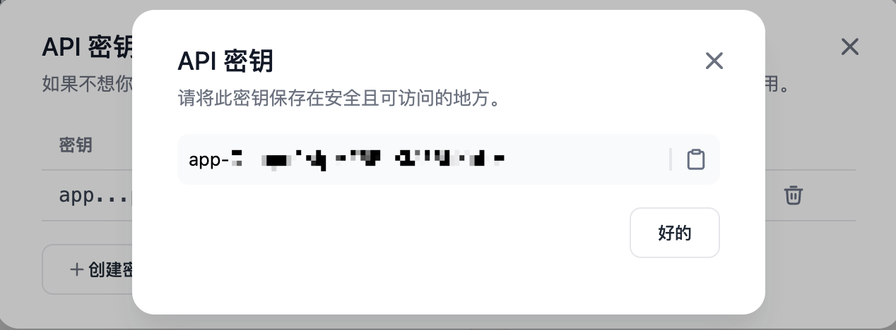

#### 2.wordpress 侧的工作

wordpress 侧的工作主要是编写和安装插件（php 文件），调用 dify api 的标题生成能力。

- 创建一个 PHP 函数 `generate_title_by_content`，传入文章内容，返回模型生成的标题。
- 以下是一个简单的 PHP 函数 `generate_title_by_content`，它接受文章内容作为参数，并返回通过 API 调用生成的标题。
- 确保将 `{api_key}` 替换为实际 API 密钥，并调整 `$content` 变量以包含希望生成标题的文章内容。

```php
function generate_title_by_content($content) {
   $api_key = '{api_key}'; _// 替换为您的实际API密钥_
   $user = 'abc-123'; _// 替换为您的用户标识_

   $ch = curl_init();
   // 本地调试用localhost，实际上传插件时地址需要改为host.docker.internal
   curl_setopt($ch, CURLOPT_URL, 'http://localhost:8082/v1/completion-messages');
   //curl_setopt($ch, CURLOPT_URL, 'http://host.docker.internal:8082/v1/completion-messages');
   curl_setopt($ch, CURLOPT_RETURNTRANSFER, true);
   curl_setopt($ch, CURLOPT_POST, true);
   curl_setopt($ch, CURLOPT_HTTPHEADER, [
       "Authorization: Bearer $api_key",
       "Content-Type: application/json",
   ]);
   curl_setopt($ch, CURLOPT_POSTFIELDS, json_encode([
       "inputs" => [
           "query" => $content,
       ],
       "response_mode" => "streaming",
       "user" => $user,
   ]));

   $response = curl_exec($ch);
   curl_close($ch);

   $data = json_decode($response, true);
   if (isset($data['answer'])) {
       return $data['answer'];
   } else {
       return "标题生成失败";
   }
}

_// 使用示例_
$content = "Hello, world!"; _// 您的文章内容_
$title = generate_title_by_content($content);
echo $title; _// 输出生成的标题_
```

- 在 WordPress 中，使用 `the_post` 钩子（[https://developer.wordpress.org/reference/hooks/the_post/](https://developer.wordpress.org/reference/hooks/the_post/)），当文章无标题时，调用该函数自动生成标题并更新数据库。

```php
// 当文章发布或更新时，如果标题为空，自动生成一个标题
add_action("the_post", "update_post_title");
function update_post_title($post)
{
    // 当标题存在，就不再生成
    if (!empty($post->post_title)) {
        return;
    }
    // 生成标题
    $post_title = generate_title_by_content($post->post_content);
    // 更新数据库中标题
    wp_update_post(["ID" => $post->ID, "post_title" => $post_title]);
    // 更新当前文章对象
    $post->post_title = $post_title;
}
```

- **完整的插件代码如下，需要放置在 WordPress 插件目录并启用（下面有详细的插件安装指引）**
- docker 环境安装的情况下：务必不要使用 http://localhost:8082 去访问 dify api，而应当使用宿主机的 IP 地址进行访问，即 http://host.docker.internal:8082（windows、mac 适用，linux 不确定；详见 3.5.3 节，搭建环境中的坑点相关内容）

```php
<?php
/*
Plugin Name: 标题生成专家
Description: 根据文章内容生成标题
Version: 1.0
Author: jackley
*/

// // 避免直接访问
// if (!defined("ABSPATH")) {
//     die();
// }

function generate_title_by_content($content) {
   $api_key = 'app-Oetcpd0AIpMFBBnKM3BbKpNV'; // 替换为您的实际API密钥
   $user = 'test'; // 替换为您的用户标识

   $ch = curl_init();
   $post_data = json_encode([
       "inputs" => [
           "content" => $content,
       ],
       "response_mode" => "blocking",
       "user" => $user,
    ]);
   // curl_setopt($ch, CURLOPT_URL, 'http://localhost:8082/v1/completion-messages');
   curl_setopt($ch, CURLOPT_URL, 'http://host.docker.internal:8082/v1/completion-messages');
   curl_setopt($ch, CURLOPT_RETURNTRANSFER, true);
   curl_setopt($ch, CURLOPT_POST, true);
   curl_setopt($ch, CURLOPT_HTTPHEADER, [
       "Authorization: Bearer $api_key",
       "Content-Type: application/json",
   ]);
   curl_setopt($ch, CURLOPT_POSTFIELDS, $post_data);

   $info = curl_getinfo($ch);
   $response = curl_exec($ch);

   if (curl_errno($ch)) { // 检查是否有CURL错误发生
      die('Curl error: ' . curl_error($ch));
   }
   curl_close($ch);

   $data = json_decode($response, true);

   if (empty($data["answer"])) {
      return "AI 生成标题失败 {$content}";
   }
   $title = $data["answer"];
   $title = str_replace('"', "", $title);

   // return $content."#".$info['url']."#".$post_data."#".$title;
   return $title;
}

// // 测试内容
// $content = "这是测试内容，用于生成标题。";

// // 调用函数并打印结果
// $title = generate_title_by_content($content);
// echo "Generated Title: " . $title;

function update_post_title($post)
{
    // 当标题存在，就不再生成
    if (!empty($post->post_title)) {
        return;
    }
    // 生成标题
    $post_title = generate_title_by_content($post->post_content);
    // 更新数据库中标题
    wp_update_post(["ID" => $post->ID, "post_title" => $post_title]);
    // 更新当前文章对象
    $post->post_title = $post_title;
}

// 当文章发布或更新时，如果标题为空，自动生成一个标题
add_action("the_post", "update_post_title");
?>
```

将 `title-generate.php` 安装为 wordpress 插件，可按照以下步骤操作：

- 本地编辑和保存 `title-generate.php` 文件。
- 将 `title-generate.php` 压缩为 zip 文件：`title-generate.php.zip`，因为 wordpress 插件只支持 zip 文件
- wordpress 插件页面，点击添加插件按钮

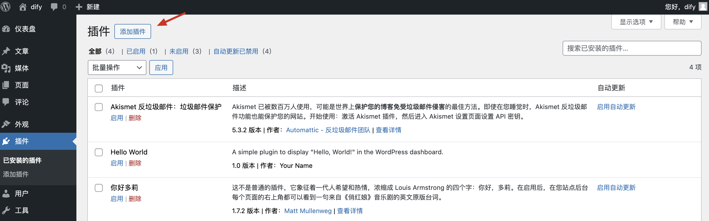

- 点击上传插件

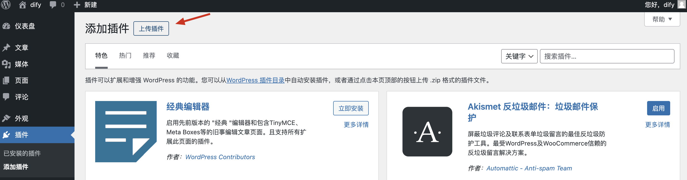

- 选择文件，上传刚刚生成的.zip 文件

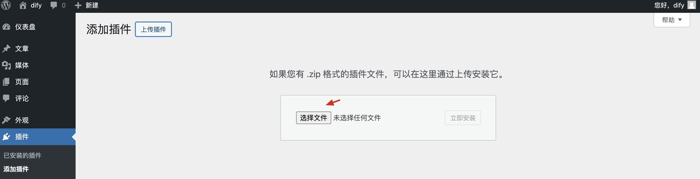

- 启用插件；回到已安装的插件页面，启用插件，即完成插件安装

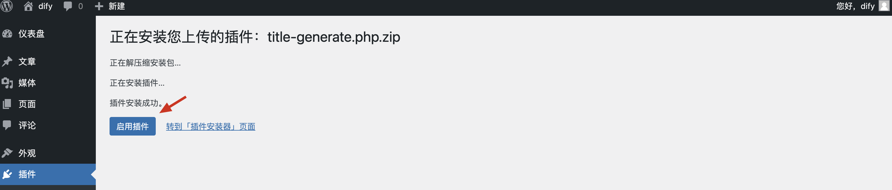

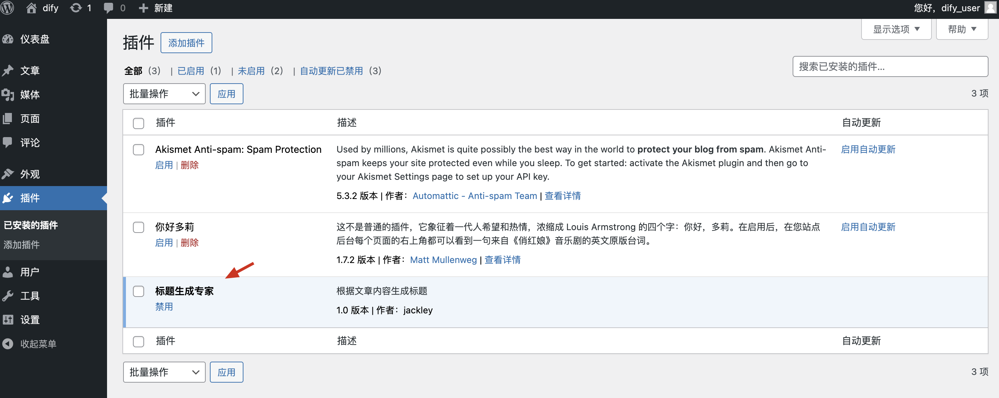

#### 3.测试 wordpress with dify

使用机器之心文章作为标题生成素材，选择另一篇文章复制内容。（比如：[https://www.jiqizhixin.com/articles/2024-05-06-8](https://www.jiqizhixin.com/articles/2024-05-06-8)）


在 WordPress 中新建文章，粘贴复制的文章内容，留空标题区域。

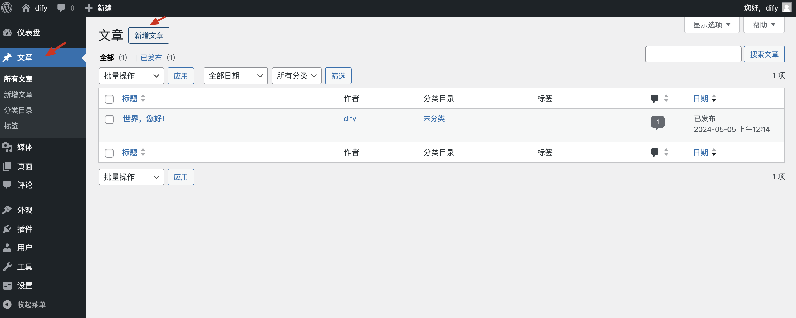

文章内容粘贴进去，标题部分留空。

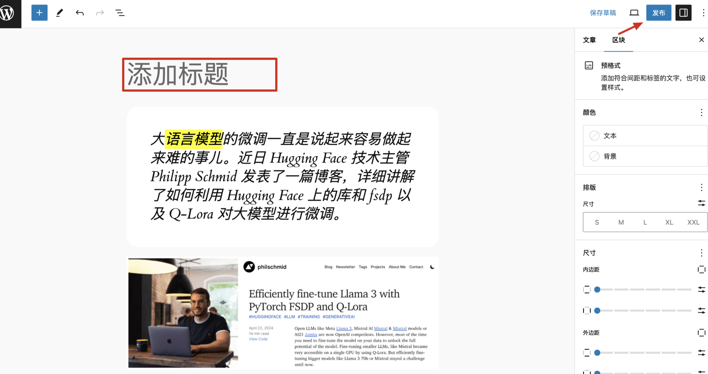

点击发布后，WordPress 将使用 Dify AI 生成标题，发送文章内容到 Dify api，返回的标题会自动填充到标题栏位；如需更新标题生成的风格，只需修改 dify 中的提示词即可。

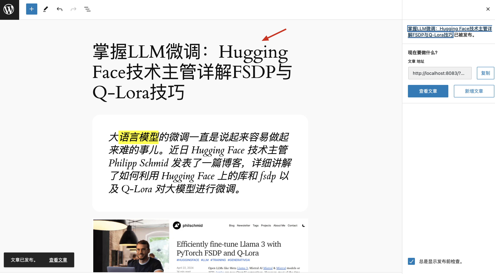
