## 5.2 Dify工作流的实现方式

在前面我们已经提到了 Agent 相关概念是如何构建的，自 Agent = LLMS + Memory + Planning + Tools 的概念诞生起，就有无数的学者与开发者们投身不断优化这些模块，其中 Planning 模块备受关注

Planing 模块意味着对 agent 问题的思考方式与求解路径，一个好的规划路径对与任务的实现作用是显而易见的，在如何让 LLM 自主导向最佳 planning 路线的的方案有很多（COT，TOT，GOT，Table of thought，code of thought），对于希望实现 AGI 通用人工智能目标的追求者来说，增强 LLM 自主规划的能力必不可少，但仅目前而言，对于开发者们更稳妥的方案是选择一套人工可控的路线，方便调试与修改，而 workflow 就是 Dify 给出的解决方案 


Dify workflow 的实现效果如上，开发者们能够清晰地看到 Agent 如何工作，最后与人类交互

接下来，我们来探索一下 Dify workflow 的具体细节

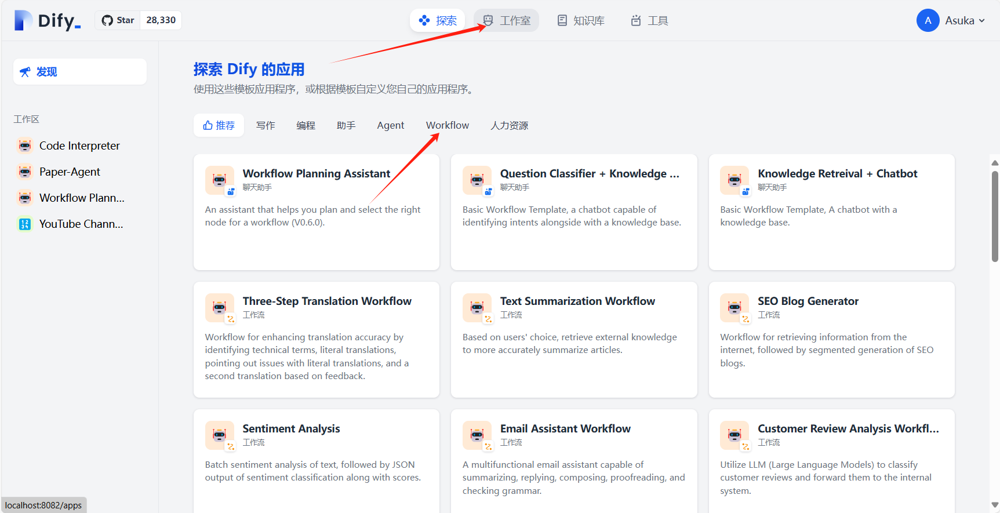

打开 Dify 推荐中已经给出了一些 workflow 示例项目，你可以随时查看这些示例项目

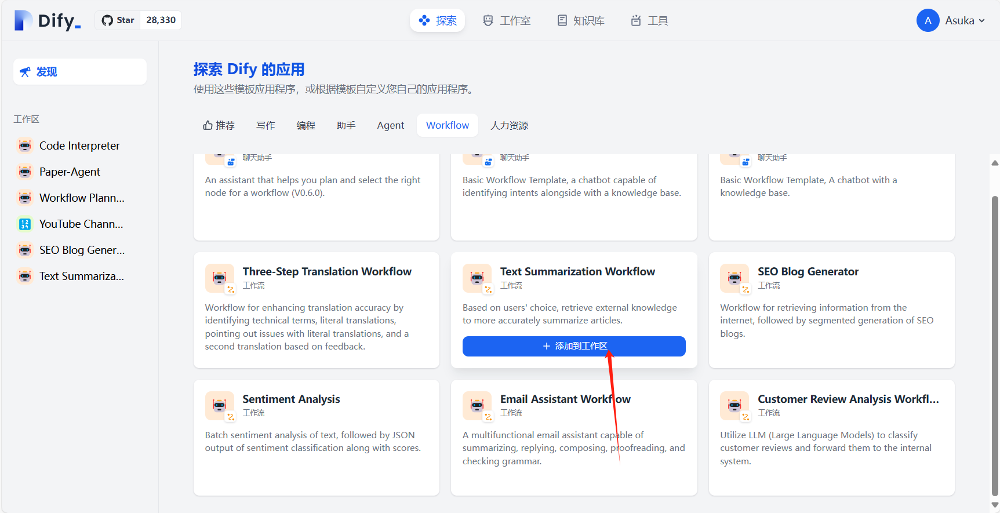

我们来看看其中一个示例项目 Text Summarization Workflow ，这是一个帮助用户总结文本的 workflow ，能够根据用户的选择，检索外部知识，更准确地总结文章。

添加至工作区后打开，就能看到 Dify workflow 画布

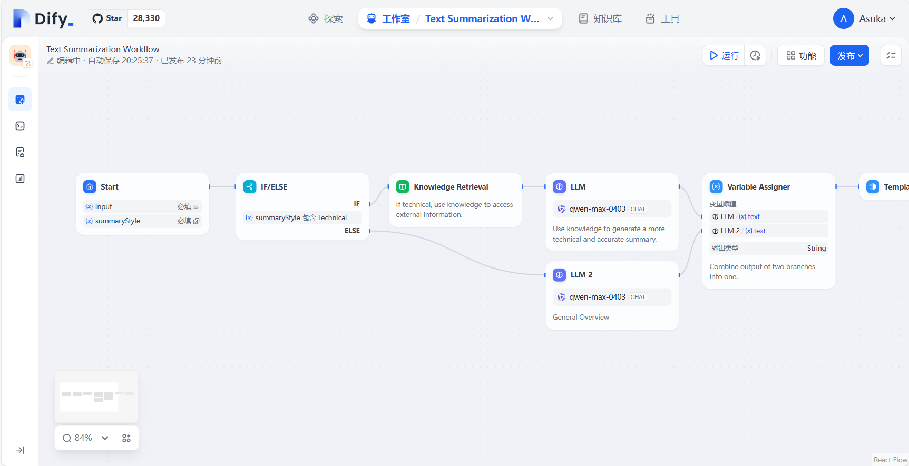

Workflow 的核心是直观的拖放界面。你可以通过连接画布上的不同节点来构建工作流程。、

Dify提供了一些关键节点包括：

LLM：通过定义的输入和输出将大型语言模型的功能封装在节点内。

工具：利用内置和自定义工具来扩展您的工作流程可以实现的目标。

问题分类器：自动对用户输入进行分类以路由对话和流程，由 LLM 提供支持。

知识检索：为 LLM 提供现有知识库的外部背景。

代码：执行自定义 Python 或 Node.js 代码。

If/Else 块：定义条件逻辑以创建分支工作流程。

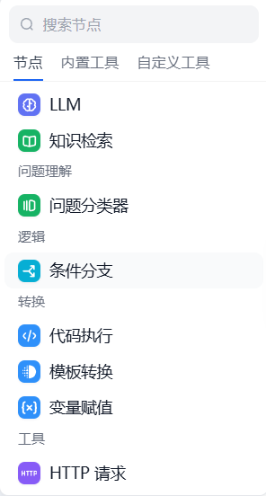

此外，workflow 中还有更多内置的节点与工具，你可以将节点看作workflow 对流入此处的数据究竟做什么处理的操作，工具也是同理，当然，workflow 也支持自定义工具来引入你自己的操作

需要注意的是，workflow 仅支持单条的数据流动，数据像一条河流，但对于分支其只能流向一条分支

接下来我们通过 Text Summarization Workflow 这个项目来向大家介绍一些基本节点的使用方法与如何编排一个好的 workflow 的基本思想

Text Summarization Workflow 的内容其实相当简单，用户提供输入与总结类型（Technical Summary OR General Overview）当类型为 Technical Summary 时，就先从提供的知识库中检索相关信息，接着交给大模型进行总结来，当类型为 General Overview 时，我们直接与大模型进行交互，让其总结我们想要的信息

我们来看这个项目的具体组成

概览图如下：

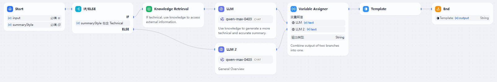

一个 workflow 的起始为 Start 节点，点击 Start 节点就可配置
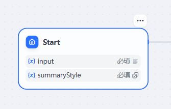

在 Start 节点中，可以配置该 workflow 启动时必须或有帮助的信息

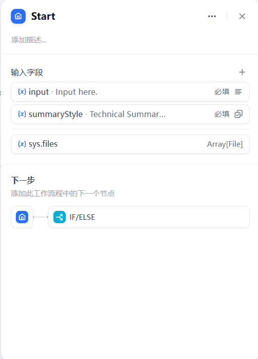

Start 节点提供了多种类型的起始信息可选

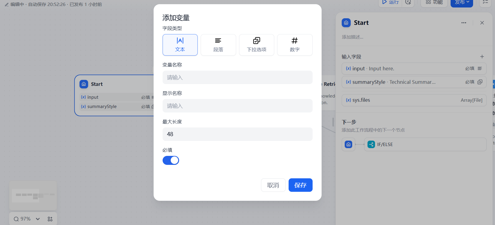

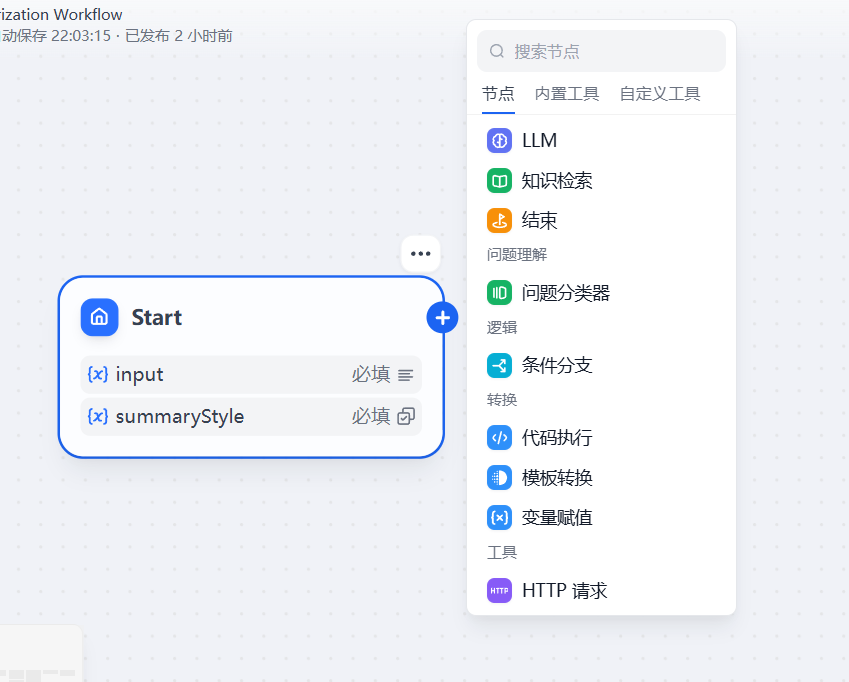

配置完Start节点后，我们就可以设定他的下游节点，workflow 将按顺序执行下去，点击节点末尾的加号就可以添加后续节点

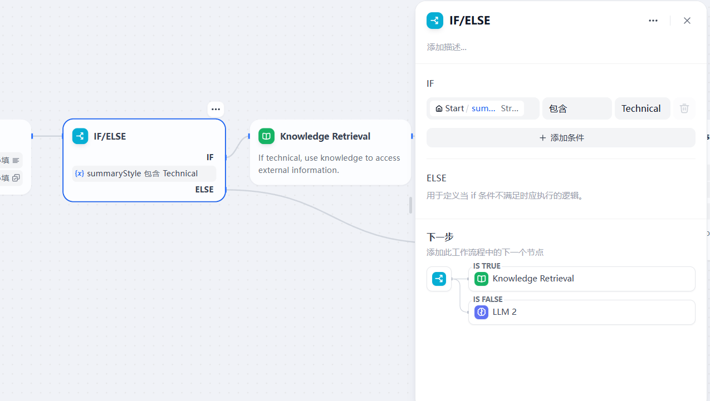

这里我们插入一个 if/else 节点，这个节点中我们可以配置具体的条件已经对应的不同的下游，对于 General Overview 任务，下游就将直接与 LLM 交互，对于 Technical Summary 任务，我们的下游就导向关联的知识库。

配置知识库非常简单，只需要设定好需要查询的变量（这里就是用户提供的 input ）接着设定好需要关联的知识库确定好，当运行至该节点时将自动发起相关的检索，检索完成后，模型将会将检索内容整理并传递给下游节点，同时支持多种检索策略


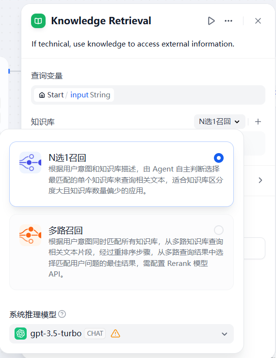

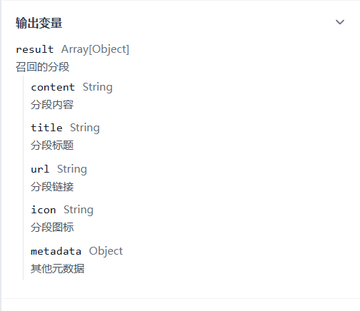

同时点击知识库中的运行按钮，我们就能调试当前知识库的具体效果

配置 LLM 的过程也很简单

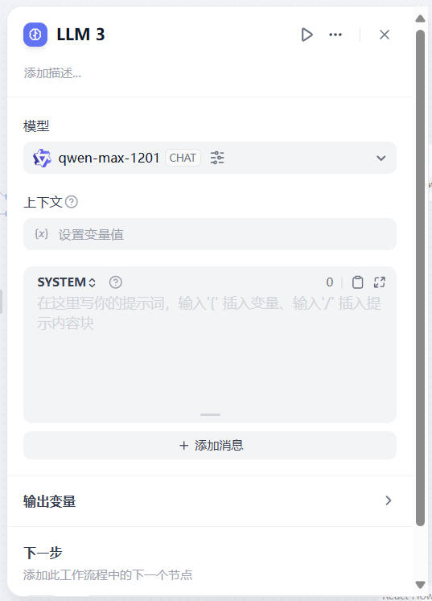

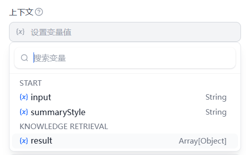


LLM 节点由模型上下文以及发给模型的消息组成，在模型中选择我们想要的 model ，接着选择上下文（即继承自上游节点的信息），在后面我们要发送给模型的信息中就可以引用该上下文

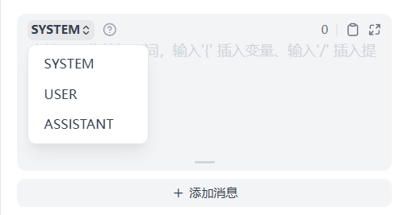

接着我们编辑发送给LLM的具体信息，这里的用法基本与正常使用各模型厂商的api信息格式一致

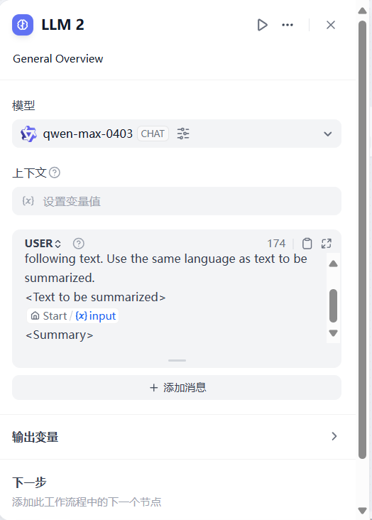

这里我们用 User 的身份向 LLM 传递我们具体的需求，在提示词模板中可以随时引用前面设定的各种变量

```
<Task>
Do a general overview style summary to the following text. Use the same language as text to be summarized. 
<Text to be summarized>
{{#1711526002155.input#}} (这里为起始消息中的input变量)
<Summary>
```

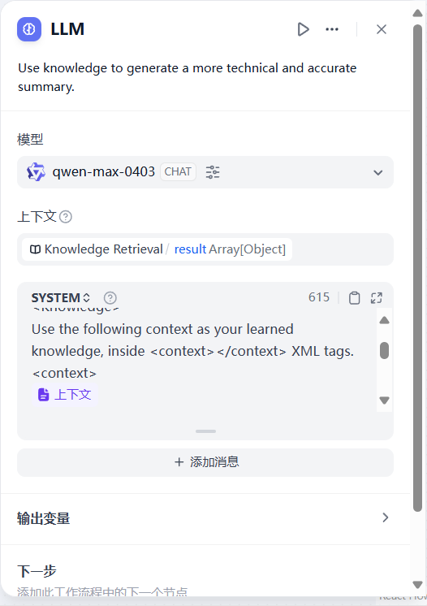

同时我们不仅能将变量嵌入提示词模板中，对于 RAG 返回的结果，我们可以将其设定为上下文，这样就能将检索结果嵌入提示词模板中

```
<Task>
With reference to result o//f knowledge retrieval. Do a technical summary to the following text. Use the same language as text to be summarized. 
<Knowledge>
Use the following context as your learned knowledge, inside <context></context> XML tags.
<context>
{{#context#}} (此处即为 RAG 上下文)
</context>
When answer to user:
- If you don't know, just say that you don't know.
- If you don't know when you are not sure, ask for clarification.
Avoid mentioning that you obtained the information from the context.
And answer according to the language of the user's question.
<Text to be summarized>
{{#1711526002155.input#}}
<Summary>
```

LLM 完成总结任务，我们需要将两种不同分支的结果进行汇总（或者分别单独处理也是可行的，这里我们仅讲解汇总处理）

我们使用 Variable Assigner 变量赋值节点来完成这个任务

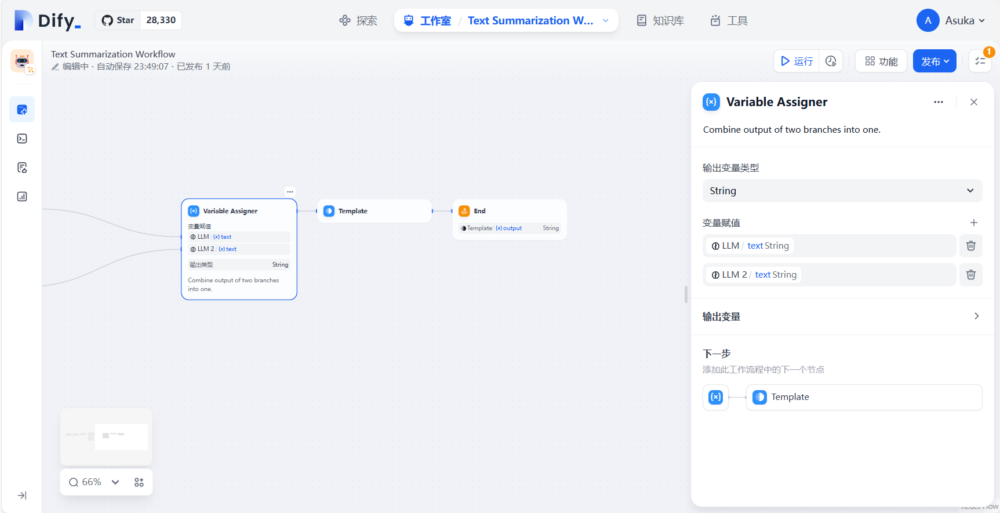

变量赋值节点允许将不同分支中的变量指派给同一个变量，以实现后置节点统一配置，因为 Dify 的信息实际上只能单支流动（即只有一条分支上有有效信息），因此，这里实际上在做的就是保留有实际意义的输出（也就是不为空），将其传递给下游节点

接着我们使用 jinjia2 来将输出整理为我们想要的格式

Jinja2 是一个流行的 Python 模板引擎，用于生成动态的文本内容，通常用于构建 Web 应用程序中的 HTML 页面。它是 Flask 框架的默认模板引擎，也被其他框架广泛采用。

Jinja2 支持模板继承、条件语句、循环、过滤器等功能，使得在模板中嵌入动态内容变得非常方便。模板中可以包含占位符和标签，这些占位符会在渲染模板时被替换为真实的数据。Jinja2 语法灵活，易于学习和使用。

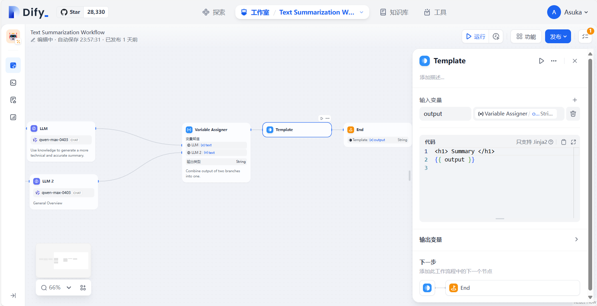

这里用一个很简单的模板，即`<h1>`标签包裹返回

最后使用 End 结束节点作为 workflow 的终点，在 End 节点中设置上一步模板化后的输出结果作为最终输出，至此 Text Summarization Workflow 的全流程就到此结束

当然还有一些节点在这个案例中并未涉及，下面是这些节点各自的作用

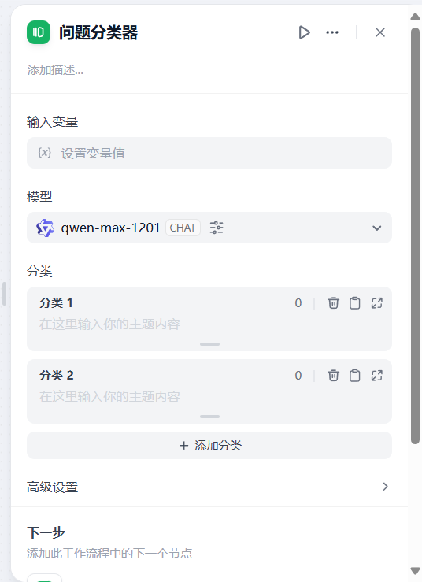

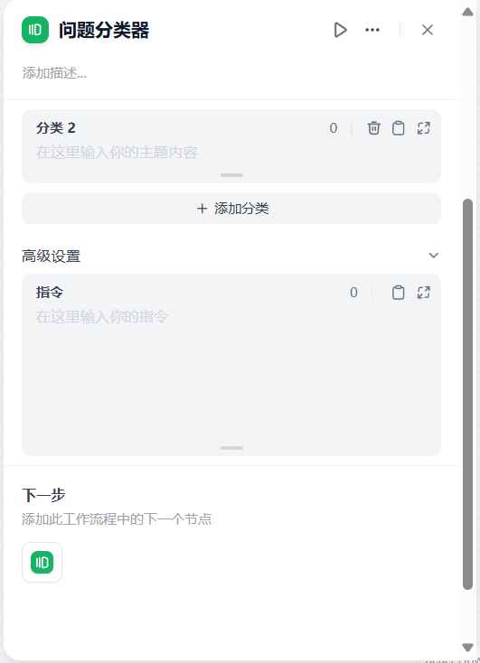

问题分类器，通过大语言模型，将根据输入变量与设定好的分类情况，将信息选择性地导向设定的分类所指向的分支，此外可以自行配置分类时大模型接收的指令内容

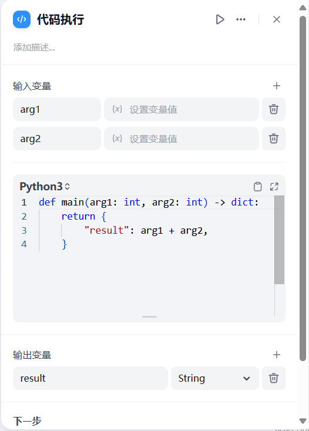

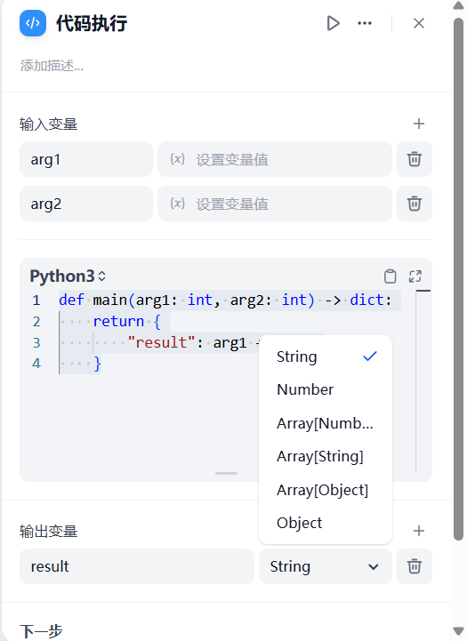

代码执行，允许将 workflow 中的变量传入设定的代码中，经过处理返回各种形式的数据

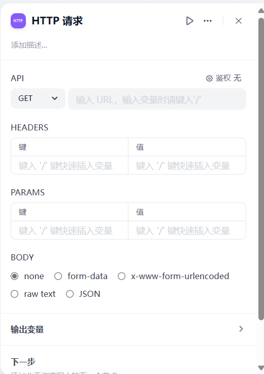

HTTP请求，该节点允许发起一个HTTP请求，获取网站提供的信息，我们将在后面的学习中再次熟悉该节点的相关内容。