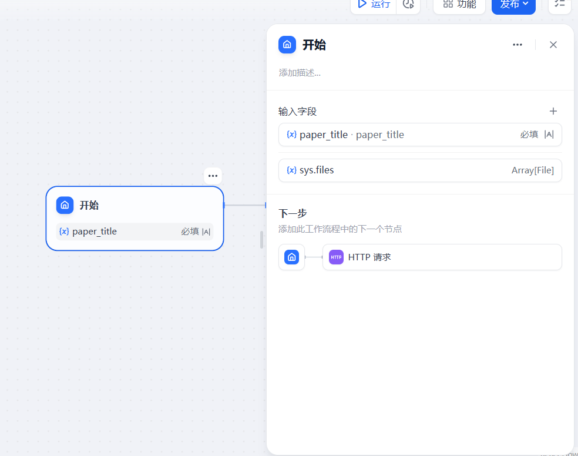
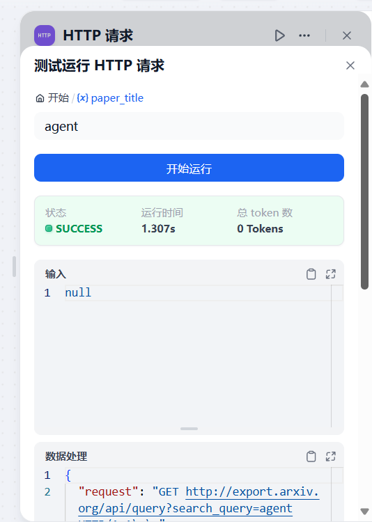
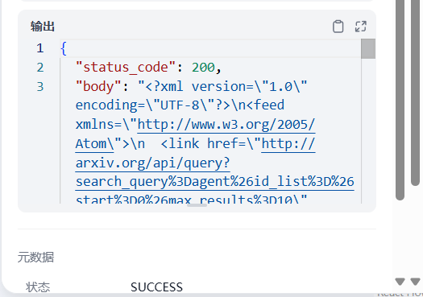
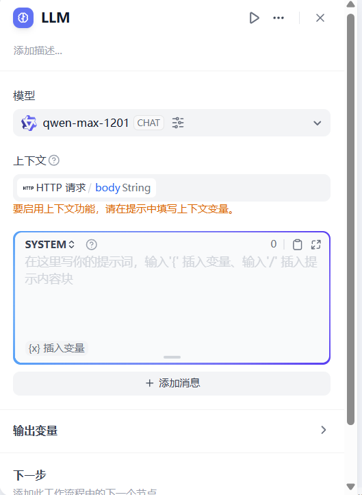
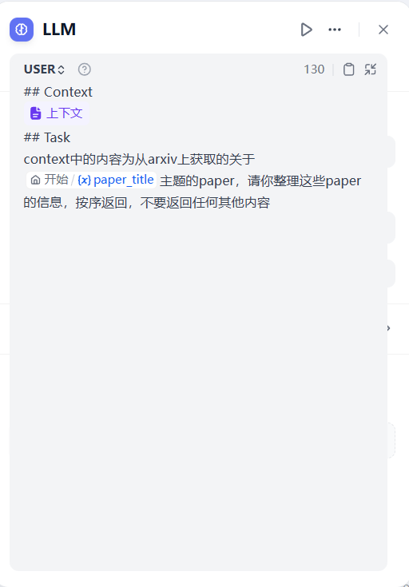
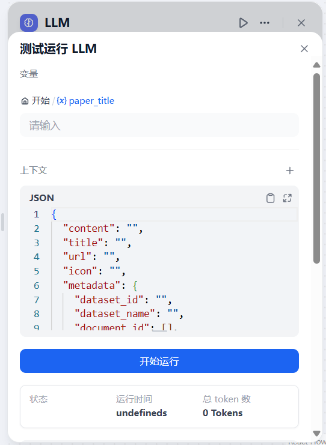
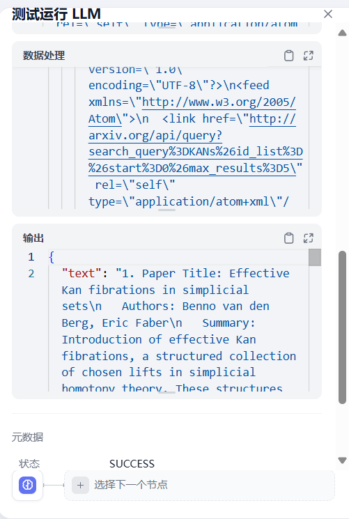
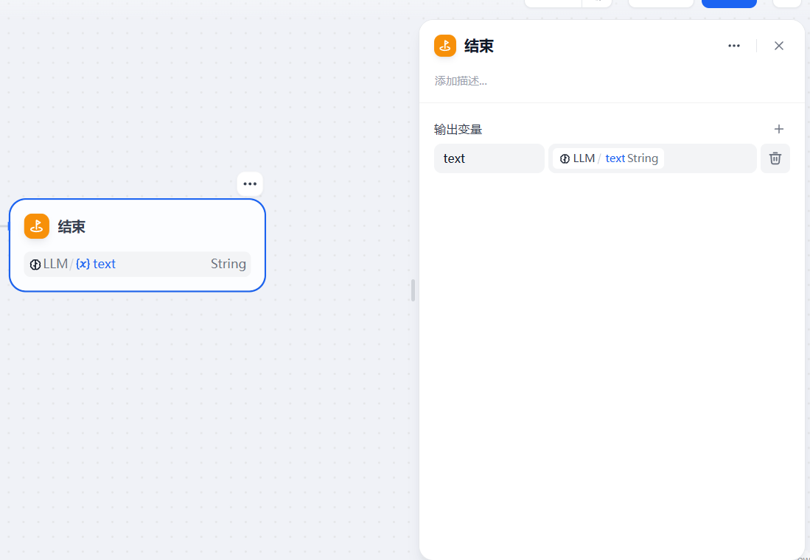
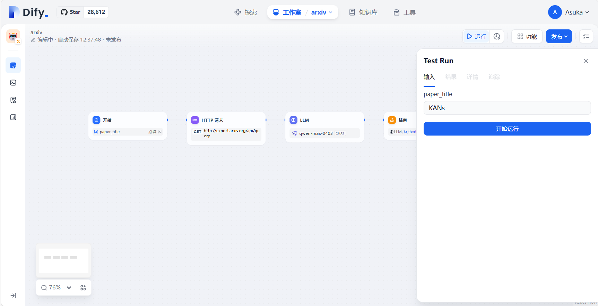
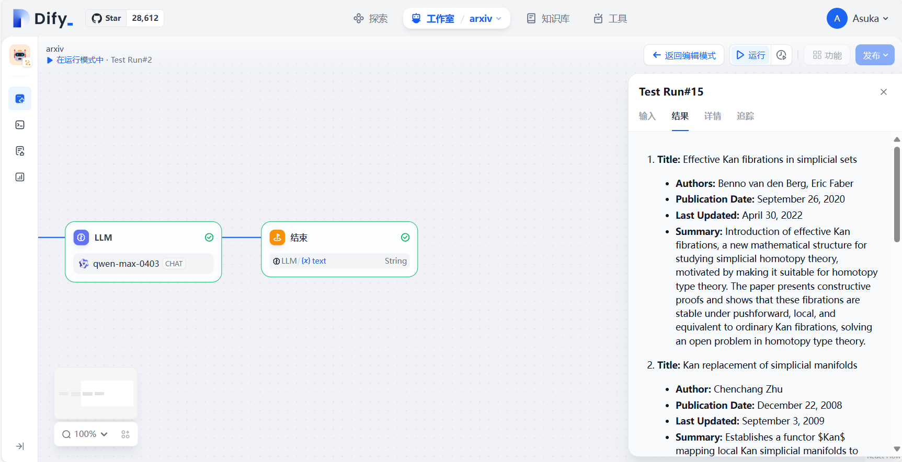

## 5.3 Dify 实现一个论文抓取工作流

在了解完 Agent 和工具概念以及 workflow 中给出的解决方案后，现在我们可以试着来写一套我们自己的解决方案了

接下来让我们来实现一个小小的 workflow ，这个 workflow 的要求是，能够根据用户提供的关键字，爬取相关的 paper 并返回给我们

在开始具体操作之前，我们来分解一下这个需求

首先我们需要一个起始消息，这个 workflow 必须要指定需要爬取的论文的相关信息（标题/领域），爬取的过程我们可以通过HTTP 组件来完成，接着拿到论文信息后，我们将内容整理并最终返回

所以我们可以将整个流程拆解为 Start -> HTTP -> LLM -> END 这样的一套流程



在 Start 节点中我们配置一个必填字段 paper_title，启动 workflow 前必须声明该变量，在下一步 HTTP 请求中将会使用该变量


接着创建一个HTTP节点，这里我们需要按照 arxiv api 的格式组装我们的 HTTP 请求，关于 arxiv api 的相关信息，大家可以查看他们的官方文档 https://info.arxiv.org/help/api/basics.html

调用的格式如下
```
http://export.arxiv.org/api/{method_name}?{parameters}
```

这里我们向 http://export.arxiv.org/api/query 即 arxiv 搜索 api 发起请求，我们将 search_query 参数设置为上文设置的变量，接着我们就可以调试这个 HTTP 请求


点击运行键，为 paper_title 赋一个测试值，点击开始运行后我们就能开始测试我们写好的请求是否有效



可以看到我这里关于 agent paper的 query 请求已经成功了！



为了节省token

获取的数据内容可以在下面查看

接着我们就到数据处理部分，因为是从网页上爬取的数据，所以没法直接反馈给人，我们可以通过代码或 jinjia 引擎去清洗，当然有了 LLM 这些工作就交给他吧，LLM 不仅能完成清洗，也能帮助我们完成翻译与内容精简



在后续我们添加一个 LLM 节点，配置好模型后，我们将上一步 HTTP 拿到的请求 body 部分，也就是信息主体作为上下文，在提示词中我们就可以嵌入这个上下文信息了

这里因为 agent 主题请求到的 paper 生成的内容触发了 qwen 的审查机制？ 所以无法正常返回结果，我们更换主题为 KANs 即最近大火的新的架构



嵌入上下文后，我们写好对应的提示词，接着调试这个 LLM 节点



调试时需要我们手动指定上下文与相关变量，填好后测试



成功拿到输出，接着送给END节点输出即可





接下来点击右上角运行，设定好起始消息，点击开始运行！



顺利拿到输出~

关于论文抓取的部分就到这里，事实上这个 workflow 依然存在许多可以优化的地方，比如更高效的爬虫，如何减少送给大模型的 token 数量来节省费用？欢迎大家继续思考