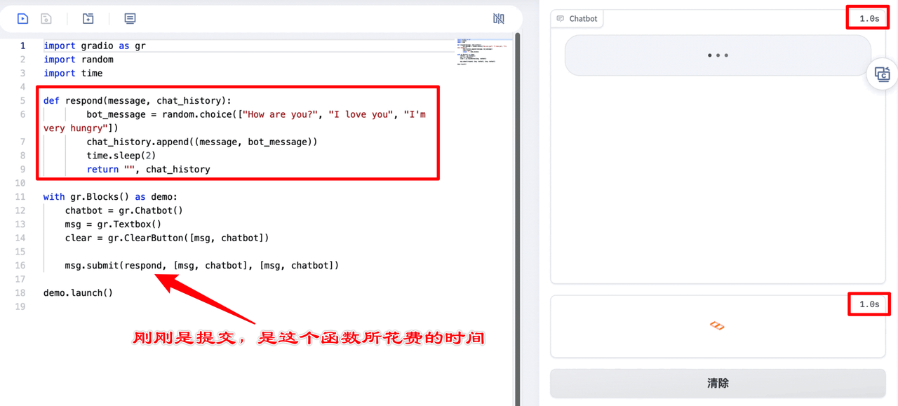
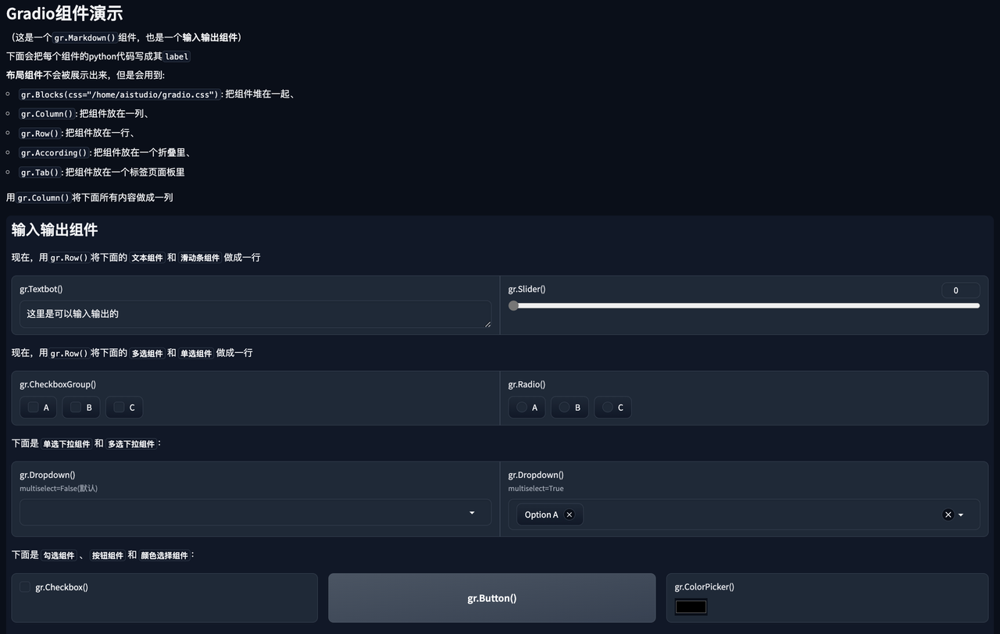

# 6.1 [Graio](https://www.gradio.app/) 介绍 @Amy

## 6.1.1 [Graio](https://www.gradio.app/) 是什么

[Graio](https://www.gradio.app/) 是开源的Python库，可用来快速构建交互式应用。
​基于[Graio](https://www.gradio.app/) ，开发者通过简单的代码和组件布局，无需精通HTML、CSS或JavaScript，就能快速搭建起一个可视化的界面。

[Graio](https://www.gradio.app/) 可以包装几乎任何 Python 函数为易于使用的用户界面，还可以查看运行相关函数从输入到输出所花费的时间。



## 6.1.2 为什么要用[Graio](https://www.gradio.app/)？

Gradio可以用于构建各种类型的应用程序，包括但不限于：

- 数据可视化
- 机器学习模型演示
- 用户界面设计工具
- 交互式数据处理

一般来说，小程序、App、企业微信、订阅号服务等还有一定的开发及审核门槛，且需要学习较多的前端甚至UI设计相关的知识，需要具有一定的专业度和人力投入。

因此我们在快速验证功能和设计demo时，往往较优的选择是直接通过 [Graio](https://www.gradio.app/) 快捷开发可交互的demo。

通过 `pip install gradio` 即可快速安装[Graio](https://www.gradio.app/) 库，通过 `gradio xxx.py` 命令运行文件，可实现热更新（即改变代码后，无需重新运行该命令，只需刷新界面即可更新），效果如下图所示：

（图片待制作）

## 6.1.3 Gradio基本要素

要基于 [Graio](https://www.gradio.app/) 开发应用，必须了解 [Graio](https://www.gradio.app/) 有输入输出组件、控制组件、布局组件几个基础模块，其中
- 输入输出组件用于展示内容和获取内容，如：`Textbox`文本、`Image`图像
- 布局组件用于更好地规划组件的布局，如：`Column`（把组件放成一列）、`Row`（把组件放成一行）
- 控制组件用于直接调用函数，无法作为输入输出使用，如：`Button`（按钮）、`ClearButton`（清除按钮）

[Graio](https://www.gradio.app/) 的设计哲学是将输入和输出组件与布局组件分开。输入组件（如`Textbox`、`Slider`等）用于接收用户输入，输出组件（如`Label`、`Image`等）用于显示函数的输出结果。而布局组件（如`Tabs`、`Columns`、`Row`等）则用于组织和排列这些输入和输出组件，以创建结构化的用户界面。

大部分输入输出组件都有以下三个参数：
- `fn`：绑定的函数，输入
- `inputs`：输入组件变量名列表，（例如：`[msg, chatbot]`）
- `ouputs`：输出组件变量名列表，（例如：`[msg, chatbot]`）
- 另外不同的 输入输出组件、控制组件 有不同动作可响应（对应一些.方法，如下面的`msg.submit()`）

## 6.1.4 示例
一个简单的代码示例如下：

```python
# 导入gradio、random、time库，他们的功能大致如名字所示
import gradio as gr # 通过as指定gradio库的别名为gr
import random
import time

# 自定义函数，功能是随机选返回指定语句，并与用户输入的message一起组织为聊天记录的格式返回
def respond(message, chat_history):
        # 在How are you 等语句里随机挑一个返回，放到bot_message 变量里
        bot_message = random.choice(["How are you?", "I love you", "I'm very hungry"])
        # 添加到 chat_history 变量里
        chat_history.append((message, bot_message))
        # 暂定2s
        time.sleep(2)
        # 返回 空字符，chat_history 变量
        return "", chat_history

# gr.Blocks()：布局组件，创建并给了他一个名字叫demo
with gr.Blocks() as demo:
    # gr.Chatbot()：输入输出组件，用于展示对话效果
    chatbot = gr.Chatbot()
    # gr.Textbox()：输入输出组件，用于展示文字
    msg = gr.Textbox()
    # gr.ClearButton：控制组件，用于清空输入输出组件
    clear = gr.ClearButton([msg, chatbot])

    # 定义gr.Textbox()文字组件msg的submit动作(回车提交)效果，执行函数为respond, 第一个[msg, chatbot]是输入，第二个[msg, chatbot]是输出
    msg.submit(fn=respond, inputs=[msg, chatbot], outputs=[msg, chatbot])

# 运行demo
demo.launch()
```

更多的组件效果查看，可见 [飞桨部署项目：Gradio组件演示](https://aistudio.baidu.com/application/detail/30723)（并不是全部），全量组件相关信息可在 [官方文档](https://www.gradio.app/guides/quickstart) 中查看，另外，如果想设计更复杂的界面风格，还可以查看学习 [官方文档：主题](https://www.gradio.app/guides/theming-guide)

