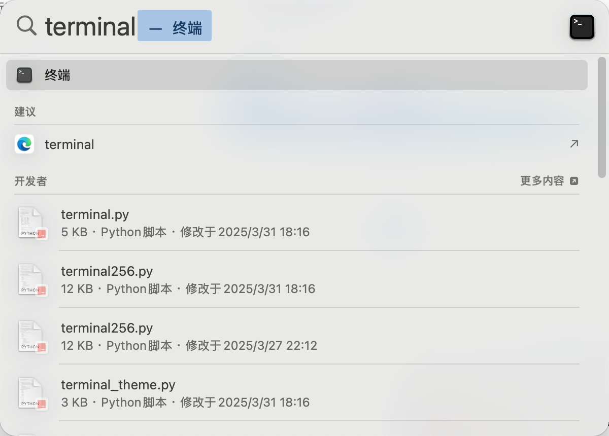

# 1. Dify 本地部署 @ 伟鸿 P0

# 零、下载 Docker 安装包

> [!TIP]
> 按需下载就好了~

Mac Apple 芯片：

Mac Intel 芯片

Windws 安装包

# 一、安装 docker

## 安装 docker @Mac

> [!TIP]
> 下载完成后直接安装即可


## 安装 Docker @Windows

### 启动 Hyper-V

> [!TIP]

1. 打开 **控制面版 -> 程序 -> 程序和功能**
2. 访问 **程序和功能** 子菜单 **启动或关闭 Windows 功能**
3. 选择“**Hyper-V**"
4. 点击“确定”
5. 重启


> [!TIP]
> !!!fold!!! 如果没有 Hyper-V
> 详见这篇材料：[https://zhuanlan.zhihu.com/p/586751199](https://zhuanlan.zhihu.com/p/586751199)
> 可以查询一下电脑是否已经开启虚拟化

### 安装 docker 桌面版

> [!TIP]
> 直接双击打开安装包进行安装即可，具体安装过程略
> ⚠️：注意不要修改安装目录

**安装过程中出现提示“无法与服务器建立连接”时，可以手动下载安装 wsl：**

_基于 x64 架构的 Windows 系统，下载 __wsl.2.4.13.0.x64.msi_
_基于 ARM64 架构，需下载 __wsl.2.4.13.0.arm64.msi_

# 二、启动 Docker

## 启动 Docker

> [!TIP]
> 直接 双击/单击 启动 docker 即可

Windows 电脑：直接在桌面、 双击 启动 docker 即可

**Mac 电脑：**⌘+ 空格，搜索“docker”，打开使用


## Docker 换源

> 复制这段代码：
>
> ```
> "registry-mirrors": [
> "https://docker.1ms.run",
> "https://docker.xuanyuan.me"
> ]
> ```


# 三、Dify本地docker部署

## 4.1 下载Dify

>[!TIP] 
>直接下载下面的文件、然后解压 就好了


## 4.2 启动终端 @Windows

1️⃣ 打开 dify文件夹 -> docker 文件夹


2️⃣ 按下shift按键点击右键，在此处打开powershell


## 4.2 启动终端 @Mac

⌘+空格，搜索terminal，打开终端开始使用




获取dify解压的路径，cd 进入dify目录-> docker目录

> ```
> cd dify的路径
> cd docker
> ```


## 4.3 部署 Dify

在终端中执行如下命令、进行部署

```bash
cp .env.example .env
    docker compose up -d # 第一次会先拉取镜像，所以可能会有点久，可以不加-d，查看日志信息
```


---

# 四、打开 Dify！

> [!TIP]
> 打开 http://localhost/install 即可看到 dify 页面
> 恭喜你已经完成了 Dify 部署！


---

# 其他补充说明

> [!TIP]
> !!!fold!!! 关闭本地部署的 dify
> `docker compose down`


> [!TIP]
> !!!fold!!! **.env 文件说明（无特殊需求，保持默认配置即可）**

### **文件概览**

#### **核心模块与可配置项**

- **向量数据库服务（Vector Database Services）**：根据所使用的向量数据库类型（由 VECTOR_STORE 指定），用户可以设置相应的访问端点、端口和认证信息。
- **存储服务（Storage Services）**：根据存储类型（由 STORAGE_TYPE 指定），用户可以配置 S3、Azure Blob、Google Storage 等服务的相关参数。
- **API 与 Web 服务（API and Web Services）**：用户可以定义 API 接口和前端 Web 应用的访问 URL 及相关设置。

#### **其他重要变量**

.env.example 是 Docker 环境中提供的示例配置文件，内容丰富，涵盖了应用和服务的广泛配置选项。它被分为多个部分，以下是一些关键部分和变量说明：

1. **通用变量（Common Variables）**：
   - CONSOLE_API_URL、SERVICE_API_URL：不同 API 服务的访问地址。
   - APP_WEB_URL：前端应用访问地址。
   - FILES_URL：文件下载与预览的基础 URL。
2. **服务器配置（Server Configuration）**：
   - LOG_LEVEL、DEBUG、FLASK_DEBUG：日志记录与调试相关设置。
   - SECRET_KEY：用于加密会话 cookie 及其他敏感数据的密钥。
3. **数据库配置（Database Configuration）**：
   - DB_USERNAME、DB_PASSWORD、DB_HOST、DB_PORT、DB_DATABASE：PostgreSQL 数据库的连接信息。
4. **Redis 配置（Redis Configuration）**：
   - REDIS_HOST、REDIS_PORT、REDIS_PASSWORD：Redis 服务的连接信息。
5. **Celery 配置（Celery Configuration）**：
   - CELERY_BROKER_URL：Celery 消息队列的连接配置。
6. **文件存储配置（Storage Configuration）**：
   - STORAGE_TYPE、S3_BUCKET_NAME、AZURE_BLOB_ACCOUNT_NAME：本地、S3、Azure Blob 等文件存储服务的相关配置。
7. **向量数据库配置（Vector Database Configuration）**：
   - VECTOR_STORE：向量数据库的类型（如 weaviate、milvus）。
   - 针对不同数据库的专用设置，如 WEAVIATE_ENDPOINT、MILVUS_URI 等。
8. **跨域资源共享配置（CORS Configuration）**：
   - WEB_API_CORS_ALLOW_ORIGINS、CONSOLE_CORS_ALLOW_ORIGINS：跨域资源共享的允许来源设置。
9. **OpenTelemetry 配置（OpenTelemetry Configuration）**：
   - ENABLE_OTEL：是否启用 OpenTelemetry 数据采集。
   - OTLP_BASE_ENDPOINT：OTLP 导出器的接收端点。
10. **其他服务相关环境变量（Other Service-Specific Environment Variables）**：
    - 每个服务（如 nginx、redis、db 及向量数据库）都有特定的环境变量，这些变量通常在 docker-compose.yaml 中直接引用。
