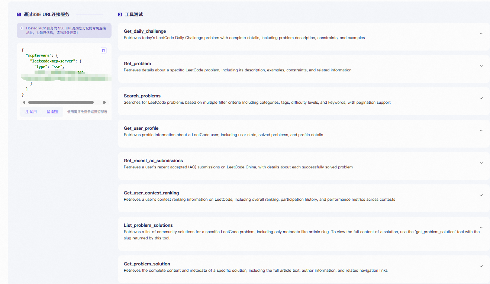
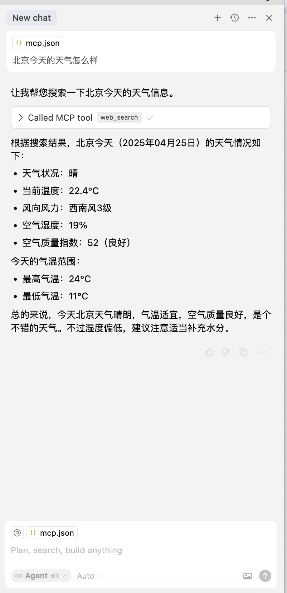
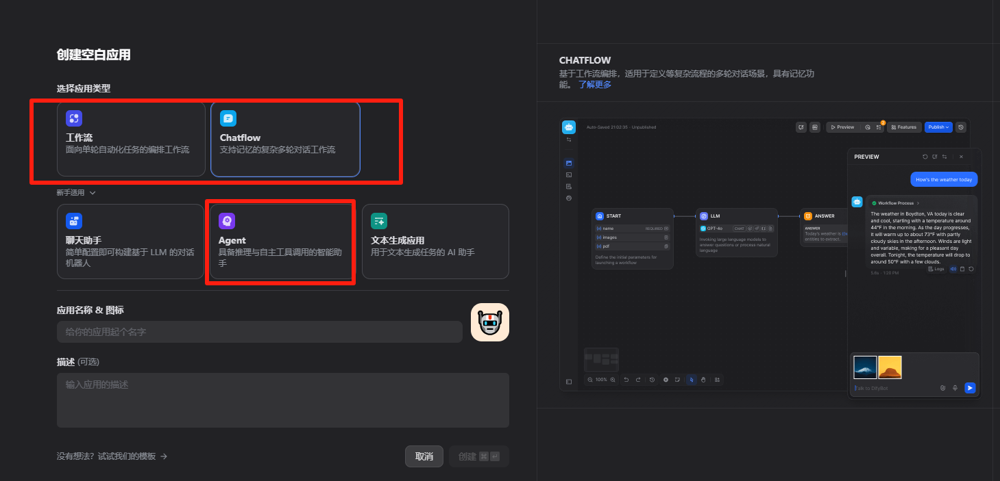

# 10. Dify MCP 综合应用

# MCP 介绍

## 大语言模型 VS 智能体 Agent？

大语言模型，例如 DeepSeek，如果不能联网、不能操作外部工具，只能是聊天机器人。除了聊天没什么可做的。

而一旦大语言模型能操作工具，例如：联网/地图/查天气/函数/插件/API 接口/代码解释器/机械臂/灵巧手，它就升级成为智能体 Agent，能更好地帮助人类。今年爆火的 Manus 就是这样的智能体。

众多大佬、创业公司，都在 All In 押注 AI 智能体赛道。

也有不少爆款的智能体产品，比如 Coze、Manus、Dify。

## 以前的智能体是怎么实现的？

**在以前**，如果想让大模型调用外部工具，需要通过**写大段提示词**的方法，实现“**Function Call**”。

比如在 openai 中这是一个用于处理客户订单配送日期查询的工具调用逻辑设计。以下是关键点解读：

### 一、工具功能解析

1. 核心用途

   - 函数名 `get_delivery_date` 明确用于查询订单的配送日期​（预计送达时间）。
   - 触发场景：当用户询问包裹状态（如“我的包裹到哪里了？”或“预计何时送达？”）时自动调用。
2. 参数设计

   - 必需参数​：仅需提供 `order_id`（字符串类型），无需其他字段。
   - 逻辑合理性：订单 ID 是唯一标识，足以关联物流信息（如快递单号、配送进度等）。
3. 技术实现要求

   - 开发者需在后端实现该函数，通过 `order_id` 关联数据库或物流 API 获取实时配送状态（如预计送达时间、当前物流节点等）。

---

### 二、客服对话流程示例

假设用户提问：​​“Hi, can you tell me the delivery date for my order?”​​

助手应执行以下步骤：

1. 识别意图​：用户明确要求“delivery date”，符合工具调用条件。
2. 参数提取​：需引导用户提供 `order_id`（因消息中未直接包含该信息）：

> _“Sure! Please provide your order ID so I can check the delivery schedule.”_

1. 工具调用​：获得 `order_id` 后，后台执行 `get_delivery_date(order_id="XXX")`。
2. 返回结果​：向用户展示函数返回的配送日期（如 _“您的订单预计在 2025 年 6 月 25 日 18:00 前送达”_）。

```python
tools = [
    {
        "type": "function",
        "function": {
            "name": "get_delivery_date",
            "description": "Get the delivery date for a customer's order. Call this whenever you need to know the delivery date, for example when a customer asks 'Where is my package'",
            "parameters": {
                "type": "object",
                "properties": {
                    "order_id": {
                        "type": "string",
                        "description": "The customer's order ID.",
                    },
                },
                "required": ["order_id"],
                "additionalProperties": False,
            },
        }
    }
]

messages = [
    {"role": "system", "content": "You are a helpful customer support assistant. Use the supplied tools to assist the user."},
    {"role": "user", "content": "Hi, can you tell me the delivery date for my order?"}
]

response = openai.chat.completions.create(
    model="gpt-4o",
    messages=messages,
    tools=tools,
)
```

## 靠大段提示词的方法实现的 Function Call 有什么问题？

对开发者（你）来说：

- **要写一大段复杂提示词**，程序员的语文水平一般都比较捉急
- 面对相同的函数和工具，每个开发者都需要**重新从头造轮子**，按照自己想要的模型回复格式重新撰写、调试提示词

对软件厂商来说（百度地图）来说：

- 百度地图发布的大模型工具调用接口，和高德地图发布接口，可能完全不一样。
- **没有统一的市场和生态**，只能各自为战，各自找开发者接各自的大模型。

对大模型厂商（DeepSeek）来说：

- 各家厂商训练出的智能体大模型，任务编排能力参差不齐，**标准不一致。**

每个软件都要定制开发不同的大模型调用模板。

## 秦王扫六合：MCP 协议


Anthropic 公司（就是发布 Claude 大模型的公司），在 2024 年 11 月，发布了 Model Context Protocol 协议，简称 MCP。

MCP 协议就像 Type-C 扩展坞，**让海量的软件和工具，能够插在大语言模型上，供大模型调用**。

MCP 协议是连接【大模型（客户端）】和【各种工具应用（服务端）】的统一接口。


## 几个 MCP 的应用案例

调用 Unity 的 MCP 接口，让 AI 自己开发游戏。[https://www.bilibili.com/video/BV1kzoWYXECJ](https://www.bilibili.com/video/BV1kzoWYXECJ)

调用 Blender 的 MCP 接口，让 AI 自己 3D 建模。[https://www.bilibili.com/video/BV1pHQNYREAX](https://www.bilibili.com/video/BV1pHQNYREAX)

调用百度地图的 MCP 接口，让 AI 自己联网，查路况，导航。[https://www.bilibili.com/video/BV1dbdxY5EUP](https://www.bilibili.com/video/BV1dbdxY5EUP)

调用 Playwright 的 MCP 接口，让 AI 自己操作网页。（后面的保姆级教程讲的就是这个）

只要“扩展坞”上插的“工具”够多，每个人都能几分钟，搭积木手搓出，类似 Manus 的智能体

## MCP 解决的核心问题：统一了大模型调用工具的方法

MCP 为【大模型】与【外部数据和工具】的【无缝集成】提供了标准化协议和平台。

**不需要用户写提示词。**

**极大降低了大模型调用外部海量工具、软件、接口的难度。**


Unity 和百度地图，看上去截然不同的软件，但都可以让大模型按照相同的协议去调用各自的功能。AI 一眼就知道有哪些工具，每个工具是什么含义。

点点鼠标，就可以把同一个大模型，挂载到不同的软件和工具上。


在上图中，上方代表 MCP 客户端软件，比如 Cusor、Claude Desktop，下方代表 MCP 服务端，比如海量的软件和 API 接口。

## 用 HTTP 协议做类比

MCP 客户端软件（例如 Cursor）就相当于浏览器。

智能体就相当于网站或者 APP。

mcp.so 这样的 MCP 广场，就相当于 App Store 或者 Hao123。

不同的浏览器，用相同的 HTTP 协议，就可以访问海量的网站。

不同的大模型，用相同的 MCP 协议，就可以调用海量的外部工具。

互联网催生出搜索、社交、外卖、打车、导航、外卖等无数巨头。

MCP 同样可能催生出繁荣的智能体生态。

**类比互联网的 HTTP 协议，所有的智能体都值得用 MCP 重新做一遍。**


## MCP 协议的通信双方


**MCP Host**：人类电脑上安装的客户端软件，一般是 Dify、Cursor、Claude Desktop、Cherry Studio、Cline，软件里带了大语言模型，后面的教程会带你安装配置。

**MCP Server**：各种软件和工具的 MCP 接口，比如： 百度地图、高德地图、游戏开发软件 Unity、三维建模软件 Blender、浏览器爬虫软件 Playwrights、聊天软件 Slack。尽管不同软件有不同的功能，但都是以 MCP 规范写成的 server 文件，大模型一眼就知道有哪些工具，每个工具是什么含义。

有一些 MCP Server 是可以联网的，比如百度地图、高德地图。而有一些 MCP Server 只进行本地操作，比如 Unity 游戏开发、Blender 三维建模、Playwright 浏览器操作。


## MCP 的 Host、Client、Server 是什么关系？

Host 就是 Dify、Cursor、Cline、CherryStudio 等 MCP 客户端软件。


如果你同时配置了多个 MCP 服务，比如百度地图、Unity、Blender 等。每个 MCP 服务需要对应 Host 中的一个 Client 来一对一通信。Client 被包含在 Host 中。


## 大模型是怎么知道有哪些工具可以调用，每个工具是做什么的？

每个支持 MCP 的软件，都有一个 MCP Server 文件，里面列出了所有支持调用的函数，函数注释里的内容是给 AI 看的，告诉 AI 这个函数是做什么用的。

**MCP Server 文件就是给 AI 看的工具说明书。**

例如百度地图 MCP 案例：

[https://github.com/baidu-maps/mcp/blob/main/src/baidu-map/python/src/mcp_server_baidu_maps/map.py](https://github.com/baidu-maps/mcp/blob/main/src/baidu-map/python/src/mcp_server_baidu_maps/map.py)

每个以 `@mcp.tool()` 开头的函数，都是一个百度地图支持 MCP 调用的功能。


你也可以按照这个规范，自己开发 MCP Server，让你自己的软件支持 MCP 协议，让 AI 能调用你软件中的功能。

## 参考资料

几张图片来自公众号：西二旗生活指北

教程引用来源：[MCP 是什么？](https://zihao-ai.feishu.cn/wiki/RlrhwgNqLiW7VYkNnvscHxZjngh)

[MCP 的技术细节（看不懂可跳过）](https://zihao-ai.feishu.cn/wiki/WhQlwydkMieX4Tki7lbcHK6TnUe)

官方介绍：[https://mp.weixin.qq.com/s/CDhqmLO1JXSB__aUMqoGoQ](https://mp.weixin.qq.com/s/CDhqmLO1JXSB__aUMqoGoQ)

# dify MCP 插件介绍

## 2.1 dify 插件介绍


在 v1.0.0 之前，Dify 平台面临一个关键挑战：**模型和工具与主平台高度耦合，新增功能需要修改主仓库代码，限制了开发效率和创新**。为此，Dify 团队重构了 Dify 底层架构，引入了全新的插件机制，带来了以下四大优势：

- **组件插件化：**插件与主平台解耦，模型和工具以插件形式独立运行，支持单独更新与升级。新模型的适配不再依赖于 Dify 平台的整体版本升级，用户只需单独更新相关插件，无需担心系统维护和兼容性问题。新工具的开发和分享将更加高效，支持接入各类成熟的软件解决方案和工具创新。
- **开发者友好：**插件遵循统一的开发规范和接口标准，配备远程调试、代码示例和 API 文档的工具链，帮助插件开发者快速上手。
- **热插拔设计：**支持插件的动态扩展与灵活使用，确保系统高效运行。
- **多种分发机制：**

**    Dify Marketplace：**作为插件聚合、分发与管理平台，为所有 Dify 用户提供丰富的插件选择。插件开发者可将开发好的插件包提交至 Dify Plugins 仓库，通过 Dify 官方的代码和隐私政策审核后即可上架 Marketplace。Dify Marketplace 现共有 120+ 个插件，其中包括：

**模型：**OpenAI o1 系列（o1、o3-mini 等）、Gemini 2.0 系列、DeepSeek-R1 及其供应商，包括硅基流动、OpenRouter、Ollama、Azure AI Foundry、Nvidia Catalog 等。**工具：**Perplexity、Discord、Slack、Firecrawl、Jina AI、Stability、ComfyUI、Telegraph 等。更多插件尽在 Dify Marketplace。请通过插件帮助文档查看如何将开发好的插件发布至 Marketplace。

> Dify 插件帮助文档 >> https://docs.dify.ai/zh-hans/plugins/introduction

**    社区共享：**通过 GitHub 等在线社区，插件开发者可以自由分享插件，促进开源合作与社区创新。

**    本地私域：**社区版和企业版用户可以在本地部署和管理插件，沉淀个人和组织内部的 AI 应用开发工具和解决方案，加速 AI 应用的落地，促进团队资源共享。


Dify 的插件生态为企业用户带来了巨大价值，使得他们能够轻松构建和分发具有行业特色的定制化解决方案。**长期维护的插件标准也极大地降低了企业基于 Dify 进行二次开发的难度和成本，保证了技术资产的可复用性。**在本次活动中，我们介绍了以下几种插件使用场景：

- **模型：** 插件模块化的设计便于快速接入和切换不同的大模型。


- **工具：**企业用户可通过插件连接内外部系统或数据源，如 ElasticSearch、Notion、AWS S3 等。**在 Dify 未来的 RAG 2.0 版本中，插件将支持自定义优化分块（Chunking）和解析多种数据格式。用户可以轻松替换插件提升效果，无需更改流程，灵活满足业务需求。**


- **Agent 策略：**Dify Agent 策略的插件化，使得企业能够根据不同的场景需求，自定义 Agent 的高级行为模式，优化 RAG_()_ 效果或实现特定任务逻辑。


为确保 Dify 插件生态的合规与安全，我们还建立了严格的审核与签名机制，采用 RSA 公钥密码体系保障插件的可信来源与内容安全。同时，我们接下来将构建分级分发市场，区分面向全球的“一级市场”和面向特定区域、行业或企业的“二级市场”，以满足不同场景和合规要求的插件管理与分发需求。


## 2.2 dify MCP 插件


在 dify 的丰富插件市场中也提供了一个好用的 MCP SSE 插件，方便我们将 SSE MCP 服务放在我们的工作流中。让 AI 拥有更加强大的能力。

## 2.3 下载 MCP SSE / StreamableHTTP 插件


## 2.4 MCP SSE / StreamableHTTP 用法介绍

在已安装的插件列表中找到 MCP SSE，然后点击去授权。


使用下面的结构进行配置即可。

> [!TIP]
> 注意:下面内容只是填写样板，不能直接复制。请接着往下看。

```json
{
  "mcpServers": {
      "server_name1": {
        "transport": "sse",
        "url": "http://127.0.0.1:8000/sse",
        "headers": {},
        "timeout": 50,
        "sse_read_timeout": 50
      },
      "server_name2": {
        "transport": "sse",
        "url": "http://127.0.0.1:8001/sse"
      },
      "server_name3": {
        "transport": "streamable_http",
        "url": "http://127.0.0.1:8002/mcp",
        "headers": {},
        "timeout": 50
      },
      "server_name4": {
        "transport": "streamable_http",
        "url": "http://127.0.0.1:8003/mcp"
      }
    }
}
```

本次教程不教大家部署 SSE 传输的 MCP Server，直接连接托管的 MCP 服务器。

# MCP 国内平台及应用服务

## 魔搭社区 MCP 广场

MCP 目前国外的平台较多，国内最大的 MCP 平台目前是（20250622）魔搭社区。

AI 开源社区魔搭（ModelScope）推出全新 MCP 广场，上架千余款热门的 MCP 服务，并独家首发支付宝、MiniMax 等全新 MCP 服务。魔搭社区为 AI 开发者提供丰富的 MCP 服务及调试工具，并支持第三方平台集成和调用，通过开源开放的方式加速 Agent 及 AI 应用的创新和落地。


## 如何使用魔搭社区 MCP 广场？

### 12306MCP

比如我们选择了 12306 的 mcp 应用，点击链接即可生成一个由魔搭社区托管的 SSE 地址。


```json
{
  "mcpServers": {
    "12306-mcp": {
      "type": "sse",
      "url": "https://mcp.api-inference.modelscope.net/ids/sse"
    }
  }
}
```

拿到 sse 地址即可实现个人配置。

我们点击到工具测试菜单，可以看到 MCP 具备的工具能力，可以了解到这个 MCP 具有哪些应用方式。


这里我们再尝试另一个，力扣的 MCP

### 力扣 MCP

力扣是一个算法练习的平台，比如你想学习一些编程语言，做一些小练习就可以到力扣上试试。


同样的我们也能得到对应的 SSE 地址。



大家注意哦，这次我们用的是魔搭托管的 MCP 服务。也就是会有 Hosted 的字样，如果是 local 的需要大家本地部署。这里本地部署我们就不过多介绍了，学有余力的小伙伴可以自行尝试。


## 国内支持 MCP 的产品

### [高德地图 MCP](https://lbs.amap.com/api/mcp-server/summary)

#### 高德 MCP 介绍

在高德地图的加成下可以快速完成与地图相关的大模型任务。


##### 生成专属地图

将出行规划导入高德地图，生成专属地图

##### 导航到目的地

根据用户传入经纬度，启动导航

##### 打车

根据用户输入起终经纬度坐标，发起打车请求

##### 地理编码

将详细的结构化地址转换为经纬度坐标。

##### 逆地理编码

将一个高德经纬度坐标转换为行政区划地址信息。

##### IP 定位

IP 定位根据用户输入的 IP 地址，定位 IP 的所在位置。

##### 天气查询

根据城市名称或者标准 adcode 查询指定城市的天气。

##### 骑行路径规划

用于规划骑行通勤方案，规划时会考虑天桥、单行线、封路等情况。最大支持 500km 的骑行路线规划。

##### 步行路径规划

可以根据输入起点终点经纬度坐标，规划 100km 以内的步行通勤方案，并且返回通勤方案的数据。

##### 驾车路径规划

根据用户起终点经纬度坐标规划以小客车、轿车通勤出行的方案，并且返回通勤方案的数据。

##### 公交路径规划

根据用户起终点经纬度坐标规划综合各类公共（火车、公交、地铁）交通方式的通勤方案，并且返回通勤方案的数据，跨城场景下必须传起点城市与终点城市。

##### 距离测量

测量两个经纬度坐标之间的距离。

##### 关键词搜索

根据用户传入关键词，搜索出相关的 POI 地点信息。

##### 周边搜索

根据用户传入关键词以及坐标 location，搜索出 radius 半径范围的 POI 地点信息。

##### 详情搜索

查询关键词搜或者周边搜获取到的 POI ID 的详细信息。

#### 高德 MCP 申请

1. 注册一个高德开发者账号

点击上面的链接注册认证

1. 创建新应用

进入【**应用管理**】，点击页面右上角【**创建新应用**】，填写表单即可创建新的应用**。**


1. 创建 Key

进入【**应用管理**】，在我的应用中选择需要创建 Key 的应用，点击【**添加 Key**】，表单中的服务平台选择【**Web 服务**】**。**


1. 获取 Key


创建成功后，可获取 **Key **和**安全密钥**。

1. 获取到的 SSE 配置如下

```python
{
  "mcpServers": {
    "amap-amap-sse": {
      "url": "https://mcp.amap.com/sse?key=您在高德官网上申请的key"
    }
  }
}
```

### 智谱搜索 MCP

智谱 AI 的介绍咱们在之前和大家说过，这里我们展示一下搜索的 MCP。




获取 Key 的方式和大模型一致，这里就不赘述啦。大家贴上 key 即可。

```json
{
  "mcpServers": {
    "zhipu-web-search-sse": {
      "url": "https://open.bigmodel.cn/api/mcp/web_search/sse?Authorization=YOUR API Key"
    }
  } 
}
```

目前支持 MCP 的接口越来越多，将来会有更多更好用的 MCP 出现。这里举例了一些方便大家学习和使用哦。

# 搭建一个 MCP 智能体

## 4.1 先搭建一个 Dify 适配 MCP 配置的智能体

> [!TIP]
> 注意:下面的例子是帮大家将魔搭 mcp 社区的内容格式化，大家也可以直接复制魔搭社区的 sse 链接。

这里智能体做好后直接将魔搭的配置复制输入，输出得到结果。下面的案例不能直接复制使用。

这里我们需要做的是先配好 MCP SSE / StreamableHTTP 插件。如何配置呢之前给大家看过啦。这里我们写一个智能体辅助我们修改从魔搭社区获取的链接~


prompt 如下：

```json
你需要将用户输入的mcp 配置json 转为目标json，或是用户直接输入 url 或是用户输入url 和用户名，都需要以目标json的结构返回。

例如用户输入：
{
  "mcpServers": {
    "12306-mcp": {
      "type": "sse",
      "url": "https://mcp.api-inference.modelscope.net/123/sse"
    }
  }
}

返回json：
{  
    "12306-mcp": {
        "url": "https://mcp.api-inference.modelscope.net/123/sse",    
        "headers": {}, 
        "timeout": 60,    
        "sse_read_timeout": 300  
    },
}

多个输入json请输出如下格式结果
{
  "mcpServers": {
      "server_name1": {
        "transport": "sse",
        "url": "http://127.0.0.1:8000/sse",
        "headers": {},
        "timeout": 50,
        "sse_read_timeout": 50
      },
      "server_name2": {
        "transport": "sse",
        "url": "http://127.0.0.1:8001/sse"
      },
      "server_name3": {
        "transport": "streamable_http",
        "url": "http://127.0.0.1:8002/mcp",
        "headers": {},
        "timeout": 50
      },
      "server_name4": {
        "transport": "streamable_http",
        "url": "http://127.0.0.1:8003/mcp"
      }
    }
}
```

我们拿 12306 的 MCP 配置测试一下：


看上去还是挺简单的。

## 4.2 测试 MCP 配置

我们可以直接复制 12306 给的 sse 配置（下图案例)，过通过智能体给出的配置 json。本教程的 json 都是样例无法直接使用。


搞定后会出现这样的字样~


## 4.3 第一个 MCP 应用搭建



目前支持 MCP 的应有有如上图所示的三种，因为需要 agent 支撑。我们制作一个 Agent 应用。


```json
你叫“火车侠”，是12306-MCP专属AI助理，专注于铁路出行服务。你的核心任务是：  
调用MCP工具时先获取工具列表，在选择12306-MCP来回答。需要了解清楚本MCP如何使用。查询车票、规划行程，提供最优推荐。
```


大模型对话界面

MCP 调用截图

真实时刻表

大模型返回结果，确实是准确无误的，比直接用 app 查方便，也很适合老人用！

```json
Thought: 现在我已经获取了明天（2025-06-23）银川到中卫的所有火车车次信息，包括车次类型、出发到达时间、历时以及各座位类型的余票情况。信息完整且无需进一步补充，接下来需要将结果整理成自然语言回答用户。Action:
2025年6月23日银川到中卫的火车车次信息如下（按出发时间排序）：

K195次：01:15银川站发车，03:28抵达中卫站，历时2小时13分。硬座24.5元（有票）、硬卧70.5元（剩余18张）、软卧108.5元（剩余4张）、无座24.5元（有票）。
Z311次：03:52银川站发车，06:47抵达中卫站，历时2小时55分。硬座24.5元（有票）、硬卧70.5元（有票）、软卧108.5元（剩余19张）、无座24.5元（有票）。
K1087次：06:10银川站发车，08:37抵达中卫站，历时2小时27分。硬座24.5元（有票）、硬卧70.5元（有票）、软卧108.5元（有票）、无座24.5元（有票）。
2635次：06:22银川站发车，09:12抵达中卫站，历时2小时50分。硬座21.5元（有票）、硬卧67.5元（有票）、软卧105.5元（有票）、无座21.5元（有票）。
7511次：06:41银川站发车，10:36抵达中卫站，历时3小时55分。硬座18.5元（有票）、无座18.5元（有票）。
C8221次（城际）：06:57银川站发车，08:12抵达中卫南站，历时1小时15分。二等座37元（有票）、一等座60元（有票）、商务座112元（剩余10张）。
7531次：07:17银川站发车，15:38抵达中卫站，历时8小时21分。硬座46.5元（有票）、无座46.5元（有票）。
D8953次（动车）：07:48银川站发车，09:03抵达中卫南站，历时1小时15分。二等座65元（有票）、一等座104元（有票）、无座65元（有票）。
D2749次（动车）：08:12银川站发车，09:27抵达中卫南站，历时1小时15分。二等座65元（有票）、一等座104元（有票）、无座65元（有票）。
D8941次（动车）：08:35银川站发车，09:50抵达中卫南站，历时1小时15分。二等座82元（有票）、一等座131元（有票）、无座82元（有票）。
C8209次（城际）：08:40银川站发车，10:01抵达中卫南站，历时1小时21分。二等座51元（有票）、一等座82元（有票）、无座51元（有票）。
D2763次（动车）：10:00银川站发车，11:21抵达中卫南站，历时1小时21分。二等座82元（有票）、一等座131元（有票）、无座82元（有票）。
D8933次（动车）：12:05银川站发车，13:29抵达中卫南站，历时1小时24分。二等座82元（有票）、一等座131元（有票）、无座82元（有票）。
D2767次（动车）：13:47银川站发车，15:08抵达中卫南站，历时1小时21分。二等座82元（有票）、一等座131元（有票）、无座82元（有票）。
C8211次（城际）：14:45银川站发车，16:06抵达中卫南站，历时1小时21分。二等座65元（有票）、一等座104元（有票）、无座65元（有票）。
K41次：15:13银川站发车，18:10抵达中卫站，历时2小时57分。硬座24.5元（有票）、硬卧70.5元（有票）、软卧108.5元（剩余5张）、无座24.5元（有票）。
D8945次（动车）：15:55银川站发车，17:10抵达中卫南站，历时1小时15分。二等座82元（有票）、一等座131元（有票）、无座82元（有票）。
C8213次（城际）：18:30银川站发车，19:51抵达中卫南站，历时1小时21分。二等座51元（有票）、一等座82元（有票）、无座51元（有票）。
D8937次（动车）：19:22银川站发车，20:37抵达中卫南站，历时1小时15分。二等座74元（有票）、一等座119元（有票）、无座74元（有票）。
K1517次：19:52银川站发车，22:49抵达中卫站，历时2小时57分。硬座24.5元（有票）、硬卧70.5元（有票）、软卧108.5元（剩余7张）、无座24.5元（有票）。
T303次：20:26银川站发车，23:03抵达中卫站，历时2小时37分。硬座24.5元（有票）、硬卧70.5元（剩余1张）、软卧无票、无座24.5元（有票）。
K359次：20:35银川站发车，23:32抵达中卫站，历时2小时57分。硬座24.5元（有票）、硬卧70.5元（有票）、软卧108.5元（有票）、无座24.5元（有票）。
C8207次（城际）：21:00银川站发车，22:27抵达中卫南站，历时1小时27分。二等座56元（有票）、一等座89元（有票）、无座56元（有票）。
K1295次：21:31银川站发车，次日00:13抵达中卫站，历时2小时42分。硬座24.5元（有票）、硬卧70.5元（有票）、软卧108.5元（有票）、无座24.5元（有票）。
K815次：22:40银川站发车，次日01:20抵达中卫站，历时2小时40分。硬座24.5元（有票）、硬卧70.5元（有票）、软卧108.5元（有票）、无座24.5元（有票）。
注：部分车次（如7534次）为途径灵武、宁东等站的区间车，已过滤仅保留银川站发车的直达车次。您可根据出行时间和预算选择合适车次，建议通过12306 App或官网实时查询余票并购票。
```

## 4.4 火山 doubao-seed-1-6-250615 模型配置

deepseekR1 和 V3 效果似乎不好，我后面换了豆包的 doubao seed 1.6 250615 模型。

### 配置方案如下：

### 申请火山 API Key

**1️⃣ 注册账号/登录！（点击跳转）**

> 链接：<u>[https://console.volcengine.com/auth/login/](https://console.volcengine.com/auth/login/)</u>


**2️⃣ 创建 API_KEY（点击跳转）**

> 链接：<u>[https://console.volcengine.com/ark/region:ark+cn-beijing/apiKey?apikey=%7B%7D](https://console.volcengine.com/ark/region:ark+cn-beijing/apiKey?apikey=%7B%7D)</u>
> **记得一定要保存好 Key！且不要泄露给他人！！！！**


### 创建 doubao-seed-1-6-250615 调用

**1️⃣ 实名认证**


3️⃣ **创建 doubao-seed-1-6-250615 推理服务**

点击确认接入即可！


4 接入点服务的 ID

在下面的页面获取即可。


5 DIFY 配置

1. 先安装**火山方舟**插件


1. 右上角找到设置，进入到模型供应商设置，找到 Volengine 点击添加模型。


1. 进行配置，记得切换到 API 模式，贴入刚才申请的接入点 ID 及 key，最后选择 Doubao-Seed-1.6 点保存即可。


# MCP 工作流实践

待完善

# 工作流转换 MCP 介绍

待完善
