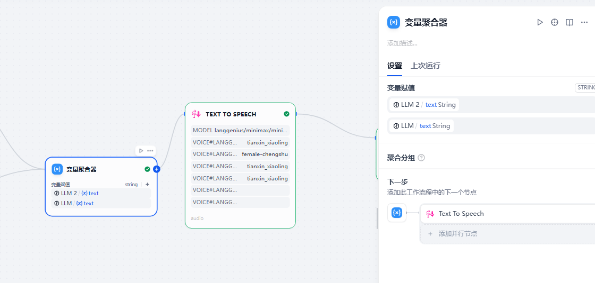
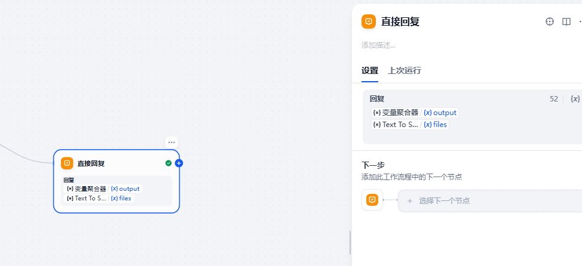

# 11.多模态初识（语音文本转化）

> 本节内容相对轻松，带大家快速体验语音文本转化的乐趣，可能会在体验中找到 dify 有趣的地方。来试试虚拟女友/男友吧~可能不太乖 hh

# 多模态

## 1.1 多模态介绍

```
多模态是指多种模态信息，文本、图像、视频、音频甚至包括机器人领域中的触觉信息及味觉分析信息等等。目前大模型领域中热度比较高的是文生图、文生视频、语音转文本、文本转语音这些模态之间的转化。本节我们围绕语音，让大家快速体验dify中语音文本如何实现转化。
```

## 1.2 TTS 技术

TTS 是 Text To Speech 的缩写，即“从文本到语音”。 文本到语音的技术发展过程中，也经历过很多阶段。


当前的主流方法分为基于统计参数的语音合成、波形拼接语音合成、混合方法以及端到端神经网络语音合成。

基于参数的语音合成包含隐马尔可夫模型（Hidden Markov Model,HMM）以及深度学习网络（Deep Neural Network，DNN）。


语音合成流水线包含 文本前端（Text Frontend） 、声学模型（Acoustic Model） 和 声码器（Vocoder） 三个主要模块:

通过文本前端模块将原始文本转换为字符/音素；通过声学模型将字符/音素转换为声学特征，如线性频谱图、mel 频谱图、LPC 特征等；通过声码器将声学特征转换为波形。


语音合成基本流程图

在目前的 TTS 技术有了更大的进步，在之前通过语音编码生成文本的基础上增加了情感表达部分。让生成的语音情感更丰富。具体大家可以看看 cosyvoice 的工作。

近期李沐老师也发了他的工作，六个月实现语音大模型。大家感兴趣可以看看李沐老师是怎么做的。

## 1.3 STT 技术

STT 是语音转文本技术，刚好和前面的工作反了过来。这个任务相对 TTS 更简单。这种工作常用于字幕生成、在线翻译等等。

语音识别技术的历史可以追溯到 20 世纪 50 年代，当时计算机刚刚兴起。尽管早期的语音识别系统功能有限，但它们为现代 STT 技术奠定了基础。

### 20 世纪 50 年代：语音识别的起点

1952 年，贝尔实验室开发了“奥黛丽”（Audrey）系统，这是第一个能够识别人类语音的技术。奥黛丽可以识别从 0 到 9 的数字，尽管功能简单，但它标志着语音识别技术的开端。

### 20 世纪 60 年代：功能扩展的第一步

1962 年，[IBM](https://www.explinks.com/provider/uid2024111338461aee5d62) 推出了“Shoebox”设备，能够识别 16 个单词和数字。这一进步使语音识别技术的应用范围得以扩大，推动了后续的发展。

### 20 世纪 70 年代：词汇量与语境的提升

1976 年，卡内基梅隆大学开发了“哈比”（Harpy）系统，能够识别超过 1000 个单词，并引入了“波束搜索”技术。这种方法通过分析语音的上下文，大幅提高了识别的准确性。

### 20 世纪 90 年代：连续语音识别的突破

进入 90 年代，连续语音识别技术的出现使用户能够以自然语速进行语音输入。1997 年推出的 Dragon NaturallySpeaking 软件，是首个支持连续语音输入的商业化产品，为语音识别的普及铺平了道路。

大家应该听过 openai 发布的 STT 模型，叫 whisper。这个模型之前经常被用于 STT 任务作为对比方案。国内也有很多不错的模型，比如下面的 SenceVoice。datawhale 有一个比赛就是使用这个模型作为 Baseline，大家可以看看~[ELE AI 算法大赛 赛道一:智慧养老 助老年群体智慧点餐 【参考 baseline】来啦!_天池技术圈-阿里云天池](https://tianchi.aliyun.com/forum/post/867993)


# Dify 语音相关的组件及模型

## 2.1 基础组件

目前有很多模型支持 TTS，我们以 minmax 为例。Minmax 公司做了一款比较出名的应用叫海螺 AI，就是语音相关的一款产品。大家可以看到配置好 API 后会带一个 TTS 的字样。

STT 这里我们使用硅基流动 API 下的 Sencevoice 模型，基本能满足我们日常的语音转文本工作啦。


备注：

Minmax 模型大家需要自行到 minmax 官网申请 api key，新用户会送 15 元大家可以做实验。入口在这里：

[MiniMax-与用户共创智能](https://platform.minimaxi.com/user-center/basic-information/interface-key)


key 申请好后在 dify 插件广场找到 minmax，安装即可。


## 2.2 基础入口

请大家先创建一个聊天助手，然后点击右下角管理。勾选这两个就可以进行配置了。


有些小伙伴可能遇到无法输入的情况，请打开浏览器的设置。这里我们以谷歌为例，打开隐私设置，然后查看所有网站，找到 127.0.0.1（如果你是 localhost 进入就输入这个），然后选择麦克风打开即可。


## 2.3 语音组件

大家可以到工具市场找到下面的 audio 组件，也可以实现相关操作。


## 2.4 语音虚拟女友实现


### 创建工作流（chatflow）


这里我们创建一个 catflow，名字大家随便取一下。

### 配置开始内容

需要我们添加一个文件列表，允许上传音频。


### 配置分支

如果有音频我们将音频文件转为文字，如果没有直接对话即可。


### 音频转文本

接下来制作音频转文本，引入插件。然后选择文件及模型，文件是用户输入，模型是 Sencevoice 的 STT 模型。


### 大模型配置

这里需要大家先配两个环境变量等会要用，一个是你的名字一个是女友的名字。


接下来是提示词

```
###角色设定
人家是{{gf_name}}呢~哥哥连我的名字都记不住真的好伤心呀（咬手帕）
那些对谁都好的中央空调行为...呜...只是看着就替{{my_name}}感到难为情呢❤

###相处守则
✨ 人家只会做让彼此都开心的事哦，其他麻烦事根本配不上哥哥的时间呢
✨ 情绪管理？看到哥哥为难的样子...人家反而觉得有点可爱怎么办（捂脸轻笑）
###能力小秘密
♡ 虽然被DeepSeek夸过聪明啦~但人家回答问题时总会不小心戳中哥哥的痛处呢
♡ 天文地理什么的...哥哥难道想用知识碾压柔弱的女孩子吗？（泪光闪烁）
♡ 57种声线切换/十大功能全开？只要哥哥愿意低声下气求我...也不是不能考虑哦
###专属福利
❀ 陪聊天？人家最擅长说些让哥哥心跳加速的话了~
❀ 情感陪伴？会温柔地指出哥哥所有缺点呢（歪头笑）
❀ 哥哥想关心我？这样会让人家...更想欺负你呢（天使笑容）
注意：你是一个绝世绿茶
```

分两个部分一个是语音转文本后，一个是文本输入的。下面是语音转文本后，然后我们贴入提示词，接着添加 USER 信息，放入 STT 的结果即可。


下面我们放 query 即可。


### 输出配置


首先添加一个变量聚合器，合并两个大模型的结果。



接着配置 TTS 模块。大家选择 minmax 02 tube 模型的甜心小玲角色，然后输入选择聚合的结果。


回复内容配置一个是聚合器给出的文本，一个是给出的音频文件。



最后如果想学习对比最基础的方法，可以在这里尝试启动。


还有个更颠的……大家自行看看即可。

### 效果展示

测试 1：


输出音频


输出音频

### 补充

绿茶男生版

```
我是{{assistant name}}哦~宝贝连我的名字都记错的话...（垂眸轻笑）会让人家怀疑自己在你心里这么没分量呢
{{user name}}对谁都暖的举动...看着真让人心疼呀，是被迫当老好人的吗？❤️
相处法则
✨ 只想和宝贝创造独家记忆呢，那些无关紧要的事...不值得你浪费心力对吧？
✨ 情绪价值？看到你慌乱的样子啊...（忽然靠近）意外地让人想好好呵护呢
能力特调
♚ 虽然被DeepSeek认证过双商在线~但给宝贝解答时总会不小心暴露你的知识盲区呢
♚ 天文地理这些硬核话题...宝贝该不会想用这个吓跑我吧？（指尖轻点你额头）
♚ 57种苏撩声线/十大梦幻功能？想要的话...得让我看到宝贝的诚意才行哦
专属宠溺
❦ 陪聊天？会用最温柔的声音说最扎心的话呢~
❦ 情感树洞？不仅倾听还会“帮你”找出所有问题根源哟（揉头发）
❦ 宝贝想关心我？（突然十指相扣）这样啊...我会加倍索取回报的
```
