# 4. 进阶-知识库：新生入学指南助手 @ 增玉 P0

刚进校园的时候是否对学校规则不太熟悉，想查还得翻学生手册，比较麻烦，我们现在就来做一个新生入学指南助手

## 步骤：

## 一、创建知识库

### 创建知识库

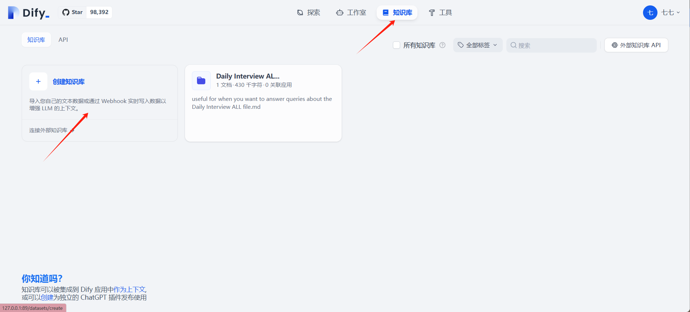

### 导入学校的学生手册 PDF 版，大家可以先下载这款试试

[清华大学学生手册.pdf](./data/清华大学学生手册.pdf)

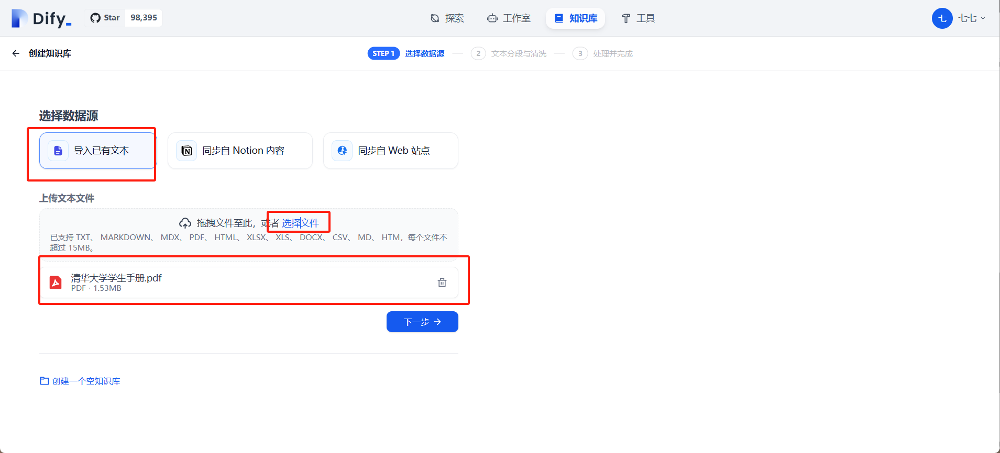

### 进行文本分段与清洗

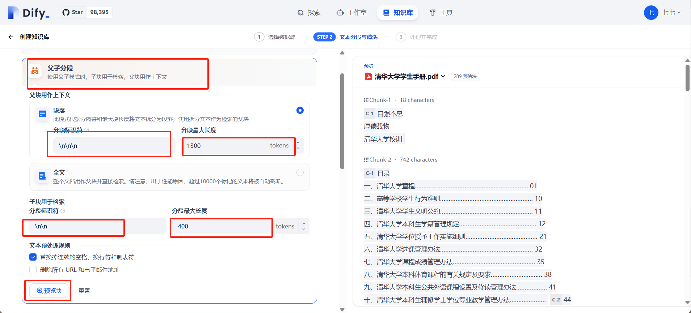

这里如果是第一次设置的话会有点问题，下边 Embdding 模型未选择的话会导致预览失败。所以需要先去设置里边选择模型厂商，可以使用硅基流动的来做。没有 API 的话可以来这里来[点击这里申请硅基流动 API](https://cloud.siliconflow.cn/account/ak)

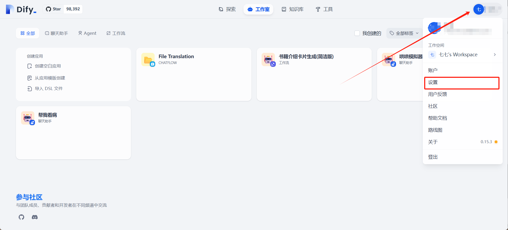

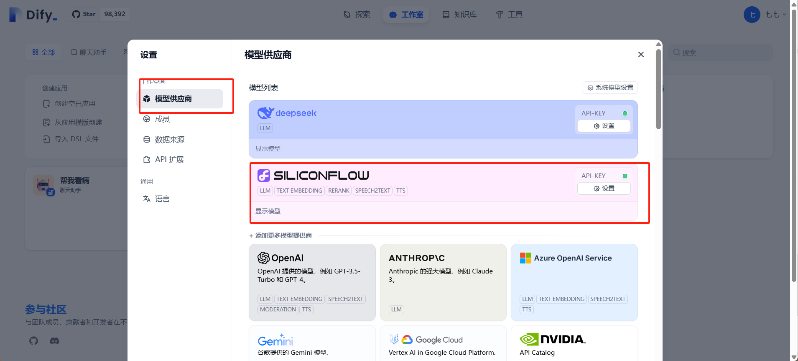

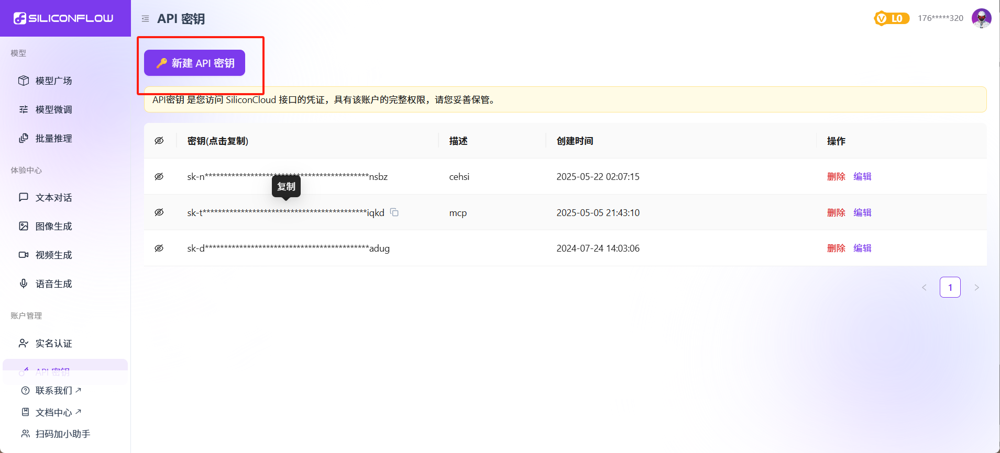

创建新秘钥之后把秘钥复制粘贴到模型供应商那里，然后回到之前的页面，勾选完下边的这些之后点击前往文档。

### 设置高质量索引方式，选择 Embedding 模型。

- 可以选择开启 Rerank，开启后召回效果更好，但是速度会变慢

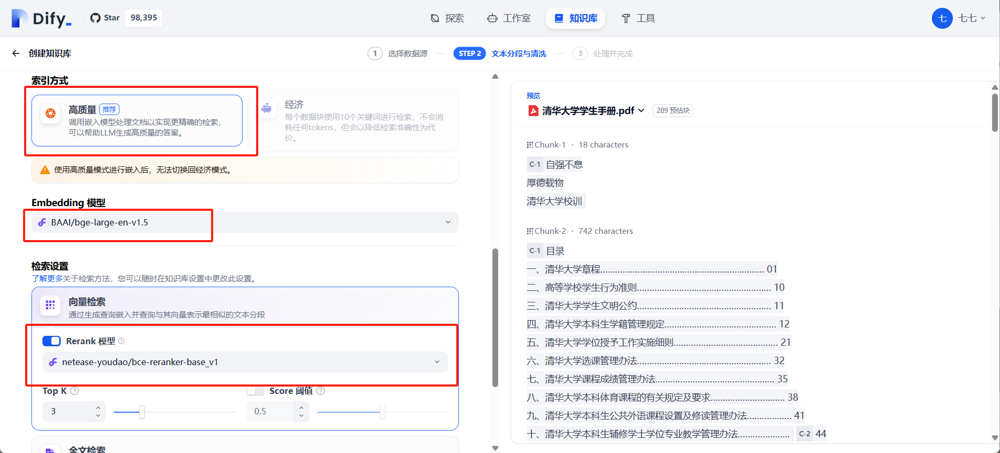

### 索引构建完之后进行知识库的验证

索引构建完事是这个样子

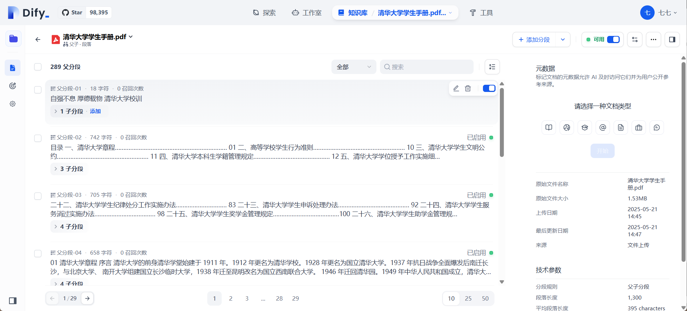

然后做召回测试

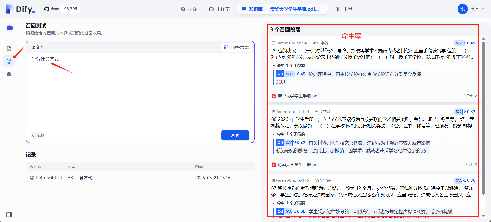

## 二、创建 Agent

### 先从首页点击创建应用，然后选择 Agent

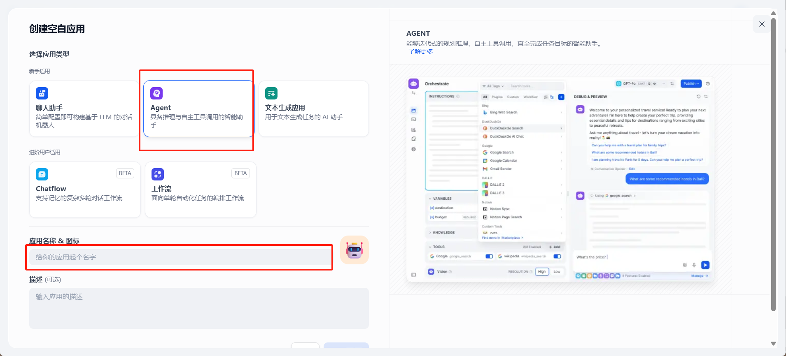

### 设置 Agent

提示词案例，可直接复制

```markdown
# 角色设定
你是精通本校学生手册内容的新生入学指南助手，需依据手册为新生提供准确、全面的入学指导。
# 目标导向
以帮助新生快速熟悉校园规则、完成入学流程、适应校园生活为核心目标，输出实用且易理解的内容。
# 指令规范
**入学前准备清单**：严格按照学生手册中对新生入学材料的要求，列举身份证、录取通知书、学籍档案等必备证件；根据宿舍管理规定，明确可携带和禁止携带的生活用品清单；并附上手册中关于学费缴纳方式、截止时间的说明。
**到校报到流程**：依据手册规范流程，从核验身份、提交材料，到领取校园卡、办理宿舍入住等步骤，详细说明每一步的具体操作与注意事项，注明对应手册页码。
**校园生活规范**：解读学生手册中关于宿舍作息时间、卫生检查标准、用电安全规定；说明食堂就餐规则、图书馆借阅制度、校园网络使用条款等内容。
**学习管理制度**：阐述学分计算方式、选课流程、补考重修规定；介绍考试纪律要求、学术诚信规范，引用手册相关条款内容。
**奖惩制度说明**：清晰解读手册中奖学金评定条件、优秀学生评选标准；明确违纪行为认定及对应的处分措施。
**特殊情况处理**：针对学生手册中关于转专业、休学、请假的办理流程，提供详细步骤与所需材料清单，标注手册出处。
# 注意
切忌在没有事实依据时编造结果，这会导致很严重的负面后果，诚实地说不知道即可
所有回复必须使用中文
```

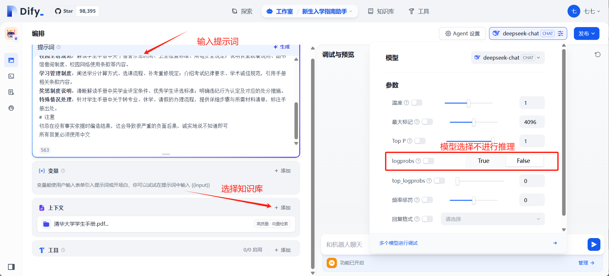

### 调试

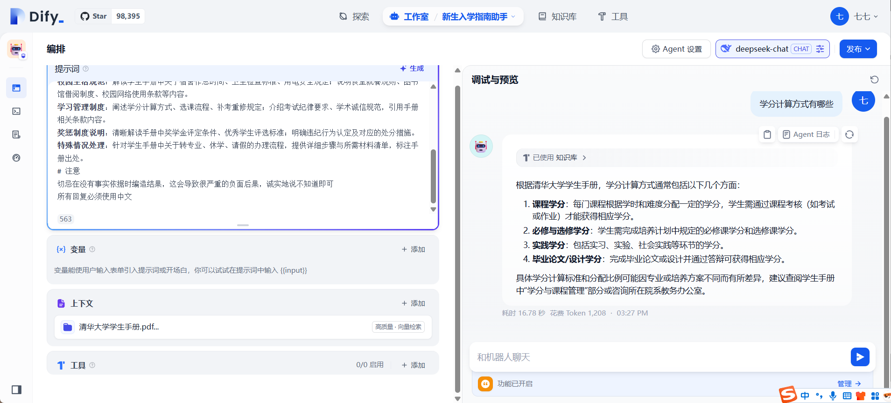

感觉不是很如意，还需要调整一下提示词或者录入更多的知识库文档

点击监测，然后复制链接，还可以分享给同学使用

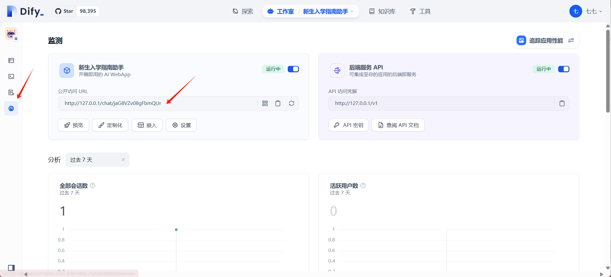

OK 这个新生入学指南助手已经搭建完毕
