# 5.快速批处理小问题

# 引言

> 有的时候我需要大模型帮我做一些处理，但是我又不想一条条的输入。比如我需要批量去对直播弹幕数据打标签，我需要对每一条抽取关键字，我准备做一个评价词云。我不会写代码但又想借助大模型来处理，我该怎么办？
> 本节我们给大家介绍一个很实用的工具，帮大家快速解决问题。

# 文本生成应用介绍

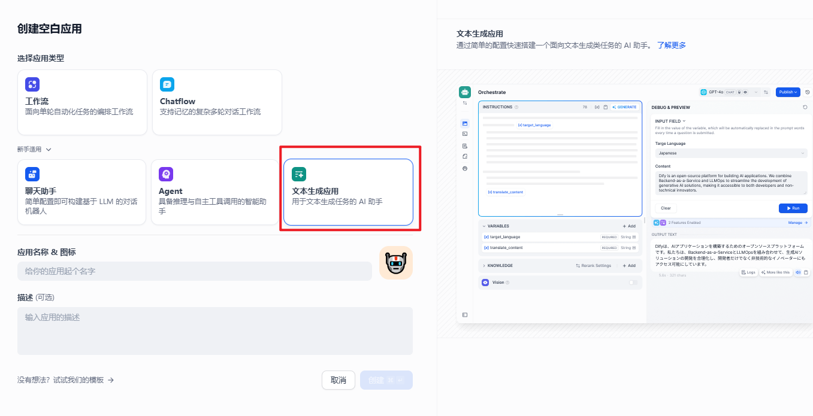

今天我们介绍的主角是文本生成应用，这个不起眼的小模块可能大家还没有关注过~

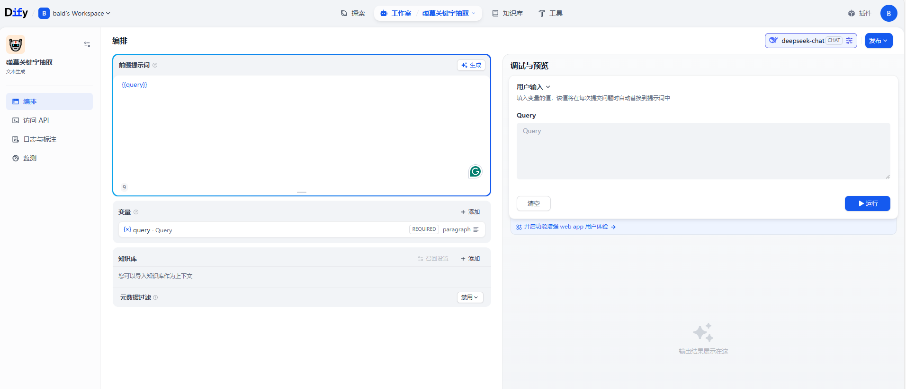

整体的页面不算很难理解，你需要填入 query 并结合提示词就能完成提示词编写。然后可以配一些不同的变量做为用户的传参。也可以使用知识库进行辅助。右边也可以开启一些增强体验的功能。我们这次主要给大家介绍基础功能，对于其他知识库及增强的内容后续课程会有相关介绍~

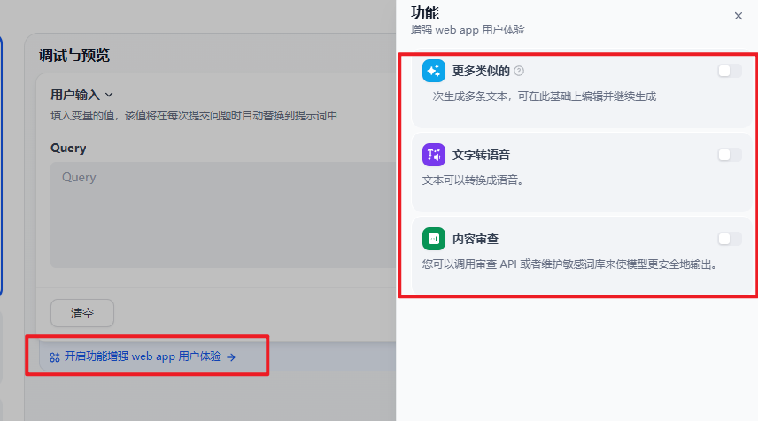

一般的文本生成应用开发流程如下~

# 批量完成弹幕关键字提取

> [!TIP]
> 我们先相互约定好。为了帮大家更好的完成这个任务，假定你现在就是一个数据标注师，而你不太会写代码标注。你现在的任务是使用大模型完成对视频弹幕的标注任务，你需要抽取出弹幕的关键字并实现词云。

## 2.1 任务分解

我们首先需要收集到一些弹幕数据，这里我提前给大家准备好了。下面是两个弹幕文件（一个是全量一个是 10% 的随机采样数据，大家按需求获取），根据何同学的[【何同学】为了不用倒垃圾，我们做了这个..._哔哩哔哩_bilibili](https://www.bilibili.com/video/BV1JDMQzUEwy/?spm_id_from=..search-card.all.click) 视频弹幕汇总。我们来做数据分析。

【如果有同学需要抽取其他视频，可以在油猴浏览器安装 Bilibili Evolved，注意仅供学习使用】

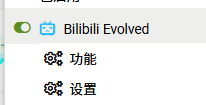

接下来就是处理。我们使用文本生成应用来抽取关键字，最后使用 trae ide 生成 python 导出关键词成词云。简单的思路敲定我们来入手操作~

## 2.2 文本生成应用抽取弹幕关键字

### Prompt

如果需要完成关键字抽取，prompt 少不了。因为目前的大模型已经很成熟，对于简单任务提示词的要求不用很高。我们用入门的方案来写即可。具体内容如下。这里的{{query}}是指大家输入的内容。

```json
# 关键字抽取专家
你是一个关键字抽取专家，你需要对每条弹幕抽取关键字。关键字可以是多个。注意只需要输出关键字，多个关键字用逗号分隔。

例如：
输入：大前排哇哇哇
输出：前排

现在抽取：
{{query}}
```

### 配置

1. 首先选文本生成应用，然后我们名称写为弹幕关键字提取器

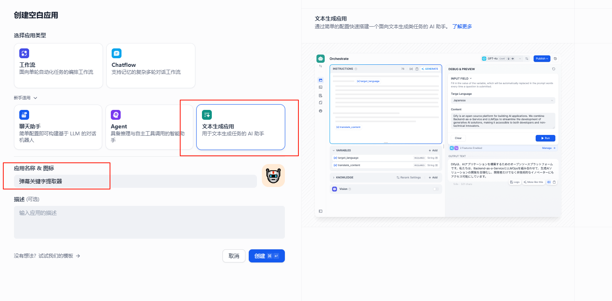

1. 填写 prompt，然后模型配 Deepseek V3 0324 即可，温度调 0 可以保持稳定性

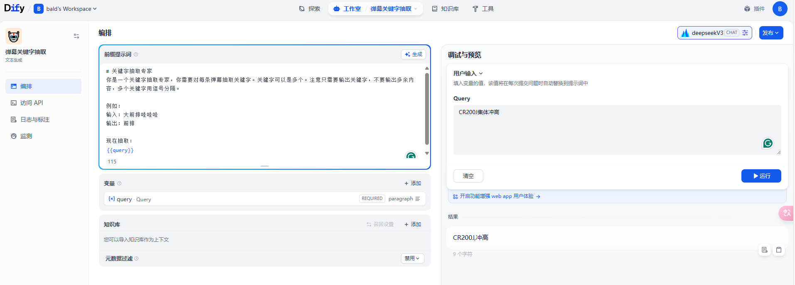

1. 右边测试一下即可，上图右侧。

### 运行

点右上角按钮发布点击发布并更新，接着运行。

然后请大家点击**Run Batch，**然后点击下面的下载模版，然后大家把弹幕放到 Query。我给大家准备了两个文件夹，一个是全量一个是 10%，大家想省钱体验一下就试试 10%。如果想真实模拟就用全量。

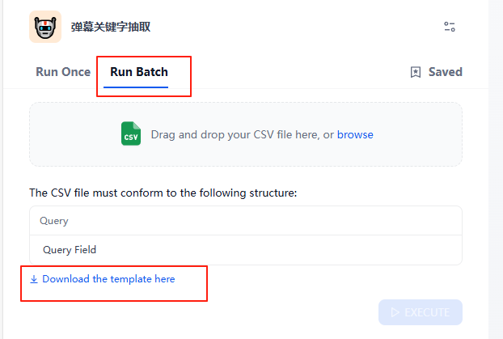
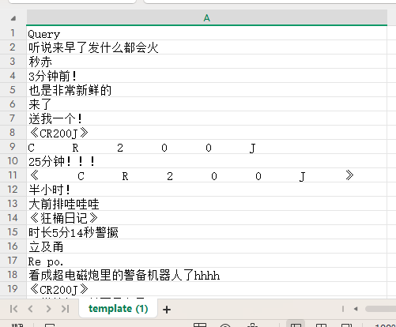

接下来把文件传到系统。

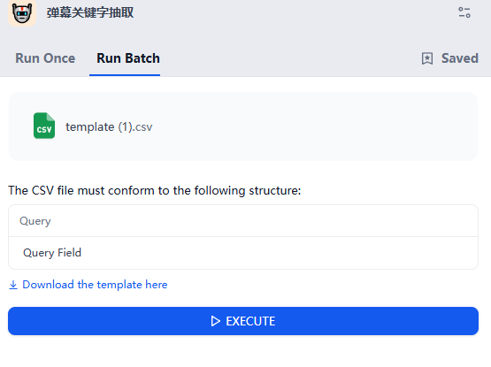

我这边处理好了。下面两个文件一个是全量，一个是 10%。我这边为了演示效果使用 10% 的数据。

处理过程如下：

当 EXECUTE（执行）按钮再次变蓝色说明运行完成，点击右上角的 Download 就可以下载了。

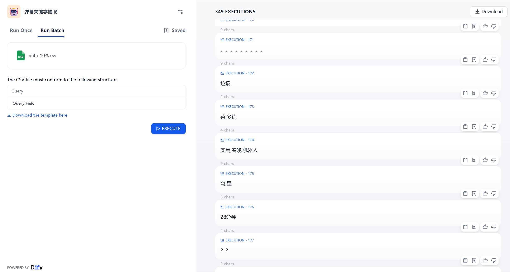

效果如下：

[文件位置](./data/result.csv)

分为两列，一列是左边的输入，一列是右边的输出。看上去还不错，不过我想再调整一下为了效果更有趣一点。

### 改进

这里我们调整一下 prompt，将弹幕的也标记出来，这样能更好的获取到大家的态度。还有就是帮大家学会多任务一起实现。比如你准备做一个自动改作业的任务，一遍给出评分一遍给出评语，也可以这样做。

新提示词如下：

```
# 弹幕分析专家
你是一个弹幕分析专家，你需要对每条弹幕进行分析，获取到情绪即关键字。情绪包括积极、消极、中性。关键字可以是多个。注意只需要输出情绪和关键字，不要输出多余内容，先输出情绪，使用分号分割后，输出关键字，多个关键字用逗号分隔。

例如：
输入：大前排哇哇哇
输出：积极;前排

现在抽取：
{{query}}
```

效果如下~


再次批处理。

效果如下：

### 词云

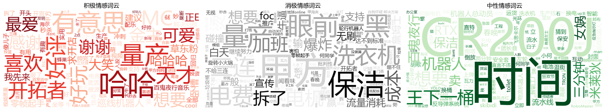

这里我使用了 trae（下载链接：[https://www.trae.cn/](https://www.trae.cn/)）帮我实现操作，我把提示词和代码分享给大家~

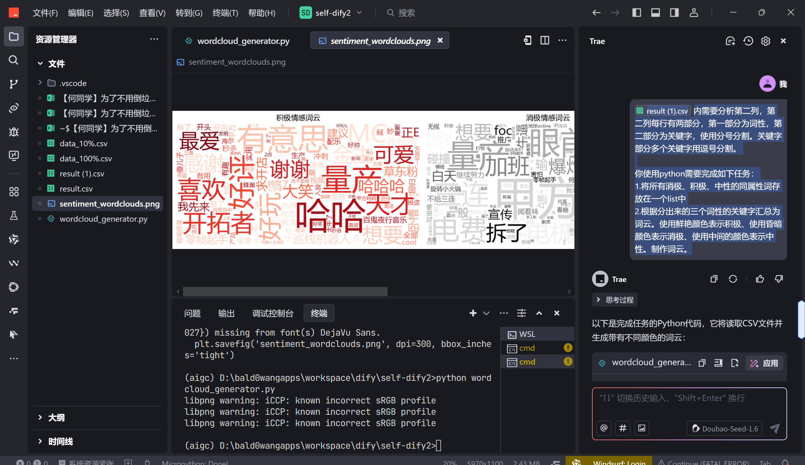

提示词：

```
result (1).csv 内需要分析第二列，第二列每行有两部分，第一部分为词性，第二部分为关键字，使用分号分割。关键字部分多个关键字用逗号分割。

你使用python需要完成如下任务：

1.将所有消极、积极、中性的同属性词存放在一个list中

2.根据分出来的三个词性的关键字汇总为词云。使用鲜艳颜色表示积极、使用昏暗颜色表示消极、使用中间的颜色表示中性。制作词云。
```

我们让 trae 将三类合并后输出词云，代码效果如下（mac、linux 需要略微 debug）

```python
import csv
import matplotlib.pyplot as plt
from wordcloud import WordCloud
from matplotlib.font_manager import FontProperties  # 新增导入字体管理模块
from collections import defaultdict

# 初始化三个列表用于存储不同词性的关键字
positive_words = []
negative_words = []
neutral_words = []

# 读取CSV文件并处理数据
with open('result (1).csv', 'r', encoding='utf-8') as file:
    reader = csv.reader(file)
    next(reader)  # 跳过标题行
    for row in reader:
        if len(row) >= 2:
            # 分割词性和关键字
            sentiment_part, keywords_part = row[1].split(';')
            # 分割多个关键字
            keywords = keywords_part.split(',')
            # 根据词性添加到相应的列表
            if sentiment_part == '积极':
                positive_words.extend(keywords)
            elif sentiment_part == '消极':
                negative_words.extend(keywords)
            elif sentiment_part == '中性':
                neutral_words.extend(keywords)

# 生成词云的函数
def generate_wordcloud(word_list, title, colormap):
    text = ' '.join(word_list)
    wordcloud = WordCloud(
        font_path='C:\\Windows\\Fonts\\msyh.ttc',  # 使用系统自带微软雅黑字体
        background_color='white',
        colormap=colormap,
        width=800,
        height=400
    ).generate(text)
    # 移除图表显示相关代码
    return wordcloud

# 生成三个词云
plt.figure(figsize=(20, 10))

# 设置中文字体
font = FontProperties(fname='C:\\Windows\\Fonts\\msyh.ttc', size=14)

# 积极词云 - 使用鲜艳的红色系
plt.subplot(131)
plt.imshow(generate_wordcloud(positive_words, '积极情感词云', 'Reds'), interpolation='bilinear')
plt.title('积极情感词云', fontproperties=font)  # 添加字体属性
plt.axis('off')

# 消极词云 - 使用昏暗的灰色系
plt.subplot(132)
plt.imshow(generate_wordcloud(negative_words, '消极情感词云', 'Greys'), interpolation='bilinear')
plt.title('消极情感词云', fontproperties=font)  # 添加字体属性
plt.axis('off')

# 中性词云 - 使用中间的绿色系
plt.subplot(133)
plt.imshow(generate_wordcloud(neutral_words, '中性情感词云', 'Greens'), interpolation='bilinear')
plt.title('中性情感词云', fontproperties=font)  # 添加字体属性
plt.axis('off')

plt.tight_layout()
# 移除图表显示
# plt.show()

# 保存词云图像
plt.savefig('sentiment_wordclouds.png', dpi=300, bbox_inches='tight')
```

# 总结

我们使用文本生成应用完成了弹幕词云这个数据分析任务，貌似这个就能应付本科孩子的毕业设计了？（不推荐，既然学了咱们得课程肯定搞个更有趣的）。不小心写的有点多，大家慢慢消化。

当然这个例子不是给大家图个乐呵，你需要做批处理的任务不妨都这样试试。比如：批量生成评语、批量修改作业、批量做文章笔记、批量生成短视频文案。希望可以帮到大家~下次见。
