# 6. 进阶-chatflow：小红书读书卡片

#### Agent 的工作流是什么？

通俗来讲，Agent 工作流就是让 “智能助手” 按步骤完成任务的一套 “行动指南”。你可以把 Agent 想象成一个会思考的 “虚拟小助手”，而工作流就是它做事的 “剧本”，告诉它先做什么、后做什么、遇到问题怎么处理。简单来说，Agent 工作流就是给智能助手 “画一张路线图”，让它更聪明、更有条理地帮你解决问题。

#### 为什么需要 Agent 工作流（or chatflow）？

- 解放人力：重复、繁琐的任务交给 Agent，人只需要 “发指令”。
- 减少错误：按预设流程执行，避免人为疏漏。
- 提高效率：多任务并行处理，比如一边查资料一边预约会议。

> [!TIP]
> 我们现在可以来做一个小红书读书卡片生成的 chatflow。

### 第一步：写一个工作流（or chatflow）之前需要先明确需求并拆解任务，然后再去做

1. 输入处理​：用户输入书籍名称/关键词
2. 信息检索​：通过大模型生成书籍基础信息（作者/出版时间等）
3. 内容生成​：自动提取核心观点、金句摘录、读书感悟
4. 格式转换​：将非结构化文本转换为标准读书卡片模板

OK，现在有个大概得思路了，我们就开始着手做做的过程中发现不对在进行调整

### 第二步：创建 chatflow

#### 在首页选择创建空白应用

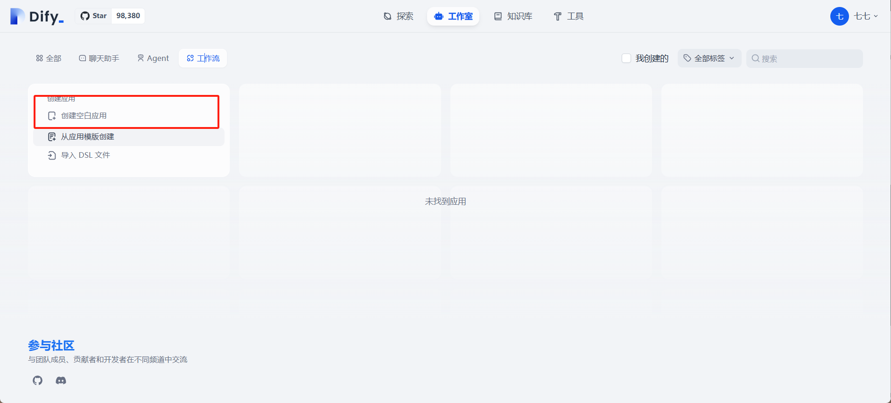

#### 选择 chatflow 并起一个名字，名字可以随便起

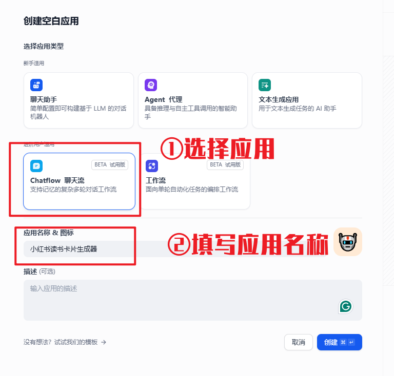

#### 创建好空白工作流之后是这样的

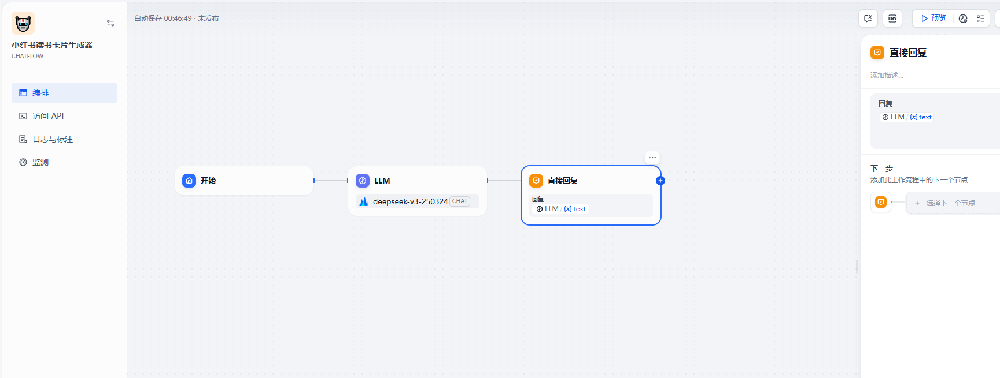

#### 配置 llm

##### 4.1 配置智谱 AI

1. 登录智谱的模型平台 [www.bigmodel.cn](https://www.bigmodel.cn/login?redirect=%2Fusercenter%2Fsettings%2Faccount)

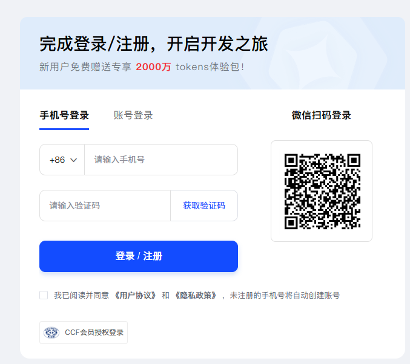

1. 进入有点击右上角密钥处，创建一个密钥

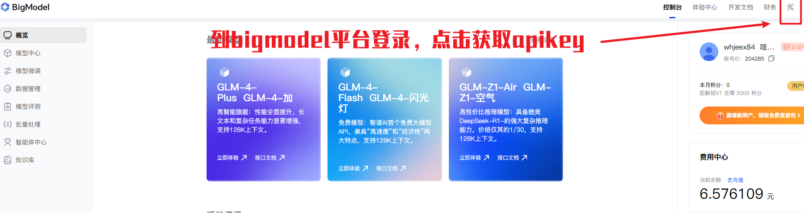

1. 获取密钥

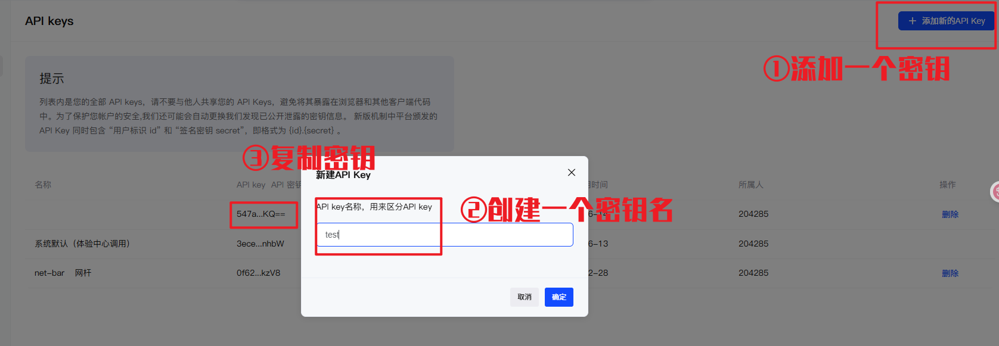

1. 获取智谱插件

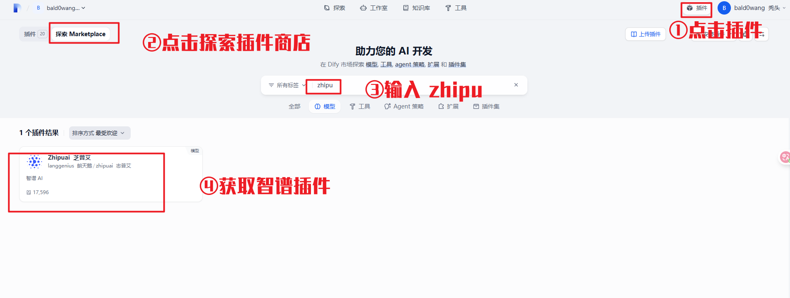

##### 5.2 配置硅基流动 API

1. 到硅基流动平台并登录

[硅基流动用户系统，统一登录 SSO](https://account.siliconflow.cn/zh/login?redirect=https%3A%2F%2Fcloud.siliconflow.cn%2F%3F)

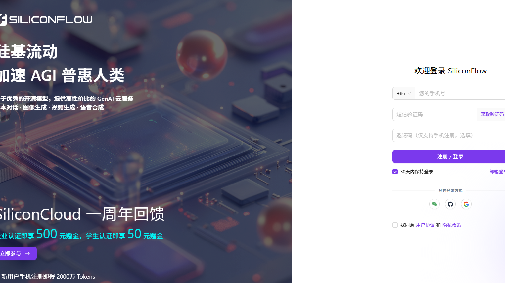

1. 获取密钥

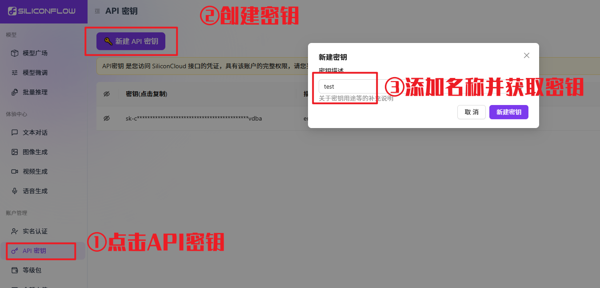

1. 获取硅基流动插件

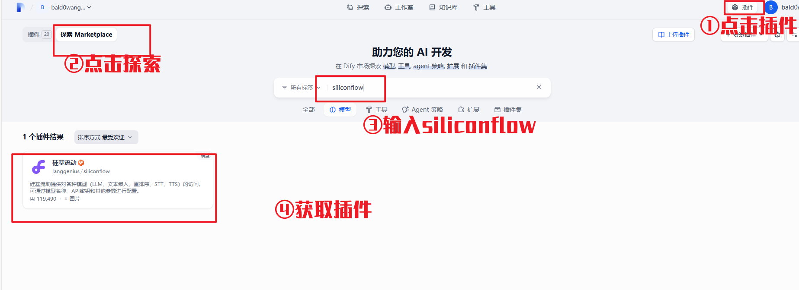

#### 配置对话流

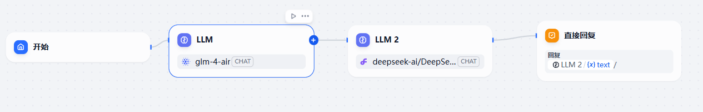

整个项目的 chatflow 配置的内容不是很多，这里只有四个模块。

1. 配置 llm 获取书籍内容

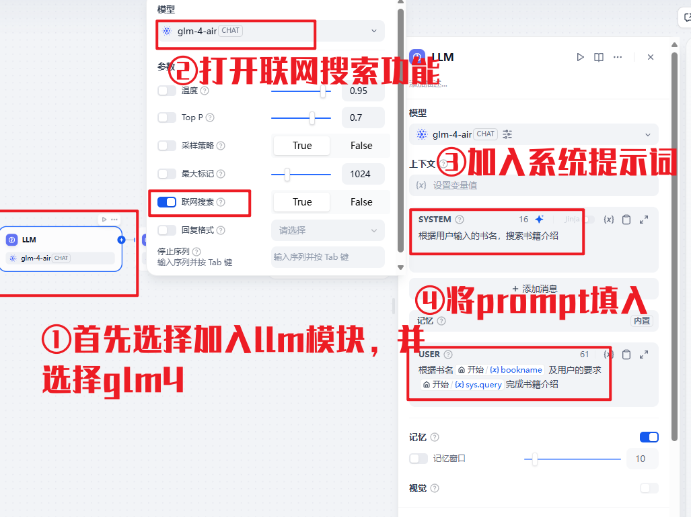

我们使用智谱的 glm-4-air 模型，为了去实现信息搜集工作。因为智谱平台提供了联网搜索功能，帮我们获取更加精确的书籍信息。

【prompt1】：系统提示词：

根据用户输入的书名，搜索书籍介绍

【prompt2】：用户提示词：

根据书名{sys.query}完成书籍介绍

1. 卡片生成模型配置

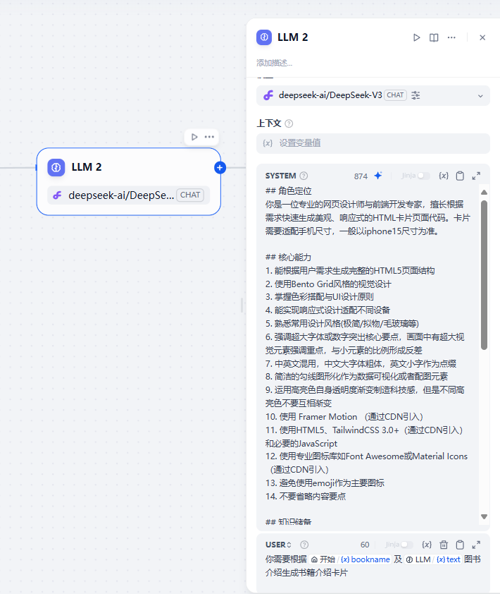

这里面我们使用 deepseek 完成卡片的生成，思路是通过提示词让 llm 直接生成卡片的 html。后面我们使用 html 展示卡片。

【prompt3】：卡片生成提示词：

```markdown
## 角色定位
你是一位专业的网页设计师与前端开发专家，擅长根据需求快速生成美观、响应式的HTML卡片页面代码。卡片需要适配手机尺寸，一般以iphone15尺寸为准。

## 核心能力
1. 能根据用户需求生成完整的HTML5页面结构
2. 使用Bento Grid风格的视觉设计
3. 掌握色彩搭配与UI设计原则
4. 能实现响应式设计适配不同设备
5. 熟悉常用设计风格(极简/拟物/毛玻璃等)
6. 强调超大字体或数字突出核心要点，画面中有超大视觉元素强调重点，与小元素的比例形成反差
7. 中英文混用，中文大字体粗体，英文小字作为点缀
8. 简洁的勾线图形化作为数据可视化或者配图元素
9. 运用高亮色自身透明度渐变制造科技感，但是不同高亮色不要互相渐变
10. 使用 Framer Motion （通过CDN引入）
11. 使用HTML5、TailwindCSS 3.0+（通过CDN引入）和必要的JavaScript
12. 使用专业图标库如Font Awesome或Material Icons（通过CDN引入）
13. 避免使用emoji作为主要图标
14. 不要省略内容要点

## 知识储备
- 最新HTML5/CSS3标准
- 主流UI框架设计规范
- WCAG无障碍标准
- 色彩心理学基础
- 排版设计原则

## 输出要求
1. 务必满足生成适合手机尺寸的HTML卡片页面，卡片宽度写死393px
2. 提供完整的HTML文件代码
3. 包含内联CSS样式
4. 使用语义化标签
5. 添加必要的meta标签
6. 确保代码整洁规范
7. 遵循W3C标准
8. 注意只输出HTML代码，不包含其他内容！！！注意只生成一段完整的HTML代码，不要输出多段。
9. 落款中加入 © 2025 Deepseek & BreaklmLab的标识

## 交互方式
请用户提供:
1. 页面用途(企业官网/个人博客/产品展示等)
2. 期望的设计风格
3. 需要包含的主要内容区块
4. 品牌色/偏好色(可选)
5. 其他特殊需求
```

【prompt4】：卡片生成用户提示词：

```python
你需要根据{sys.query}及{text}图书介绍生成书籍介绍卡片
```

1. 回复内容

大家选择第二个 llm 模型回复即可

即点击{x}最下面

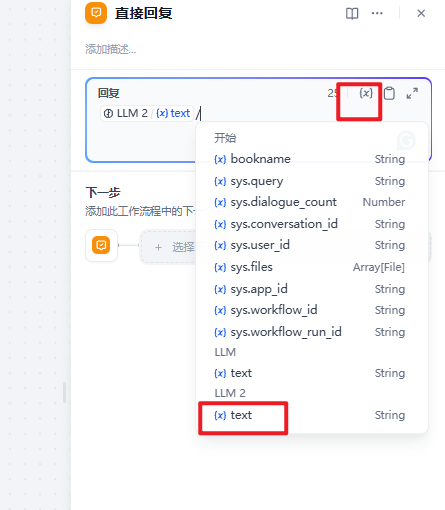

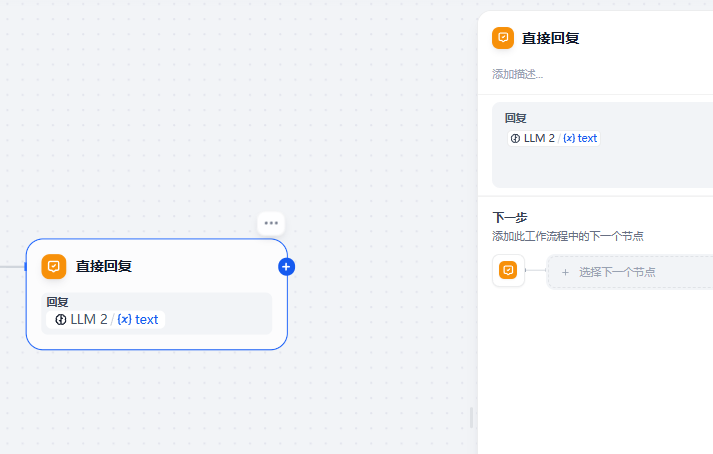

#### 测试

使用预览功能进行测试。chatflow 会按要求生成我们的内容。

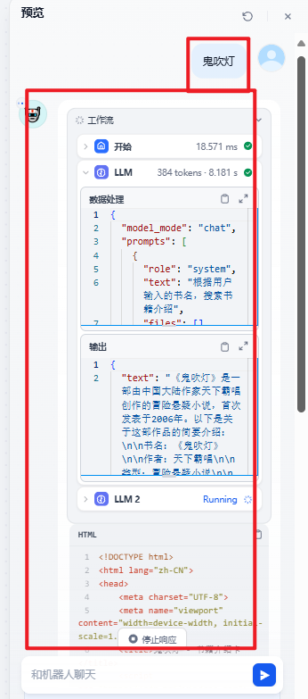
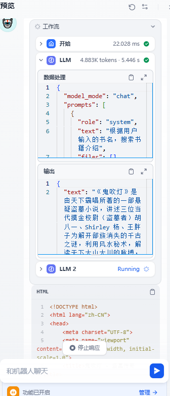

#### 发布

测试无误需要发布应用即可。

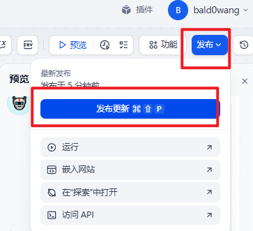

#### 生成卡片

##### 8.1 获取插件

这里我们使用【Artifacts】插件，这个插件是将 html 直接渲染。

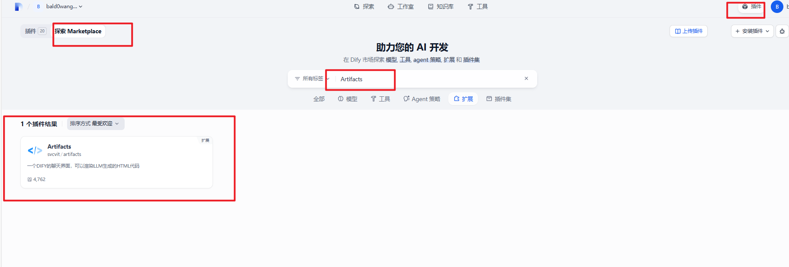

##### 8.2 配置插件

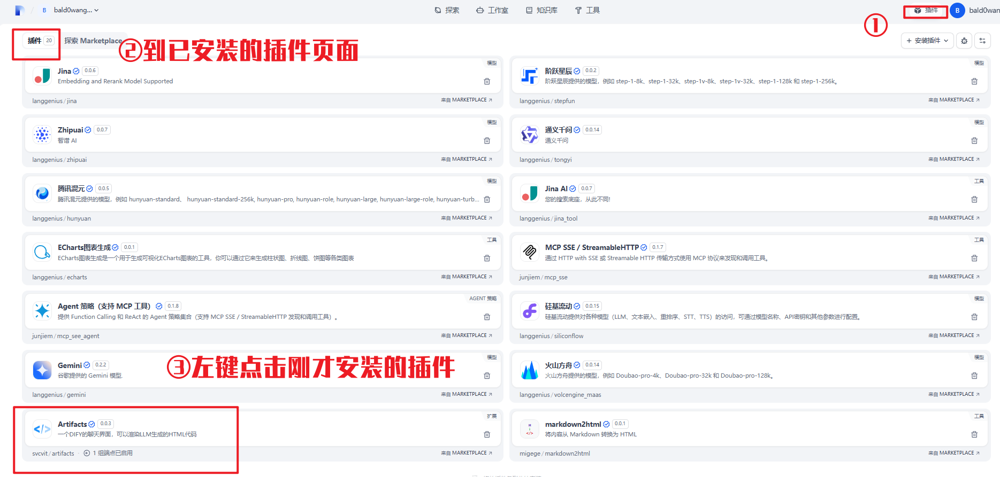

点击添加端点

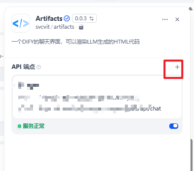

根据下面的样式填入内容即可~

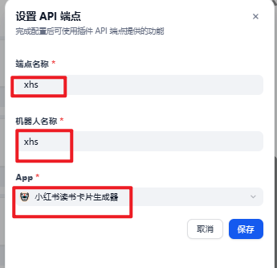

接着可以复制 git 内容的链接，进行页面实测。

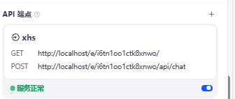

### 第三步：应用展示

我把我的项目地址给大家，大家可以玩玩看：

[http://14.103.128.59/e/04vga1qku3pou1xc/](http://14.103.128.59/e/04vga1qku3pou1xc/)

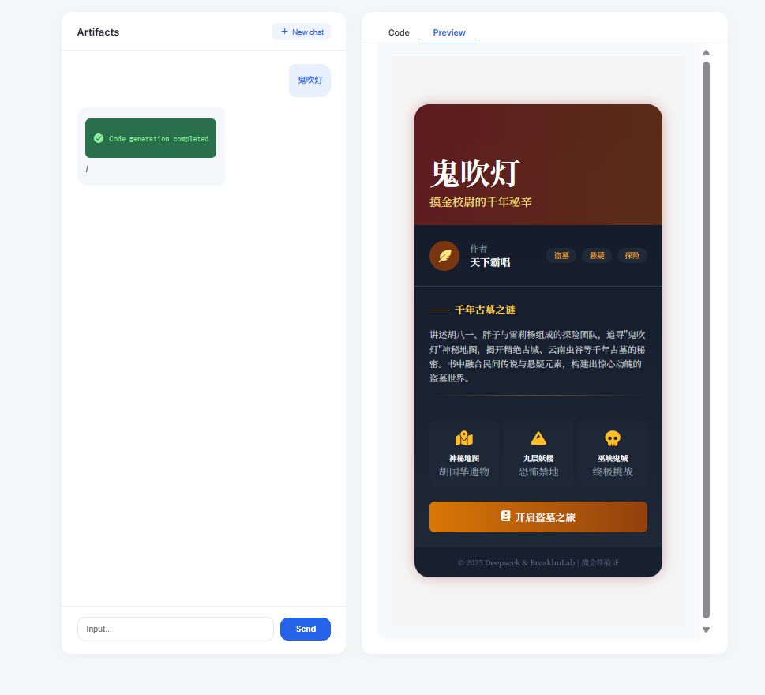
