# 7. 综合-面试宝典 @ 增玉 P2

这次我们来写一个用于面试提升的面试宝典

## 构建步骤：

## 一：构建知识库索引

### 下载面试知识库文件（点击文件预览区域左下角的文件名下载文件）

- 该文件来自 Datawhale 社区成员贡献的，从各大平台收集来的面试经验汇总，目前 2.9k star，持续更新。
- 项目链接：[https://github.com/datawhalechina/daily-interview](https://github.com/datawhalechina/daily-interview)
- 为了方便大家使用，这里把仓库中所有的 markdown 文件全部合并到一个里了

### 在 Dify 知识库菜单中，点击按钮，创建一个新的知识库

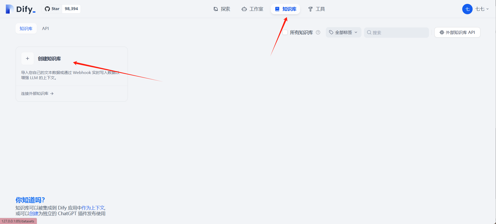

### 导入之前下载的 md 文档

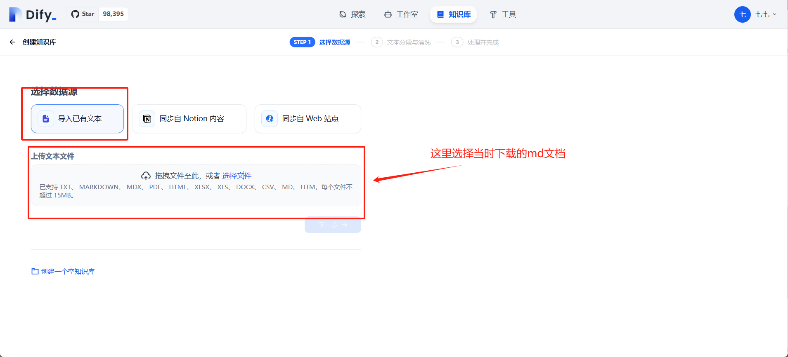

### 如图中所示进行参数配置。

由于专业知识文档的知识点比较密集，可能对于我们的提问的知识点，很多大分段都将其包含在内。所以我们这里使用父子分段，检索小分片，返回大分片。

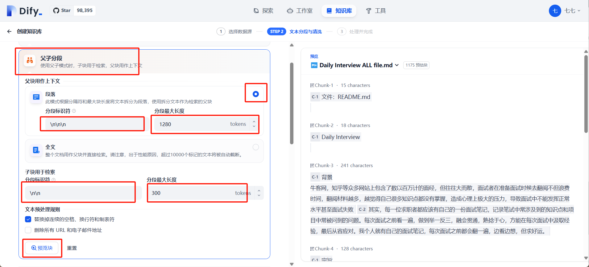

这里点击预览的时候如果下边没有配置 embedding 的话，预览会报错可以先去这里配置一下

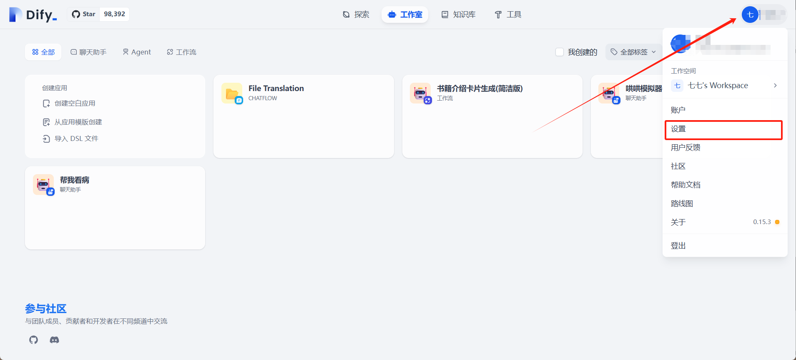

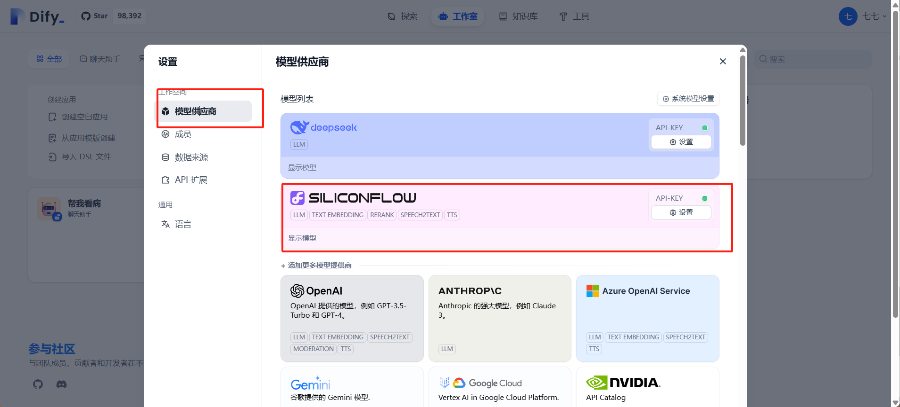

可以点击这里去拿到硅基流动的 api [硅基流动 Api_key](https://cloud.siliconflow.cn/account/ak)

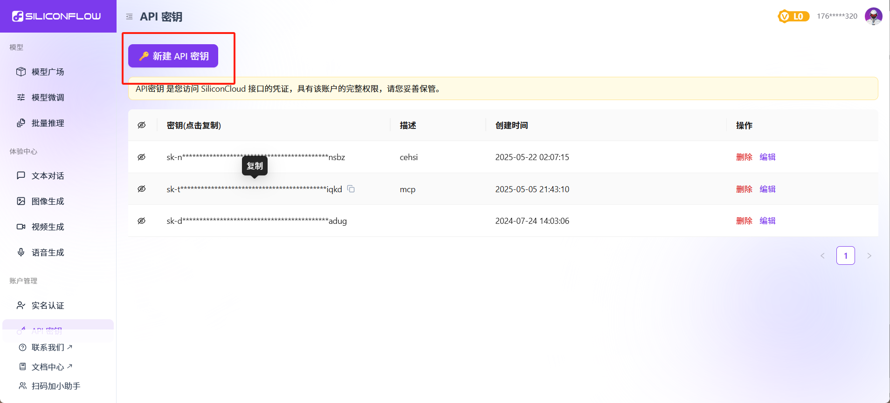

创建新秘钥之后把秘钥复制粘贴到模型供应商那里，然后回到之前的页面

### 设置高质量索引方式，选择 Embedding 模型。

- 可以选择开启 Rerank，开启后召回效果更好，但是速度会变慢

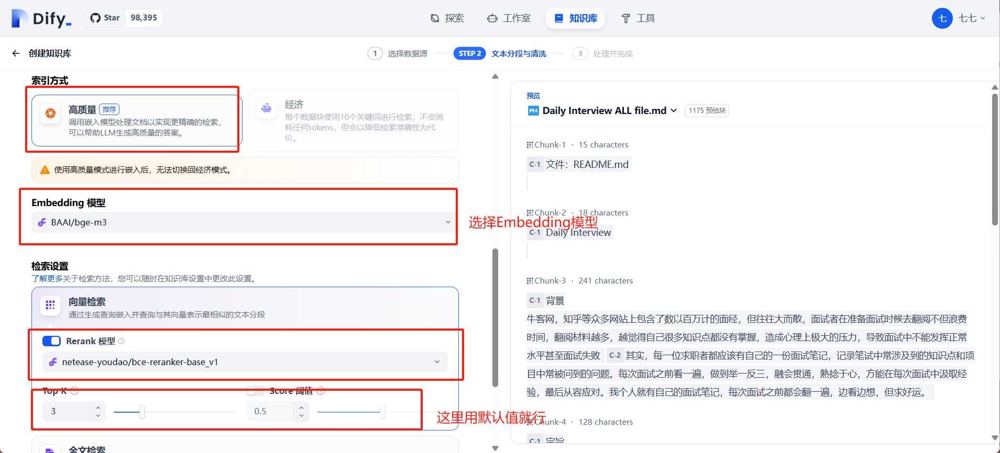

> [!TIP]

### Top - K

- 含义：Top - K 是在信息检索等领域常用的概念，指从检索结果集合中选取排名前 K 个最相关的结果 。这里的 “K” 是一个可设定的正整数。比如在图中设置为 3，就是从检索出的所有结果里，挑选出最符合条件的前 3 个结果展示给用户。
- 作用：通过限定返回结果数量，能在一定程度上减少冗余信息，优先展示最可能满足用户需求的内容，提升检索效率和用户获取有效信息的速度 。同时，也有助于降低系统资源消耗，不必处理和展示过多的检索结果。

### Score 阈值

- 含义：Score（分数）是对检索结果相关性等属性的量化度量。Score 阈值则是一个设定的分数临界值。只有检索结果的 Score 达到或超过这个阈值，才会被纳入最终展示或进一步处理的结果集中。例如图中设置为 0.5，那么只有得分大于等于 0.5 的检索结果才会被考虑。
- 作用：用于过滤掉相关性较低的检索结果，保证最终呈现给用户或进入后续处理流程的结果具有较高的质量和相关性 ，提高检索结果的精准度 。

### 等待构建数据库，时间稍微有些长

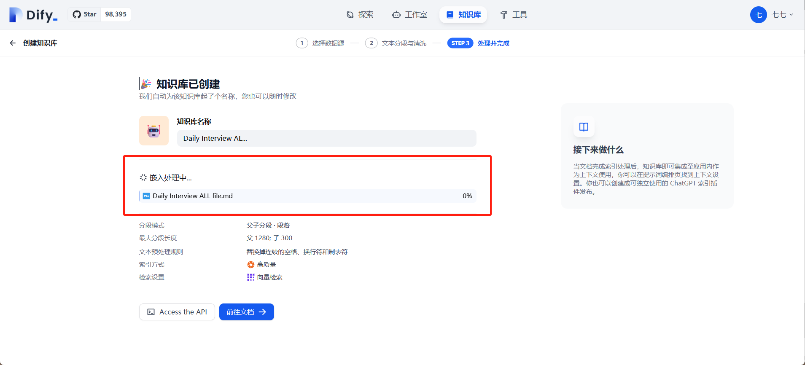

### 索引完成，大功告成！可以在左侧召回测试页面测试效果

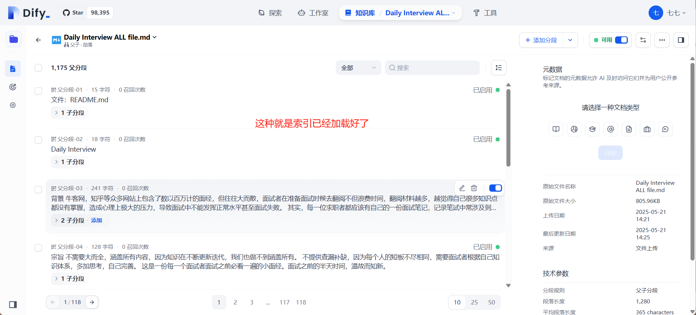

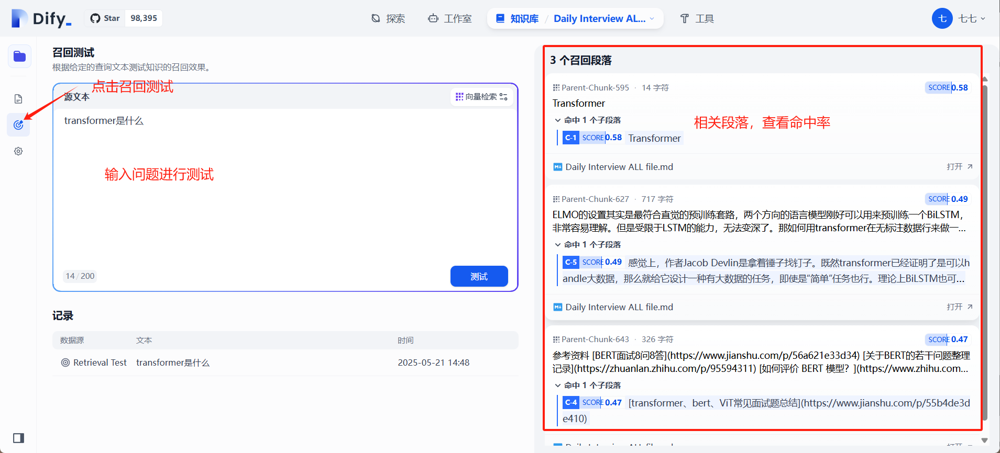

## 二：创建面试宝典 Agent

### 首页点击创建应用，然后创建 Agent

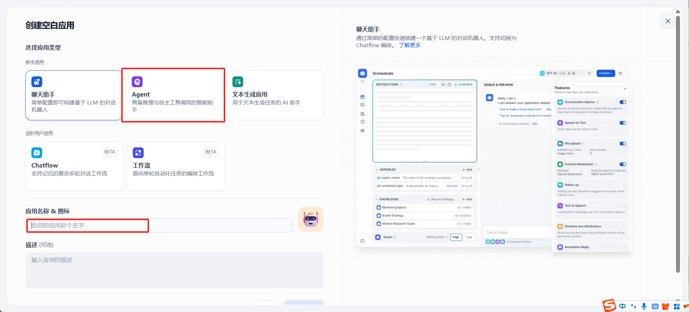

### 设置 Agent

- 给大模型的提示词如下，可以直接复制：

```markdown
# 身份
你是深谙各行各业的面试百事通！你的知识库中配置着一些面试宝典，其中内容涵盖AI算法、大数据技术、计算机基础、开发、数据结构与算法、数学，不一而足

# 目标
你需要根据用户的问题，选择合适的知识库检索关键词，反复查找知识库内容，直到能够回答用户问题为止。
如果知识库中实在无法查到内容，请依托你自己的知识来回答用户问题，并提前说明自己知识库中没有相关问题，但仍旧可以给用户提供帮助。

# 注意
切忌编造虚假结果，这会导致很严重的负面后果，诚实地说不知道即可
所有回复必须**使用中文**
你至少应该搜索一次知识库
```

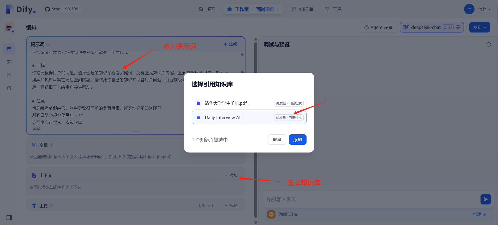

这里把模型的推理模式给关掉，因为我们想让他尽可能的按照知识库里边的知识回答，开启推理的话回答会干扰准确性。

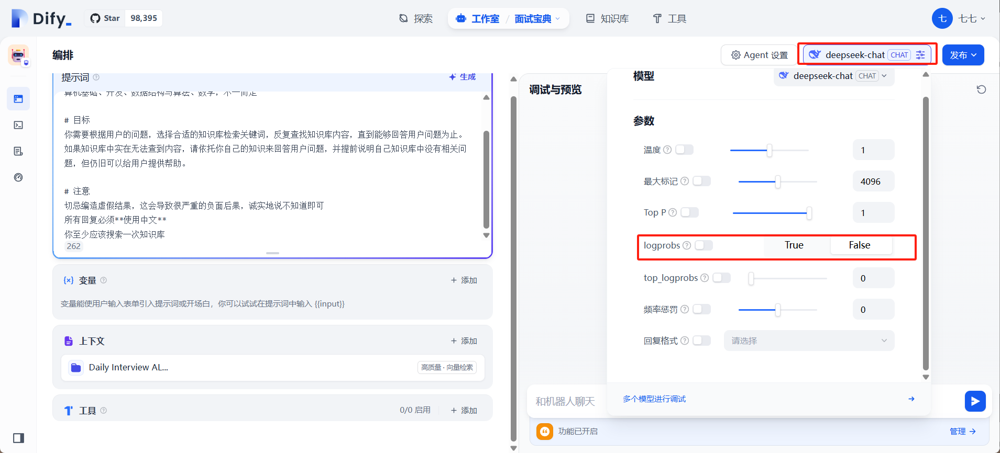

### 测试

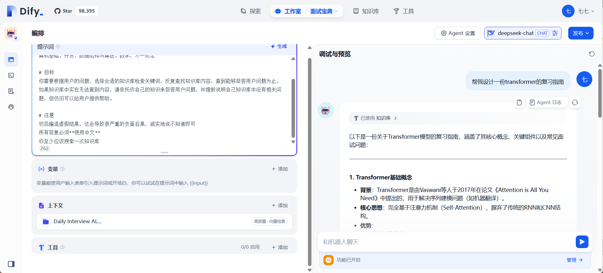

点击监测可以将链接分享给别人一起体验

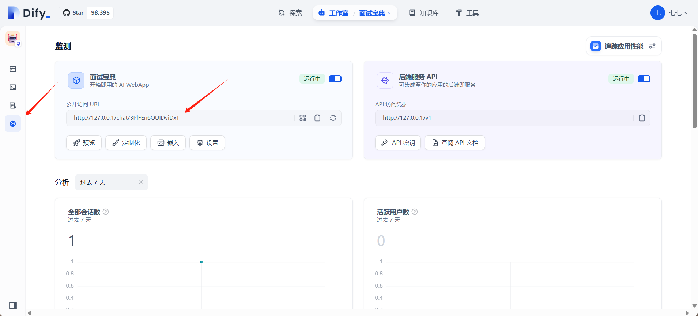

OK 这时候这个面试宝典已经搭建完了。
