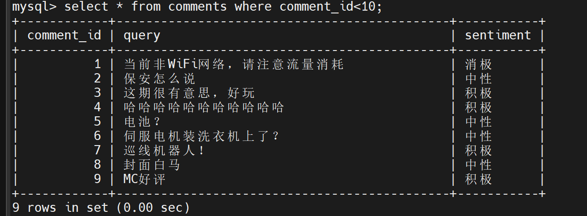
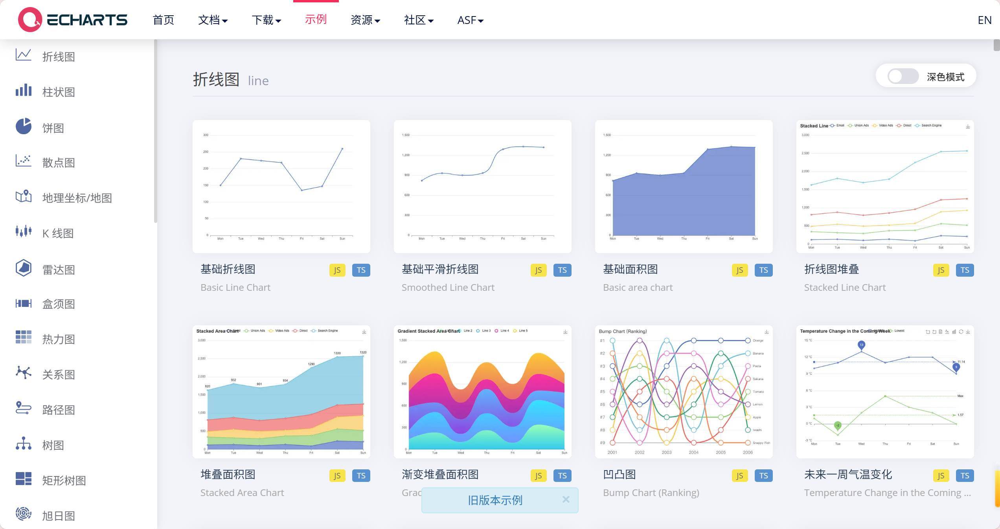

# 8.text2sql及echart数据分析

> 引言：
> mysql 是大家经常会使用的数据库，大家经常会遇到需要人为的查询数据写 sql 来获取对应的数据。有些大一点的企业业务部门伙伴需要自学一些 sql 才能拿到想要的数据。这对大家来说非常不便。对于开发的小伙伴来说，sql 需要重复编写也影响获取的效率。当大模型发展如火如荼的今天，也有人提出使用大模型来处理这些问题。我们今天就看看如何使用 dify 完成这个小任务吧。查到数据后我们顺便使用 echat 完成可视化分析~

# 数据库相关介绍

## 1.1 数据库介绍

数据库是一个组织、存储和管理数据的系统，它允许用户对数据进行增加、查询、更新和删除等操作。在现代互联网世界中，数据库成为了管理大量数据的关键工具，无论是文本、图像还是音乐等各种形式的数据。数据库管理系统（DBMS）是用于管理数据库的软件，它提供了一系列的功能和工具，用于创建、操作、维护和查询数据库。

## 1.2 mysql 介绍

MySQL 是一个**关系型数据库管理系统****，**由瑞典 [MySQL AB](https://baike.baidu.com/item/MySQL%20AB/2620844?fromModule=lemma_inlink) 公司开发，属于 [Oracle](https://baike.baidu.com/item/Oracle/301207?fromModule=lemma_inlink) 旗下产品。MySQL 是最流行的[关系型数据库管理系统](https://baike.baidu.com/item/%E5%85%B3%E7%B3%BB%E5%9E%8B%E6%95%B0%E6%8D%AE%E5%BA%93%E7%AE%A1%E7%90%86%E7%B3%BB%E7%BB%9F/696511?fromModule=lemma_inlink)之一，在 [WEB](https://baike.baidu.com/item/WEB/150564?fromModule=lemma_inlink) 应用方面，MySQL 是最好的 [RDBMS](https://baike.baidu.com/item/RDBMS/1048260?fromModule=lemma_inlink) (Relational Database Management System，[关系数据库管理系统](https://baike.baidu.com/item/%E5%85%B3%E7%B3%BB%E6%95%B0%E6%8D%AE%E5%BA%93%E7%AE%A1%E7%90%86%E7%B3%BB%E7%BB%9F/11032386?fromModule=lemma_inlink))应用软件之一。

MySQL 是一种关系型数据库管理系统，[关系数据库](https://baike.baidu.com/item/%E5%85%B3%E7%B3%BB%E6%95%B0%E6%8D%AE%E5%BA%93/1237340?fromModule=lemma_inlink)将数据保存在不同的表中，而不是将所有数据放在一个大仓库内，这样就增加了速度并提高了灵活性。

目前有很多很优秀的数据库，但 mysql 依然是大家最青睐的数据库之一。这导致 mysql 数据库基本上是很多与数据打交道的小伙伴必学必用的一个应用。


## 1.3 SQL 介绍

**SQL** (Structured Query Language:结构化查询语言) 是用于管理关系数据库管理系统（RDBMS）。

SQL 通过一系列的语句和命令来执行数据定义、数据查询、数据操作和数据控制等功能,包括数据插入、查询、更新和删除，数据库模式创建和修改，以及数据访问控制。

简单来讲 SQL 就是使用 MySQL 的一个钥匙，学习了 SQL 就可以灵活的取用 MySQL 中的数据。

## 1.4 Text2SQL

本节课我们的核心是通过 text2SQL，完成大模型与数据库的交互。所以也需要大家了解 Text2SQL 的相关技术。为后续使用做好铺垫。

Text2SQL 是一种将自然语言问题（如“查询 2023 年销售额最高的产品”）自动转换为结构化查询语言（SQL）的技术。它通过理解用户意图、识别关键实体（时间、对象、操作）并将其精准映射到数据库表结构和字段，最终生成可执行的 SQL 语句。这项技术极大地降低了数据库查询的门槛，使非技术人员也能通过日常语言高效获取和分析数据，显著提升数据利用效率，推动数据民主化，广泛应用于企业数据分析、智能决策支持等领域，并随着大模型和语义理解技术的进步持续发展。

深入学习入口：

Text2SQL 技术通过自然语言（如“查询 2023 年销售额最高的产品”）自动生成 SQL 查询，大幅降低数据库使用门槛，推动数据民主化与智能 BI 发展。其核心实现分三类：1. Prompt 工程方案依赖结构化指令（数据库 Schema+ 问题描述）驱动大模型生成 SQL，简单但复杂场景易出错；2. SQLDatabaseChain 方案基于 LangChain 框架自动化执行“自然语言 →SQL 生成 → 数据库查询 → 结果返回”全流程，需警惕输出幻觉与安全风险；3. Agent 智能体方案融合动态纠错与 RAG 优化，例如通过 Few-shot 示例增强语义理解，或利用向量库（如 FAISS）校准专有名词拼写（如将“alis in chain”纠正为“Alice In Chains”），实现多轮交互式精准查询。

核心挑战在于语义歧义性（如“最厉害的销售”指销量还是金额）和“正常运行假象”（语法正确但逻辑错误），解决方案包括：动态注入相关表结构（非全库 Schema）、多结果投票机制（多次生成 SQL 取共识）、注入领域知识提示（如定义“客户流失率=流失用户数/总用户数”）。

开源框架 Vanna 提供成熟落地方案：支持主流数据库（MySQL/Snowflake 等）与大模型（OpenAI/智谱等），通过“训练 RAG 模型 → 自然语言提问 → 自动执行 SQL”三步简化流程，并集成 Streamlit/Flask 等部署工具。未来优化聚焦动态 Schema 压缩、多模态交互及领域知识强化。

> 详见：《Text2SQL 圣经》，完整实现详见[原文](https://mp.weixin.qq.com/s/_Sn86M-4dVK28xOeLeesmQ)。

## 1.5 安装 mysql

### windows 入口

首先下载上面的文件，然后根据下面的配置安装即可。

1. 双击启动
2. 取消更新


1. 选择 server only


1. 然后继续


1. 接着点击 next


1. 密码配置。这里我设了两个 root 配进来，你可以根据自己需要设计，要记住哦。然后点击 next。


1. 后面 next 即可


1. 这一步如果卡在中间请查看自己的电脑是不是中文名作为用户名，是的话请改为英文。


没问题点击 finish，next，finish 即可。

### Linux

**Ubuntu 上安装和配置 MySQL**

在 Ubuntu 系统中安装 MySQL 可以通过在线或离线方式完成。以下是详细步骤，帮助您快速完成 MySQL 的安装与配置。

**在线安装 MySQL**

1. **更新软件包列表** 运行以下命令以确保系统的软件包列表是最新的：

sudo apt update

1. **安装 MySQL 服务器** 使用以下命令安装 MySQL：

sudo apt install -y mysql-server

1. **启动并设置开机自启动** 启动 MySQL 服务并设置为开机自启动：

sudo systemctl start mysql

sudo systemctl enable mysql

1. **检查 MySQL 状态** 确认 MySQL 是否正常运行：

sudo systemctl status mysql

1. **配置 MySQL 安全性** 运行安全脚本以提高安全性：

sudo mysql_secure_installation

根据提示设置 root 密码、移除匿名用户、禁止 root 远程登录等。

**离线安装 MySQL**

1. **下载 MySQL 安装包** 在联网设备上访问 [MySQL 官方网站](https://dev.mysql.com/downloads/repo/apt/) 下载适合 Ubuntu 的_.deb_文件。
2. **传输到目标机器** 将下载的文件通过 USB 或网络传输到目标 Ubuntu 机器。
3. **安装 MySQL 包** 使用以下命令安装：

sudo dpkg -i mysql-apt-config_*.deb

sudo apt update

sudo apt install -y mysql-server

**配置远程访问**

- 修改配置文件：

sudo vim /etc/mysql/mysql.conf.d/mysqld.cnf

- 授予远程访问权限： 登录 MySQL 后执行以下命令：

GRANT ALL PRIVILEGES ON _._ TO 'root'@'%' IDENTIFIED BY 'your_password';

FLUSH PRIVILEGES;

**验证与测试**

- 登录 MySQL：

sudo mysql -u root -p

- 查看运行状态：

sudo systemctl status mysql

通过以上步骤，您可以成功在 Ubuntu 上安装并配置 MySQL。根据需求选择在线或离线方式，并确保完成必要的安全配置。

### MAC

**Mac 上配置 MySQL**

在 Mac 上配置 MySQL 可以通过下载安装包或使用 Homebrew 来完成。以下是详细步骤：

1. **下载并安装 MySQL**

**使用 Homebrew 安装**

brew install mysql

启动 MySQL 服务：

brew services start mysql

**使用安装包安装**

1. 访问 [MySQL 官网](https://dev.mysql.com/downloads/mysql/)下载适用于 macOS 的.dmg 文件。
2. 双击下载的.dmg 文件，按照提示进行安装。
3. 在安装过程中，设置 root 用户的密码。
4. **配置环境变量**

打开终端，输入以下命令编辑.bash_profile 文件：

vim ~/.bash_profile

在文件中添加以下内容：

export PATH=$PATH:/usr/local/mysql/bin

保存并退出编辑模式，然后使配置生效：

source ~/.bash_profile

1. **验证安装**

在终端中输入以下命令查看 MySQL 版本：

mysql --version

1. **启动和登录 MySQL**

启动 MySQL 服务：

mysql.server start

使用 root 用户登录 MySQL：

mysql -u root -p

输入之前设置的密码，即可进入 MySQL 命令行界面。

通过以上步骤，你可以在 Mac 上成功安装和配置 MySQL。如果遇到任何问题，可以参考相关文档或社区资源获取帮助。

## 1.6 测试

windows 为例。我们需要使用 cmd，输入：

`cd C:\Program Files\MySQL\MySQL Server 5.7\bin`


然后需要输入：（接着输入密码）

```python
mysql -u root -proot
```

可能遇到下面情况 密码可能输错了，记不起来需要重新安装。


没问题会出现下图这样：


## 1.7 导入数据

1. 下载文件到 C:\Program Files\MySQL\MySQL Server 5.7\bin 目录

文件如下：

1. 进入数据库，输入下面内容创建一个数据库

```python
create database test；
```

1. 打开 mysql 的目录 cmd，输入下面内容，导入数据。

```python
mysql -u root -p test < comments.sql
```

1. 打开数据库输入，查看数据。

```python
use test;
select * from comments where comment_id<10;
```

大家看完知道这是弹幕的数据后续，我把弹幕数据转为了 sql 存入 mysql。



## 1.8 数据关系

### 表结构设计 ：

- comments ：存储评论 ID、查询内容和情绪分类
- keywords ：存储唯一关键字及自增 ID（确保关键字不重复）
- comment_keywords ：多对多关联表，连接评论和关键字

### 三个表的基本信息

#### 1. comments 表（评论表）

<table>
<tr>
<td>字段名<br/></td><td>数据类型<br/></td><td>说明<br/></td><td>约束<br/></td></tr>
<tr>
<td>comment_id<br/></td><td>INT<br/></td><td>评论ID（主键）<br/></td><td>PRIMARY KEY<br/></td></tr>
<tr>
<td>query<br/></td><td>TEXT<br/></td><td>评论内容<br/></td><td>NOT NULL<br/></td></tr>
<tr>
<td>sentiment<br/></td><td>VARCHAR(20)<br/></td><td>情绪分类（积极/消极/中性）<br/></td><td>NOT NULL<br/></td></tr>
</table>

#### 2. keywords 表（关键字表）

<table>
<tr>
<td>字段名<br/></td><td>数据类型<br/></td><td>说明<br/></td><td>约束<br/></td></tr>
<tr>
<td>keyword_id<br/></td><td>INT<br/></td><td>关键字ID（主键）<br/></td><td>PRIMARY KEY<br/></td></tr>
<tr>
<td>keyword<br/></td><td>VARCHAR(255)<br/></td><td>关键字内容<br/></td><td>NOT NULL, UNIQUE<br/></td></tr>
</table>

#### 3. comment_keywords 表（评论-关键字关联表）

<table>
<tr>
<td>字段名<br/></td><td>数据类型<br/></td><td>说明<br/></td><td>约束<br/></td></tr>
<tr>
<td>comment_id<br/></td><td>INT<br/></td><td>评论ID（外键）<br/></td><td>FOREIGN KEY<br/></td></tr>
<tr>
<td>keyword_id<br/></td><td>INT<br/></td><td>关键字ID（外键）<br/></td><td>FOREIGN KEY<br/></td></tr>
<tr>
<td><br/></td><td><br/></td><td>复合主键<br/></td><td>PRIMARY KEY (comment_id, keyword_id)<br/></td></tr>
</table>

### 表关联关系

- **一对多关系**：一个评论可以对应多个关键字（通过 comment_keywords 表）
- **一对多关系**：一个关键字可以属于多个评论（通过 comment_keywords 表）
- **多对多关系**：comments 表和 keywords 表通过 comment_keywords 表建立多对多关联

### 基本查询 SQL 案例

#### 1. 查询所有积极情绪的评论及其关键字

```sql
SELECT 
  c.comment_id, 
  c.query AS comment_content, 
  GROUP_CONCAT(k.keyword SEPARATOR ', ') AS keywords
FROM 
  comments c
JOIN 
  comment_keywords ck ON c.comment_id = ck.comment_id
JOIN 
  keywords k ON ck.keyword_id = k.keyword_id
WHERE 
  c.sentiment = '积极'
GROUP BY 
  c.comment_id, c.query;
```

#### 2. 统计各情绪类型的评论数量

```sql
SELECT 
  sentiment, 
  COUNT(*) AS comment_count
FROM 
  comments
GROUP BY 
  sentiment;
```

#### 3. 查询出现频率最高的前 10 个关键字

```sql
SELECT 
  k.keyword, 
  COUNT(ck.keyword_id) AS occurrence_count
FROM 
  keywords k
JOIN 
  comment_keywords ck ON k.keyword_id = ck.keyword_id
GROUP BY 
  k.keyword
ORDER BY 
  occurrence_count DESC
LIMIT 10;
```

#### 4. 查询包含特定关键字的所有评论

```sql
SELECT 
  c.comment_id, 
  c.query AS comment_content, 
  c.sentiment
FROM 
  comments c
JOIN 
  comment_keywords ck ON c.comment_id = ck.comment_id
JOIN 
  keywords k ON ck.keyword_id = k.keyword_id
WHERE 
  k.keyword = '环保';
```

# echart 介绍

## 2.1 基本介绍

echart 是由 apache 公司开发的 js 图表工具库，也是市面上非常流行的一款数据可视化工具。这里来辅助我们对取出的 mysql 数据进行分析。





## 2.2 使用原理


查看官网给出的实例大家能看到，代码结构比较简单。引入对应的包之后需要做的就是在 option 配置即可。简单易用。

# dify 使用 mysql 及 echart

## 3.1 mysql 工具

大家需要到应用市场搜索 SQL 找到数据库查询这个工具，然后点击安装即可。sql 查询工具通过 http 方式链接 mysql 服务，这种方法不需要大家在 docker 内额外为 dify 配置数据库，也不用写 http 请求链接 mysql。简单方便快速上手。


## 3.2 echats 工具

大家需要到应用市场搜索 echart，第一个安装一下就是 echat 的对应服务。因为目前插件市场的 echart 工具只有三种，目前大家用起来不太够，也有一些其他的方法实现更复杂的表格。


## 3.3 dify 连接 mysql

### 前期准备

本地电脑需要的配置：[https://blog.csdn.net/xiaoyao961/article/details/139524263](https://blog.csdn.net/xiaoyao961/article/details/139524263)
注意：需要提前关闭防火墙

云服务器需要的配置：[https://blog.csdn.net/m0_73385807/article/details/148160241](https://blog.csdn.net/m0_73385807/article/details/148160241)

### dify 工作流配置


1. 请先创建一个 chatflow
2. 需要配置一个环境变量，这里是我们的端口号，因为工具有点问题可以在这里配置变量加载


1. 配置模板转换模块存储我们的表结构 prompt，输入变量随便写一下就好


```sql
表结构设计 ：
- comments ：存储评论ID、查询内容和情绪分类
- keywords ：存储唯一关键字及自增ID（确保关键字不重复）
- comment_keywords ：多对多关联表，连接评论和关键字
   
三个表的基本信息
1. comments表（评论表）
字段名
数据类型
说明
约束
comment_id
INT
评论ID（主键）
PRIMARY KEY
query
TEXT
评论内容
NOT NULL
sentiment
VARCHAR(20)
情绪分类（积极/消极/中性）
NOT NULL

2. keywords表（关键字表）
字段名
数据类型
说明
约束
keyword_id
INT
关键字ID（主键）
PRIMARY KEY
keyword
VARCHAR(255)
关键字内容
NOT NULL, UNIQUE

3. comment_keywords表（评论-关键字关联表）
字段名
数据类型
说明
约束
comment_id
INT
评论ID（外键）
FOREIGN KEY
keyword_id
INT
关键字ID（外键）
FOREIGN KEY

复合主键
PRIMARY KEY (comment_id, keyword_id)

表关联关系
- 一对多关系：一个评论可以对应多个关键字（通过comment_keywords表）
- 一对多关系：一个关键字可以属于多个评论（通过comment_keywords表）
- 多对多关系：comments表和keywords表通过comment_keywords表建立多对多关联
  
基本查询SQL案例

1. 查询所有积极情绪的评论及其关键字
SELECT 
  c.comment_id, 
  c.query AS comment_content, 
  GROUP_CONCAT(k.keyword SEPARATOR ', ') AS keywords
FROM 
  comments c
JOIN 
  comment_keywords ck ON c.comment_id = ck.comment_id
JOIN 
  keywords k ON ck.keyword_id = k.keyword_id
WHERE 
  c.sentiment = '积极'
GROUP BY 
  c.comment_id, c.query;

2. 统计各情绪类型的评论数量
SELECT 
  sentiment, 
  COUNT(*) AS comment_count
FROM 
  comments
GROUP BY 
  sentiment;

3. 查询出现频率最高的前10个关键字
SELECT 
  k.keyword, 
  COUNT(ck.keyword_id) AS occurrence_count
FROM 
  keywords k
JOIN 
  comment_keywords ck ON k.keyword_id = ck.keyword_id
GROUP BY 
  k.keyword
ORDER BY 
  occurrence_count DESC
LIMIT 10;

4. 查询包含特定关键字的所有评论
SELECT 
  c.comment_id, 
  c.query AS comment_content, 
  c.sentiment
FROM 
  comments c
JOIN 
  comment_keywords ck ON c.comment_id = ck.comment_id
JOIN 
  keywords k ON ck.keyword_id = k.keyword_id
WHERE 
  k.keyword = '环保';
```

1. 设计 agent

这一步比较复杂，需要我们选择 agent 模块进行配置。


我们选择 agent 工具后进入配置。策略选择 agent 的 react 模式。模型使用 v3。工具使用 SQL 查询。


具体的配置可以参考我的：记得一定要使用局域网 IP，而且在前期准备里根据参考内容配置完毕。局域网 IP 的查询方式大家可以在群里问一下我~


智能体指令如下，最后的查询内容就是用户的 query


```bash
你是数据库查询助手，根据用户输入命令调用工具查询数据库，查询的数据库为test，它包含的表结构:
{output}

根据输入分析，如果需要输出表格请组合成json输出


x轴数据为类型，y轴数据为数值。数据之间需要用；隔开。请输出
{
   "xdata":["a";"b";"c";"d";"e"],
   "ydata":[1;2;3;4;5]
}
```


1. 统计图绘制

这里的 echarts 我们选择柱状图，你也可以参考之前的教程做意图识别把多种图表同步加载进来。使用 echarts 需要导入数据和 x 轴来做绘制图像的基本数据。那么基本数据从哪里来呢？我们通过智能体把数据基本获取到，这里使用两个 llm 来做格式汇总，最后输出图表需要的数据即可。


两个模型用法一样，主要 few-short 将数据整理为目标数据。大家注意两个不要弄反了~

prompt 如下：


```python
用户输入内容，将json中的y data值抽取出来。注意只输出抽取的数据结果。结果用分号分割。

例如输入的：
{
"xdata": ["消极"; "中性"; "积极"],
"ydata": [121; 133; 95]
}}

输出：
121; 133; 95

输入：
{agent/text}


输出：
```

```json
用户输入内容，将json中的x data值抽取出来。注意只输出抽取的数据结果。结果用分号分割。

例如输入的：
{
"xdata": ["消极"; "中性"; "积极"],
"ydata": [121; 133; 95]
}}

输出：
"消极"; "中性"; "积极"

输入：
{agent/text}

输出：
```

1. 数据分析

这里我们简单做一个数据分析模块，并行的帮我们对数据处理进行分析。最后将分析和图表汇总即可~


1. 效果

> [!TIP]

# 评论数据分析报告

根据提供的数据和表结构，我将对评论情绪分布进行分析并创建可视化图表。

## 情绪分布分析

从 SQL 查询结果来看，评论情绪分布如下：

- 消极评论：121 条
- 中性评论：133 条
- 积极评论：95 条

## 可视化图表

我将使用柱状图展示情绪分布情况：
Python
`import matplotlib.pyplot as plt`
`import seaborn as sns`
`# 数据准备 ``data = {`
`    "xdata": ["消极", "中性", "积极"],`
`    "ydata": [121, 133, 95]`
`} `
`# 创建图表 ``plt.figure(figsize=(10, 6))`
`sns.barplot(x=data["xdata"], y=data["ydata"], palette=["#ff6b6b", "#feca57", "#1dd1a1"])`
`# 添加标题和标签 ``plt.title("评论情绪分布分析", fontsize=16, pad=20)`
`plt.xlabel("情绪类型", fontsize=12)`
`plt.ylabel("评论数量", fontsize=12)`
`# 添加数据标签 ``for i, v in enumerate(data["ydata"]):`
`    plt.text(i, v + 2, str(v), ha='center', fontsize=12)`
`# 美化图表 sns.despine() plt.tight_layout() ``plt.show()`

## 分析结论

1. 情绪分布特点：
   - 中性评论最多(133 条)，占比约 38%
   - 消极评论次之(121 条)，占比约 35%
   - 积极评论最少(95 条)，占比约 27%
2. 建议：
   - 中性评论占比较高，说明大部分评论较为客观中立
   - 消极评论略多于积极评论，可能需要关注用户不满意的方面
   - 可以考虑进一步分析消极评论的关键词，找出主要问题点

## 扩展分析建议

1. 关键词分析：
2. SQL
3. `-- 消极评论中的高频关键词 ``SELECT k.keyword, COUNT(*) as count`
   `FROM keywords k`
   `JOIN comment_keywords ck ON k.keyword_id = ck.keyword_id`
   `JOIN comments c ON ck.comment_id = c.comment_id`
   `WHERE c.sentiment = '消极' ``GROUP BY k.keyword`
   `ORDER BY count DESC ``LIMIT 10;`
4. 时间趋势分析（如果数据有时间戳）：
   - 分析情绪随时间的变化趋势
   - 识别是否有特定事件导致情绪波动
5. 情绪与关键词关联分析：
   - 找出哪些关键词更常出现在积极/消极评论中
   - 建立情绪-关键词关联矩阵


