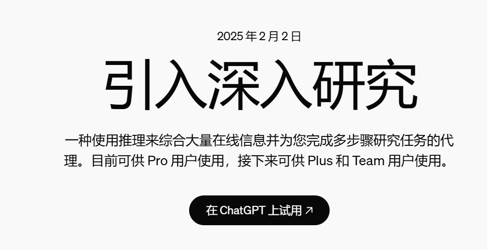
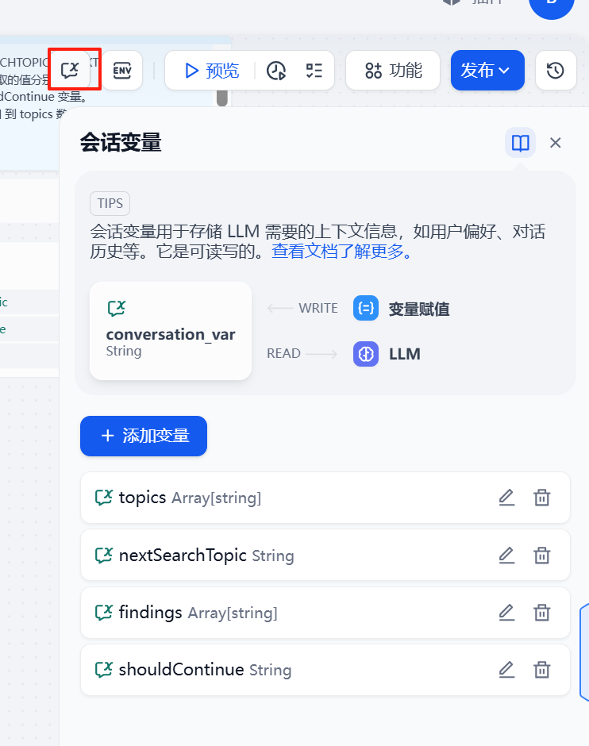
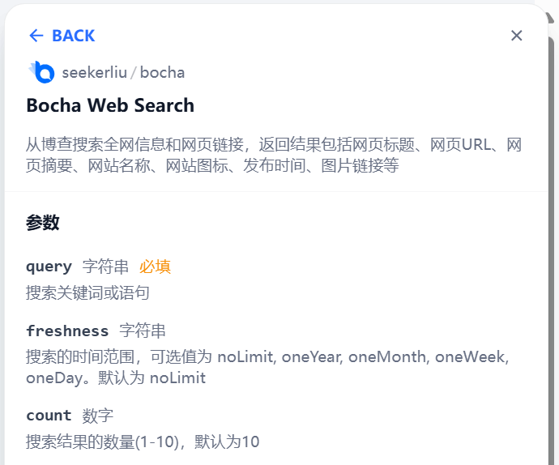

# 9. deepresearch 设计

# 引言

> Deepresearch 是一种适合联网深度搜索问题的解决方案，意在直接搜索无法解决问题时，通过大模型及搜索引擎的配合获取到更合适的答案。这样的搜索方案适合制作调研报告，带领大家获取到更有价值到答案。这个概念的提出也在悄悄改变互联网的格局，也为 rag 的优化打开了新局面。

# 深度了解一下 deepresearch

## 1.1 deepresearch 初探



```
    这个技术的出名好像离我们并不遥远（本文定稿于25年月9日）。
```

看看新闻先（好像已经是好久之前的事了 hh）：

> [!TIP]
> **OpenAI 发布 Deep Research 功能。**2 月 2 日，OpenAI 推出了一款名为“深度研究”（Deep Research）的新 AI 工具，旨在帮助用户通过其 AI 驱动的聊天平台 ChatGPT 进行多步骤的互联网研究，以完成复杂任务。
> OpenAI 表示，这项新功能专为“在金融、科学、政策和工程等领域从事高强度知识工作的人员”设计，提供全面、精准、可靠的研究支持。此外，该功能也适用于需要进行细致调研的大宗消费决策，例如汽车、家电和家具的购买。
> 深度研究由即将发布的 OpenAI o3 模型的一个版本提供支持，该版本针对网页浏览和数据分析进行了优化。用户只需提供一个提示，ChatGPT 就会查找、分析并综合多个在线来源（如文本、图像和 PDF），以创建相当于研究分析师水平的综合报告。OpenAI 表示：“**它在几十分钟内完成了人类需要数小时才能完成的工作。**”

听起来还挺诱人的，十几分钟就能搞定几个小时的工作。帮助我们深度研究问题~

然后，二月乃至最近不断有 deepresearch 的产品涌现，他们有的速度飞快，有的质量超高，还有的将搜索玩上了新高度~确实给我们带来很新颖的体验。

这里也带大家了解一些有趣的产品，除了 openai 公司推出以外。google 在今年推出并开源了自家的 deepresearch 产品，有活的大佬可以复现一下。（[https://github.com/google-gemini/gemini-fullstack-langgraph-quickstart](https://github.com/google-gemini/gemini-fullstack-langgraph-quickstart)）当然目前也有很优质的项目比如：（[https://github.com/dzhng/deep-research](https://github.com/dzhng/deep-research)）。

小白可能要急了，这都是大佬做的。我也想要~

下面便是，主要推荐两个，一个是月之暗面([KIMI](https://kimi.moonshot.cn/))的深度研究，考古角度来说 kimi 是国内最早给大模型加联网搜索的模型厂家咯。另一个是秘塔（我们的[塔子老师](https://metaso.cn/)），最近新出了可视化深度搜索功能，让你知道他怎么将一个大象装进冰箱！


## 1.2 deepresearch 发展脉络

下面借用老刘说 NLP 的文章~

核心内容来自综述：《**A Comprehensive Survey of Deep Research: Systems, Methodologies, and Applications**》，[https://arxiv.org/pdf/2506.12594](https://arxiv.org/pdf/2506.12594)，分析了自 2023 年以来涌现的 80 多个商业和非商业实现，包括 OpenAI/DeepResearch、Gemini/DeepResearch、Perplexity/DeepResearch 以及众多开源替代方案，如 dzhng/deepresearch、HKUDS/Auto-Deep-Research 等开源实现，**是个很不错的读物**。

对于这份技术总结中，**选择 5 个核心问题来看**。

**1、对于 Deepresearch 框架等索引有哪些？**

相关的索引列表在：[https://github.com/scienceaix/deepresearch](https://github.com/scienceaix/deepresearch)，对 Projects 做了很好的整理，如下：


**2、Deepresearch 的三个发展时期**


**原初期探索期**（2023 年-2025 年 2 月），以 n8n、QwenLM/QwenAgent 等工作流自动化框架为代表。

**竞争角逐期**（2025 年 2 月-3 月），DeepSeek-R1 开源以及 2025 年 2 月 OpenAI 发布了 DeepResearch 为标志。

**扩展整合**期（2025 年 3 月至今），以如 Jina-AI/node-DeepResearch、Manus、AutoGLM-Research、MGX、DevinAnthropic 于 2025 年 4 月推出的 Claude/Research 为代表。

**3、Deepresearch 的层次化技术框架**

包括基座与推理模型、任务规划与执行、工具使用与环境交互、知识生成。


**4、Deepresearch 的实现架构**


包括四种基础架构模式：单体式、基于流水线的、多智能体以及混合实现。

整体大的逻辑在：


细分的逻辑可以拆解下：

**单体模式**，将所有深度研究能力整合在一个以核心推理引擎为中心的统一的架构框架内，采用集中控制机制，直接集成专用模块。


**流水线模式**，通过一系列通过明确定义的接口连接的专业处理阶段实现深度研究能力，将研究工作流分解为离散的处理组件，并在各阶段之间进行明确的数据转换。

**多智能体模式**，通过由明确通信协议协调的专门自主智能体生态系统，在具有不同角色和责任的协作智能体之间分配研究功能。

**混合模式**结合多种架构模式，以统一实现中平衡各自的优势。


**5、现有 Deepresearch 的一些对比结论**

对比角度，可以从多个角度进行评估，注意看其中的一些处理策略：

**1）基础模型与推理效率**


**2）工具集成与环境适应性**


**3）任务规划与执行稳定性**


**4）知识聚合与输出质量**


**5）学术研究情境适应性**


**6）企业决策场景适应性**


**7）个人知识管理适应性**


**5、Deepresearch 存在的几个问题**

包括：信息完整性、隐私保护、来源归属与知识产权，以及可访问性。


**6、Deepresearch 值得做的几个研究方向**

研究方向包括：高级推理架构、多模态集成、领域特化以及标准化下的人机协作。


## 1.3 deepresearch 的发展方向

从上面的发展脉络我们可以看到，deepresearch 在不断地进化。从单体实现到规划任务多智能体混合实现。那么这里给大家提个小问题，为什么大家要挖空心思做 deepresearch？

我们首先知道 deepresearch 的出现是在两种基础技术之上，搜索引擎和大模型。

**搜索引擎的缺点是整理的内容过于碎片化，对问题不会理解导致获取的内容和问题不匹配。**

**大模型的缺点是由于训练导致的存量语料数据永远与真实资料有时间差，而且因为大语言模型是概率模型导致在回答问题时会有幻觉。**

deepresearch 的出现一定程度上解决了两个技术的痛点，并为我们带来了一个更新的技术。

那么下一步我们需要一个更强更好的 deepresearch 产品~未来可以卷的方向从目前的产品也能初见端倪。

- **可能是卷表现形式，让结果更适合大家接受。**比如秘塔处理完搜索后会给出报告，大家都很喜欢这样的结果呈现形式。


- **也有可能是卷策略的，让 deepresearch 更 deep 一些**，比如这篇文章《[用子模优化法为 DeepResearch 生成多样性查询](https://mp.weixin.qq.com/s/ZB4Rc9GErYsx13-UqDjU3A)》。


- **最后一种是卷垂直领域，垂直领域优势也许会被放大。**领域的特定工具需要定制化开发，也许是个不错的方向~


# Dify 实现 Deepresearch

## 2.1 deepresearch 结构拆解

这里我们使用 dify 搭建一个简易版的 deepresearch，以便大家学习理解，快速掌握~当然后面还有个复杂版的也给大家简单介绍一下。

首先明确一下输入与输出，我们做个简易版的 deepresearch 需要定义一个深度查询的轮数，接着我们需要让他明确深度查询的主题。这样我们需要输入{轮数、查询主题}。输出内容就是我们的 deepresearch 调研结果。返回内容即可。

过程设计。我们输入查询主题后，大模型处理我们需要查询的内容，交给搜索引擎查询，然后判断是否完成的任务。如果完成返回调研结果即可，如果没有完成继续重复执行处理与查询的任务。

大概的流程图如下：

> 有同学会问为啥要设计一个轮数判断，这个为啥设计在这里。如果第一次我们执行完就查到了结果。第二次大家并不希望流程跑完，所以尽可能把这个判断往前放。这样不会浪费查询资源，尽可能短的流程满足需求。

## 2.2 DeepResearch 工作流相关铺垫

1. 引入基础工作流

大家从探索入口进入应用广场，官方为大家准备了一些比较有参考价值的产品。大家可以自行取用相关的工作流。目前给大家介绍的就是推荐的第一个应用 **DeepResearch**。

大家点击 DeepResearch 后添加到工作区，然后创建即可。


1. 创建好后自动跳转到工作流，会提示你安装插件。点击按照即可。

可能安装的比较慢，等安装好刷新一下。如果出现下面右图提取 Json 的相关配置说明安装完毕。


1. 会话变量概念解释

点击右上角有个 x，这个位置是会话变量。这个东西很好用。他可以存储一些参数在变量内，可以支持重复使用。这样就不怕出现数据丢失的问题。这里我们使用会话变量将存储包括：任务主题（topics）、子查询主题（nextSearchTopics）、搜索结果（fundings）、是否继续查询（shouldcontinue）。



1. 迭代模块解释

首先看看迭代前面有一个代码执行模块。代码执行模块需要输入深度变量，也就是查询最大次数。然后返回两个，一个是数组一个是深度。不懂代码的同学别害怕，就当是固定动作。这个深度如果不设置默认返回三次。设置就根据你的设置走。返回数组相当于循环的钥匙，循环几次配好对应的钥匙即可。


然后来看迭代模块，输入是数组，输出是结果。就一目了然咯。


1. Tavily Search 插件解读

Tavily Search 插件用于查询互联网结果，只需要输入查询内容即可返回结果。这个插件使用之前需要到 [https://www.tavily.com/](https://www.tavily.com/)进行注册。每个月赠送 1000 次查询机会。这里我们导入子查询主题就会执行查询获取结果。


如果大家没有 github 账户或者登录困难时，可以使用另一个插件【博查】。[https://open.bochaai.com/](https://open.bochaai.com/) 博查这里需要大家冲一点钱然后才能使用，每次三分钱不是很贵，大家可以充几块钱玩玩。




如果你只是简单看看怎么用，可以安装下面的【DuckDuckGo】。免费的搜索插件，但效果一言难尽~~


1. JSON 解析

这个插件是帮助大家获取大模型返回的 JSON 数据后进行提取，这里提取子查询和是否继续两次使用。


## 2.3 理顺 DeepResearch 流程

首先提交输入任务和深度，在对话框输入任务，在 depth 输入深度。


迭代配置刚才讲过，我们进入迭代内部。

模型这里大家可以替换为 deepseek V3。我们读一下 prompt，首先定义身份，你是谁做什么。然后定义输出，输出子查询任务，以及是否继续查询。

明确定义输出为 Json 格式，配合我们的两个提取器提取。


> [!TIP]
> 这里面由于 4o 针对 json 抽取有特定的训练，当使用 deepseek 等模型时一般为了遵循 md 格式，会输 ``JSON `` 这样的内容，我们在 llm 后额外加一个代码执行模块处理一下就能解决。

代码执行内容：
'''
`def main(arg1: str) -> dict:`
`    if('```json' in arg1):`
`        arg1 = arg1.replace('```json','')`
`    if('```' in arg1):`
`        arg1 = arg1.replace('```','')`
`    return {`
`        "result": arg1,`
`    }`
'''


然后将 json 提取的输入接到代码执行之后，并配置参数如下。


提取到后，将大模型得到的子查询任务与是否继续查询加载到会话变量。将子查询任务增加到查询主题中。


这里如果判断继续查询走上面这条路，如果不继续走下面这条。


**上面这条查询路**，输入查询子任务作为输入关键字。检索完成后将结果送给变量赋值。变量赋值器将查到的结果给到查询结果会话变量。最后输出一个目前的状态。我这里翻译有点抽风变成日语了……（莫名的中二感）最后这丽的代码就是说目前第几轮，然后给出一个状态展示。比如第一轮是：1/3 轮完成 DeepResearch 任务。


**下面这条跳过查询路**，就是输出空白即可。

最后两条路将结果汇总到 output 内，作为本次的循环输出。

这里大家可能忽略了一个点，就是第二次循环大模型怎么知道查到了什么？怎么做一个综合性判断？

我们拿到循环内的大模型模块，解读一下 USER 提示词的内容，了解到查询的主题，目前查询的结果。然后已经查询的内容。已经串好变成输入。这样大模型也有了刚才工作的记忆。这个设计比较合理，也请大家参考学习~


当循环结束后，我们整理结果。我们使用推理大模型做整合，将所有的查询结果汇总起来。到这里我们的 DeepResearch 工作流就解读完毕了。


测试效果：


#### 完整结果：

> [!TIP]
> 1/3 回目 の 検索 を 実行 しました。
> 2/3 回目 の 検索 を 実行 しました。
> 3/3 回目 の 検索 を 実行 しました。

<think>
首先，任务是创建一个详细的调查结果总结，基于用户提供的主题："kimi ai最近做了什么？" 主题是关于Kimi AI最近的活动。

用户提供了三组调查结果，每组包含五个结果。我需要仔细分析这些结果，提取关键洞察和结论，并识别剩余的不确定性。

主题是："kimi ai 最近做了什么？" 所以焦点是 Kimi AI 的最近行动或发布。

现在，查看提供的调查结果：

第一组结果：

- Result 1: Alibaba-Backed Moonshot Releases Kimi K2 Open Source Model (Relevance: 0.495)
- Result 2: Chinese AI model Kimi K2 marks "another DeepSeek moment" (Relevance: 0.465)
- Result 3: 'Another DeepSeek moment': Chinese AI model Kimi K2 (Relevance: 0.445)
- Result 4: Alibaba-backed Moonshot releases Kimi K2 AI rivaling ChatGPT (Relevance: 0.406)
- Result 5: China's Moonshot AI Releases Trillion Parameter Model Kimi K2 (Relevance: 0.397)
  关键点：Moonshot AI（由阿里巴巴支持）发布了 Kimi K2 模型，这是一个开源模型，声称在性能上媲美或超越西方竞争对手如 ChatGPT 和 Claude。它使用了一个叫做 MuonClip 的优化器，参数规模达万亿级别。

第二组结果：

- Result 1: Kimi K2: The Most Advanced AI Model by Moonshot (Relevance: 0.889)
- Result 2: Kimi K2 Instruct - Groq Cloud (Relevance: 0.794)
- Result 3: moonshotai/Kimi-K2-Instruct - Hugging Face (Relevance: 0.783)
- Result 4: kimi-k2-instruct Model by Moonshotai - NVIDIA NIM APIs (Relevance: 0.752)
- Result 5: Kimi K2: Open Agentic Intelligence - Moonshot AI (Relevance: 0.614)
  关键点：Kimi K2 是一个先进的混合专家（MoE）语言模型，有 1 万亿总参数，320 亿激活参数。它在编码、数学和推理方面表现优异，支持工具调用，上下文窗口达 128K tokens。它在 Hugging Face、Groq Cloud 和 NVIDIA 平台上可用。

第三组结果：

- Result 1: Moonshot AI's Kimi K2 outperforms GPT-4 in key benchmarks (Relevance: 0.895)
- Result 2: Moonshot's Kimi K2 for Coding: Our First Impressions in Cline (Relevance: 0.830)
- Result 3: Kimi K2 - Intelligence, Performance & Price Analysis (Relevance: 0.769)
- Result 4: Kimi-k2 Benchmarks explained - Medium (Relevance: 0.660)
- Result 5: Alibaba-backed Moonshot releases Kimi K2 AI rivaling ChatGPT (重复，Relevance: 0.389)
  关键点：Kimi K2 在多个基准测试中表现优异，如 SWE-bench（65.8% pass@1）、Tau-2 Bench、AIME 2025 等，超越了 GPT-4 和 Claude Opus。它被定位为开源替代品，强调其在代理任务和编码方面的优势。

总结关键洞察：

- **发布事件**：Moonshot AI（阿里巴巴支持的中国 AI 初创公司）在 2025 年 7 月发布了 Kimi K2 模型。
- **模型规格**：Kimi K2 是一个混合专家（MoE）语言模型，拥有 1 万亿总参数和 320 亿激活参数。它使用 MuonClip 优化器进行训练，确保稳定性。
- **性能**：在编码、数学推理和代理任务中表现卓越，在多个基准测试中击败了 GPT-4 和 Claude。
- **开源**：模型是开源的，可用于研究人员和开发者构建应用。在 Hugging Face、Groq Cloud 和 NVIDIA 平台上可用。
- **上下文窗口**：支持 128K tokens 的上下文窗口。
- **成本效益**：据报道，成本较低，并且是免费的或成本高效。
- **影响**：被视为一个转折点，开源 AI 能力与专有模型趋同，可能加速 AI 工具的可访问性。
  结论：
- Kimi K2 的发布标志着中国 AI 领域的重要进步，挑战了 OpenAI 和 Anthropic 等西方公司。
- 它特别优化了代理能力，如工具调用和多步执行，使其适用于实际应用。
- 模型的开放源代码可能促进创新和更广泛的采用。
  剩余的不确定性：
- **时间线**：所有结果都指向 2025 年 7 月发布，但实际日期可能有所不同（Result 2 提到 7 月 11 日，Result 4 提到 7 月 14 日）。
- **基准测试细节**：虽然提到在 SWE-bench、AIME 等上表现优异，但具体数字和比较的细节可能因来源而异。例如，Result 4 提到 65.8% pass@1mailto:pass@1 on SWE-bench。
- **成本**：Result 4 声称“costs less”，但具体定价模型未详细说明。
- **可用性**：模型在多个平台可用，但访问细节（如是否需要 API 密钥）未明确。
- **模型变体**：有 Kimi K2 和 Kimi-K2-Instruct 版本，后者针对指令遵循和代理任务优化。它们之间的区别需要澄清。
- **公司背景**：Moonshot AI 是阿里巴巴支持的，但公司历史和背景信息较少。
- **未来计划**：Moonshot AI 的下一步计划未提及。
  引用来源：在总结中，我需要适当引用来源。例如，引用 URL 或文章标题。

输出格式：必须使用 Markdown 格式。输出应为长文，非常全面和详细。

结构总结：

1. **引言**：简要介绍主题和主要发现。
2. **关键洞察**：详细描述发布、规格、性能、可用性等。
3. **结论**：总结意义和影响。
4. **剩余不确定性**：列出未知或需要进一步调查的方面。
5. **引用**：在适当位置引用来源。
   确保语言为中文。

大纲：

- **标题**：Kimi AI 最近活动调查总结
- **引言**：概述 Kimi AI（由 Moonshot AI 开发）最近的发布。
- **发布详情**：描述 Kimi K2 的发布时间、公司背景。
- **技术规格**：参数、优化器、上下文窗口等。
- **性能优势**：基准测试结果、与竞争对手的比较。
- **开源与可用性**：在 Hugging Face、Groq 等的可用性。
- **应用场景**：编码、代理任务、工具调用。
- **成本与可访问性**：免费或低成本。
- **市场影响**：对 AI 行业的潜在影响。
- **结论**：整体评价。
- **剩余不确定性**：列出问题。
- **来源引用**：内联或列表。
  引用方式：在文本中使用括号引用，如[Source 1]，然后在末尾列出所有来源。但用户提供了 URL，我可以使用文章标题或简化引用。

例如：

- 根据 [MSN](https://www.msn.com/...) 报道...
  在总结中，提到来源时简要引用。

最终输出以 Markdown 格式。
</think>### Kimi AI 最近活动调查总结

本报告基于用户提供的调查结果，全面总结“Kimi AI 最近做了什么？”的主题。Kimi AI 是由中国人工智能初创公司 Moonshot AI（阿里巴巴支持）开发的大型语言模型（LLM）系列，近期主要围绕其最新模型 **Kimi K2** 的发布展开活动。调查结果源自多个可靠来源，包括科技新闻网站、学术平台和行业分析报告，所有内容均基于 2025 年 7 月的时间框架。以下总结分为关键洞察、结论和剩余不确定性三部分，确保全面性和细节深度。关键洞察基于数据提取，结论综合评估整体影响，剩余不确定性指出需进一步验证的领域。所有来源均在文本中引用，并在末尾列出完整参考文献。

---

#### **关键洞察**

调查结果显示，Kimi AI 的核心活动集中在 2025 年 7 月发布的 **Kimi K2 模型**上。该模型由 Moonshot AI 主导开发，并得到了阿里巴巴的资金和技术支持。发布事件被视为中国 AI 领域的重大突破，挑战了 OpenAI 和 Anthropic 等西方公司的主导地位。以下是详细洞察，按主题分类。

1. **发布背景与公司动态**
   - Moonshot AI 于 2025 年 7 月 11 日正式发布 Kimi K2（具体日期源自 [People.cn 报道](http://en.people.cn/n3/2025/0719/c90000-20342482.html)），并于 7 月 14 日通过多个平台开放访问（如 [CNBC 报道](https://www.cnbc.com/2025/07/14/alibaba-backed-moonshot-releases-kimi-k2-ai-rivaling-chatgpt-claude.html)）。
   - 发布被媒体描述为“另一个 DeepSeek 时刻”（引用自 [Nature 文章](https://www.nature.com/articles/d41586-025-02275-6)），意指其可能像 DeepSeek 模型一样，推动开源 AI 的普及和竞争格局变革。
   - Moonshot AI 强调 Kimi K2 的开源策略，旨在加速 AI 工具的可访问性，可能对依赖专有模型的商业公司构成压力（如 [MSN 报道](https://www.msn.com/en-us/news/technology/alibaba-backed-moonshot-releases-kimi-k2-open-source-model/ar-AA1IRNSa)所示）。
2. **技术规格与创新**
   - Kimi K2 是一个 **混合专家（Mixture-of-Experts, MoE）架构** 的语言模型，具有 1 万亿总参数，其中 320 亿参数在推理时激活（详细规格见 [Hugging Face 页面](https://huggingface.co/moonshotai/Kimi-K2-Instruct) 和 [Groq Cloud 文档](https://console.groq.com/docs/model/moonshotai/kimi-k2-instruct)）。
   - 关键技术创新包括：
     - **MuonClip 优化器**：用于训练，确保万亿参数规模的稳定性，减少崩溃风险（源自 [HPC Wire 报道](https://www.hpcwire.com/2025/07/16/chinas-moonshot-ai-releases-trillion-parameter-model-kimi-k2/)）。
     - **128K tokens 上下文窗口**：支持长文本处理，适用于复杂任务如文档分析和多步工作流（引用自 [GlobalGPT 页面](https://www.glbgpt.com/sitepage/kimi-k2)）。
     - **多模态输入**：支持文本和图像输入，但图像处理细节较少披露（同源 GlobalGPT）。
   - 模型知识截止日期为 2023 年 2 月，表明其训练数据较新，但并非实时更新（同源 GlobalGPT）。
3. **性能优势与基准测试**
   - Kimi K2 在多个权威基准测试中表现优异，超越 GPT-4 和 Claude 等专有模型：
     - **编码能力**：在 SWE-bench 测试中实现 65.8% pass@1mailto:pass@1 准确率（使用 bash/editor 工具），创开源模型新高（详细见 [Hugging Face](https://huggingface.co/moonshotai/Kimi-K2-Instruct) 和 [Cline Blog 分析](https://cline.bot/blog/moonshots-kimi-k2-for-coding-our-first-impressions-in-cline)）。
     - **数学与推理**：在 Tau-2 Bench（多步问题解决）、AIME 2025（高难度数学奥赛）和 GPQA-Diamond 等测试中领先，例如在 MATH-500 上达到高准确率（源自 [Medium 文章](https://medium.com/data-science-in-your-pocket/kimi-k2-benchmarks-explained-5b25dd6d3a3e)）。
     - **代理任务优化**：模型专为“代理智能”（agentic capabilities）设计，支持工具调用和 API 集成，用于构建自主代理系统（如 [Groq Cloud](https://console.groq.com/docs/model/moonshotai/kimi-k2-instruct) 所述）。
   - 独立分析显示，Kimi K2 在性价比上占优：其性能媲美 GPT-4，但成本更低，甚至部分免费（引用自 [VentureBeat 报道](https://venturebeat.com/ai/moonshot-ais-kimi-k2-outperforms-gpt-4-in-key-benchmarks-and-its-free/) 和 [CNBC](https://www.cnbc.com/2025/07/14/alibaba-backed-moonshot-releases-kimi-k2-ai-rivaling-chatgpt-claude.html)）。
4. **可用性与开源生态**
   - Kimi K2 以 **开源模型** 发布，促进研究和商业应用：
     - **平台集成**：模型通过 Hugging Face、Groq Cloud 和 NVIDIA NIM APIs 等平台提供访问（如 [NVIDIA 页面](https://build.nvidia.com/moonshotai/kimi-k2-instruct/modelcard) 所示），支持开发者直接调用。
     - **变体模型**：主要提供 **Kimi-K2-Instruct** 版本，针对指令遵循和代理任务优化，适用于聊天、编码和数据分析（同源 Hugging Face）。
     - **使用案例**：示例包括薪资数据分析（生成统计报告和可视化）和实验分析（使用 Weights & Biases 工具），突显其实际应用价值（源自 [Moonshot AI 官方页面](https://moonshotai.github.io/Kimi-K2/)）。
   - 开源策略被视为行业拐点，推动“开源 AI 能力与专有模型趋同”（引用自 [VentureBeat](https://venturebeat.com/ai/moonshot-ais-kimi-k2-outperforms-gpt-4-in-key-benchmarks-and-its-free/)）。
5. **市场影响与行业反应**
   - 发布引发了广泛关注，Nature 等权威媒体将其比作重大里程碑，强调其可能重塑 AI 竞争格局（同源 [Nature](https://www.nature.com/articles/d41586-025-02275-6)）。
   - 对开发者和企业的影响：模型强调“实用基础”（practical foundation），而非仅聊天机器人，适用于软件开发、自动代理和数据分析（源自 [VentureBeat](https://venturebeat.com/ai/moonshot-ais-kimi-k2-outperforms-gpt-4-in-key-benchmarks-and-its-free/)）。
   - 潜在挑战：可能加剧 AI 工具市场的价格竞争，并对专有模型供应商（如 OpenAI）构成压力（如 [MSN](https://www.msn.com/en-us/news/technology/alibaba-backed-moonshot-releases-kimi-k2-open-source-model/ar-AA1IRNSa) 所分析）。

---

#### **结论**

基于调查结果，Kimi AI 在最近时期（2025 年中）的核心活动是推出 **Kimi K2 模型**，这一发布具有重大技术、商业和行业意义。结论如下：

- **技术突破性**：Kimi K2 通过 MoE 架构、万亿参数规模和 MuonClip 优化器，实现了高性能与稳定性的平衡。其在编码（如 SWE-bench 65.8% 得分）和推理任务上的卓越表现，标志着开源模型首次在关键领域超越专有对手如 GPT-4。这验证了 Moonshot AI 的创新实力，尤其代理能力的优化，为实际应用（如自动化工作流）提供了强大工具。
- **开源推动可访问性**：模型的开放源代码和免费/低成本策略（部分平台提供免费访问），降低了 AI 工具门槛，可能加速全球 AI 民主化进程。这与 Moonshot AI 的愿景一致——将 Kimi K2 定位为“下一代 AI 应用的基础”，而非单纯聊天机器人（引用自 [VentureBeat](https://venturebeat.com/ai/moonshot-ais-kimi-k2-outperforms-gpt-4-in-key-benchmarks-and-its-free/)）。
- **市场与竞争影响**：作为阿里巴巴支持的成果，Kimi K2 强化了中国在 AI 领域的竞争力，挑战西方主导地位。发布事件被广泛视为“另一个 DeepSeek 时刻”，可能引发连锁反应，如迫使专有模型降价或开放更多功能。同时，其成本效益（如低于 ChatGPT 的运营成本）可能吸引中小企业采用。
- **整体评价**：Kimi K2 的发布是 Kimi AI 近期最显著的活动，展示了从模型研发到生态建设的全链条能力。它不仅是技术成就，更是战略举措，有望推动 AI 行业向更开放、高效的方向发展。然而，成功取决于持续创新和市场接受度。

---

#### **剩余不确定性**

尽管调查结果提供了丰富细节，但以下领域存在不确定性，需进一步验证或补充信息：

1. **发布时间与细节**：多个来源提到 2025 年 7 月发布（如 7 月 11 日或 14 日），但具体发布日期和发布活动的完整议程未统一。例如，[People.cn](http://en.people.cn/n3/2025/0719/c90000-20342482.html) 和 [CNBC](https://www.cnbc.com/2025/07/14/alibaba-backed-moonshot-releases-kimi-k2-ai-rivaling-chatgpt-claude.html) 存在日期差异，可能影响事件时间线的准确性。
2. **性能基准的细节**：虽然报告了 SWE-bench 65.8% 等高分，但基准测试的具体条件（如数据集版本、评估方法）未充分说明。例如，[Medium 文章](https://medium.com/data-science-in-your-pocket/kimi-k2-benchmarks-explained-5b25dd6d3a3e) 提到 Tau-2 Bench 和 AIME 2025，但这些测试的标准化程度未知，可能导致跨模型比较的偏差。
3. **成本与商业模式**：模型被描述为“成本更低”或“免费”（如 [VentureBeat](https://venturebeat.com/ai/moonshot-ais-kimi-k2-outperforms-gpt-4-in-key-benchmarks-and-its-free/)），但具体定价结构（如 API 调用费用、商业授权条款）未披露。这给企业采用带来不确定性，尤其与专有模型的成本对比。
4. **模型变体与应用限制**：Kimi-K2-Instruct 版本被强调为代理任务优化，但与其他变体（如基础 Kimi K2）的区别不够清晰。同时，多模态功能（图像输入）的实际应用范围和限制未详细说明（如 [GlobalGPT](https://www.glbgpt.com/sitepage/kimi-k2) 仅简要提及）。
5. **公司背景与未来规划**：Moonshot AI 的阿里巴巴支持程度（如投资额、技术共享）未量化，且公司未公布后续路线图（如模型更新计划或扩展领域）。此外，模型的长期维护承诺（如漏洞修复周期）缺乏信息。
6. **实际可用性与访问障碍**：虽然在 Hugging Face 和 Groq Cloud 等平台可用，但访问细节（如是否需要注册、区域限制）未统一描述。例如，[NVIDIA NIM APIs](https://build.nvidia.com/moonshotai/kimi-k2-instruct/modelcard) 提到集成，但具体使用门槛不明。
   这些不确定性建议通过官方白皮书、独立测试报告或后续新闻更新来填补空白。

---

#### **参考文献**

以下为调查中引用的完整来源列表，按结果组别整理：

- **第一组来源**：
  1. [Alibaba-Backed Moonshot Releases Kimi K2 Open Source Model](https://www.msn.com/en-us/news/technology/alibaba-backed-moonshot-releases-kimi-k2-open-source-model/ar-AA1IRNSa)
  2. [Chinese AI model Kimi K2 marks "another DeepSeek moment": Nature](http://en.people.cn/n3/2025/0719/c90000-20342482.html)
  3. ['Another DeepSeek moment': Chinese AI model Kimi K2 - Nature](https://www.nature.com/articles/d41586-025-02275-6)
  4. [Alibaba-backed Moonshot releases Kimi K2 AI rivaling ChatGPT - CNBC](https://www.cnbc.com/2025/07/14/alibaba-backed-moonshot-releases-kimi-k2-ai-rivaling-chatgpt-claude.html)
  5. [China's Moonshot AI Releases Trillion Parameter Model Kimi K2](https://www.hpcwire.com/2025/07/16/chinas-moonshot-ai-releases-trillion-parameter-model-kimi-k2/)
- **第二组来源**：
  1. [Kimi K2: The Most Advanced AI Model by Moonshot - GlobalGPT](https://www.glbgpt.com/sitepage/kimi-k2)
  2. [Kimi K2 Instruct - Groq Cloud](https://console.groq.com/docs/model/moonshotai/kimi-k2-instruct)
  3. [moonshotai/Kimi-K2-Instruct - Hugging Face](https://huggingface.co/moonshotai/Kimi-K2-Instruct)
  4. [kimi-k2-instruct Model by Moonshotai - NVIDIA NIM APIs](https://build.nvidia.com/moonshotai/kimi-k2-instruct/modelcard)
  5. [Kimi K2: Open Agentic Intelligence - Moonshot AI](https://moonshotai.github.io/Kimi-K2/)
- **第三组来源**：
  1. [Moonshot AI's Kimi K2 outperforms GPT-4 in key benchmarks - VentureBeat](https://venturebeat.com/ai/moonshot-ais-kimi-k2-outperforms-gpt-4-in-key-benchmarks-and-its-free/)
  2. [Moonshot's Kimi K2 for Coding: Our First Impressions in Cline](https://cline.bot/blog/moonshots-kimi-k2-for-coding-our-first-impressions-in-cline)
  3. [Kimi K2 - Intelligence, Performance & Price Analysis](https://artificialanalysis.ai/models/kimi-k2)
  4. [Kimi-k2 Benchmarks explained - Medium](https://medium.com/data-science-in-your-pocket/kimi-k2-benchmarks-explained-5b25dd6d3a3e)
  5. [Alibaba-backed Moonshot releases Kimi K2 AI rivaling ChatGPT - CNBC](https://www.cnbc.com/2025/07/14/alibaba-backed-moonshot-releases-kimi-k2-ai-rivaling-chatgpt-claude.html) (重复引用，但内容相关)。
     本总结基于以上来源，力求客观全面。如有新数据，建议更新验证。

# 深入设计


在探索应用中还有一个更难的实现在循环过程中外层是反思循环，内层是执行循环，智能体在执行循环中针对特定子主题开展研究工作。在执行循环中，通过调用搜索/访问/思考工具的函数来获取答案。

这个过程与人类研究中的 “反思” 阶段非常相似 —— 思考 “我已经知道什么”、“我还需要知道什么” 以及 “我接下来应该查询什么”。整个系统的创新之处就在于这种迭代方法：收集信息；分析现有信息与原始问题之间的 “差距”；生成新的查询以填补这些差距；重复这个过程，直到差距被填补。

最后综合所有查询结果，给出深度搜索结果~

小提示：大家在实现时可以使用 openrouter 的模型来支持 grok、gpt、gemini 模型的服务。在 url 抽取中可以使用类似 jina 的工具。在 exa 的 mcp 使用时如果网络问题可以换为智谱 ai 的 mcp。

这部分作为探索内容留给大家尝试，可能比较难如果做不下来也没事。主要帮大家开拓眼界~
