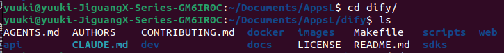
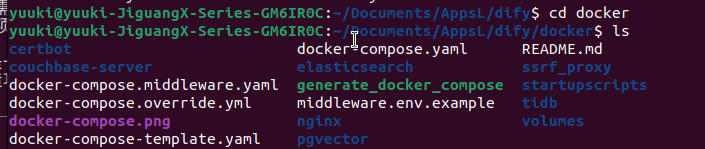
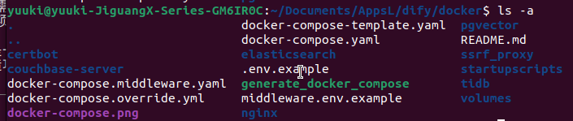
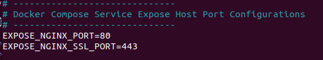
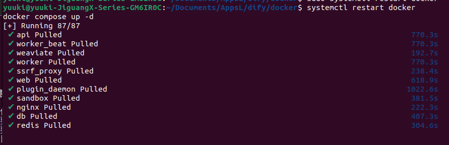
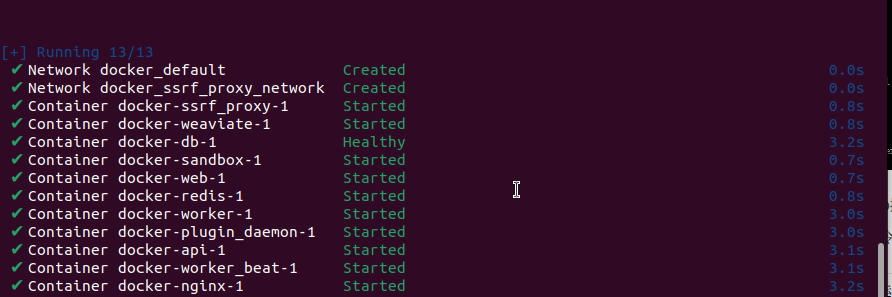
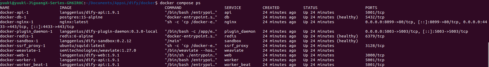
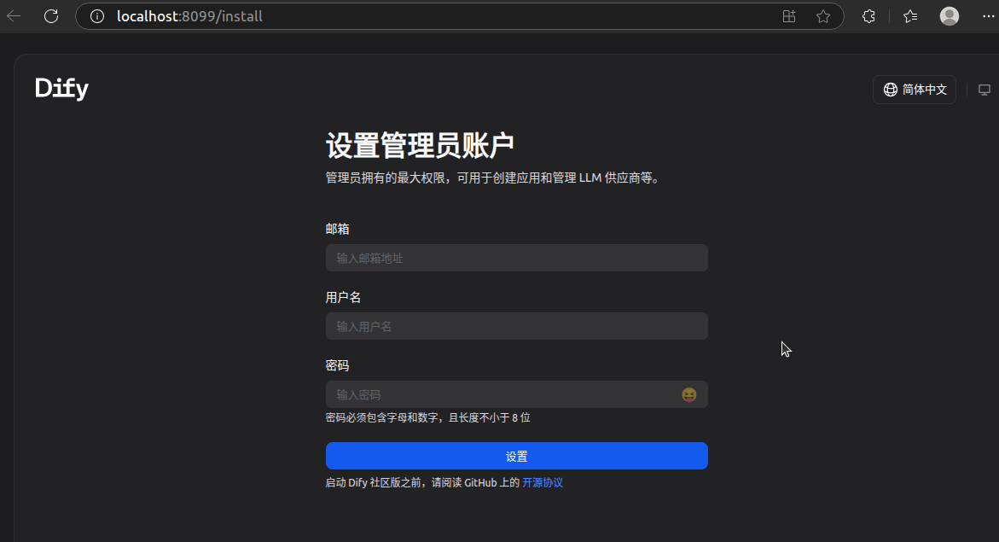
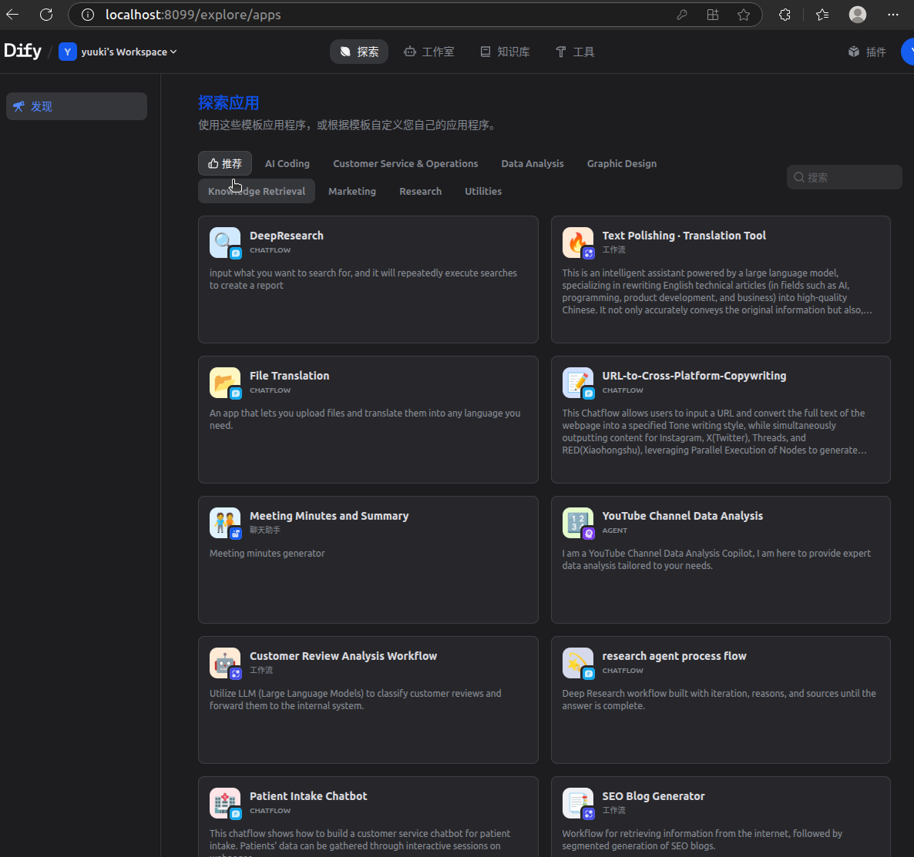
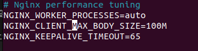

# Dify本地部署-基于Linux系统
- 更适合个人用户使用的Ubuntu系统，使用apt作为包管理工具（本文使用Ubuntu系统为示例）
- 更适合服务器使用的Centos系统，使用yum作为包管理工具（流程相似，同步提供所需指令）


### 一、安装docker
- 检验docker是否安装成功：

```
docker --version
docker-compose --version
```
- 安装的docker方法：

**Ubuntu系统：**
```
sudo apt-get update && sudo apt-get upgrade -y
sudo apt-get install docker.io
sudo apt-get install docker-compose
```

**CentOS系统：**
```
sudo yum update -y
sudo yum install -y yum-utils
sudo yum-config-manager --add-repo https://download.docker.com/linux/centos/docker-ce.repo
sudo yum install -y docker-ce docker-ce-cli containerd.io docker-compose-plugin
```

>> CentOS系统需要添加Docker官方仓库，然后安装docker-ce（社区版）和docker-compose-plugin（新版Docker Compose插件）
>> 如果CentOS系统版本较老，可能需要单独安装docker-compose：
```
sudo curl -L "https://github.com/docker/compose/releases/latest/download/docker-compose-$(uname -s)-$(uname -m)" -o /usr/local/bin/docker-compose
sudo chmod +x /usr/local/bin/docker-compose
```

### 二、下载dify及配置端口号
1. 下载仓库
```
git clone https://github.com/langgenius/dify.git
```


2. 进入dify目录下的docker文件夹，将`.env.example`文件复制到`.env`
```
cd dify
cd docker
ls
```


>> 这里我们需要找到dify的模板文件，但是在ubuntu系统里属于隐藏文件，可以使用快捷键`Ctrl + H`或者在终端里输入`ls -a`查看
```
ls -a
```


```
cp .env.example .env
```

3. 修改`.env`文件中的端口号
```
nano .env
```
>> 在 nano 中，使用`Ctrl + W`来查找文本。使用`Ctrl + W`后输入文本并按`Enter`查找下一个匹配项。

- 查找`EXPOSE_NGINX`

- 修改端口号，防止冲突
>> 端口冲突：端口 80 和 443 是 HTTP 和 HTTPS 协议的默认端口，很多系统或服务（如 Apache、其他 Web 服务、甚至系统级别的服务）都可能使用这些端口。如果你在同一台机器上运行多个 Web 服务或应用，可能会发生端口冲突，导致一个应用无法启动或无法访问。

>> 通过将 Nginx 的默认端口改为非标准端口（如 8099 和 4433），可以避免与其他已经占用 80 和 443 端口的服务发生冲突。例如，若你的服务器同时运行着多个 Web 服务，你可以为每个服务分配不同的端口，避免冲突。

然后保存`Ctrl + O`并确定`Enter`，然后退出nano`Ctrl + X`

### 三、docker换源
>> 因为DockerHub服务器在国外，所以直接下载依赖可能会出现网络连接问题，所以需要给Docker配置。在docker中直接部署会出现网络问题，因此先配置使用镜像加速器，提高 Docker Hub 镜像拉取速度。

**Ubuntu/CentOS通用配置（需要sudo权限）：**

1. 打开配置文件

```
sudo nano /etc/docker/daemon.json
```

2. 如果文件不存在，创建文件并添加以下配置：
```
{
        "registry-mirrors": ["https://docker.m.daocloud.io"]
}
```

3. 重新加载配置并重启Docker服务
```
sudo systemctl daemon-reload
sudo systemctl restart docker
```

>> 不同系统下的文件操作工具说明：
>> - Ubuntu通常预装nano编辑器，CentOS可能需要安装：`sudo yum install nano -y`
>> - 如果不想用nano，CentOS也可以使用vi编辑器：`sudo vi /etc/docker/daemon.json`

### 四、启动Docker和dify

1. 换源后重启Docker

>> 真正的 docker-compose 文件在`dify/docker/`目录里，因此需要确保在docker目录下
```
cd docker
```

💡 第一次运行前建议先确保 .env 文件已配置好：确认数据库、端口、镜像源等参数都设置正确。
```
nano .env
```

- 重启docker
```
sudo systemctl restart docker
```
>> 配置好以后可以直接使用`sudo systemctl start docker`启动docker

🔍 检查 Docker 状态
```
sudo systemctl status docker
```
>> 正常状态应该显示：`Active: active (running)`，如果显示 `inactive`或`failed`，则可以尝试重启

**CentOS系统特别说明：**

(1). 启用Docker服务开机自启动（推荐）
```
sudo systemctl enable docker
```

(2). 添加当前用户到docker组（可选，避免每次使用sudo）
```
sudo usermod -aG docker $USER
```
>> 注意：添加到docker组后，需要重新登录用户才能生效，或者执行：`newgrp docker`

(3). 如果遇到权限问题，可以在所有docker命令前加sudo：
```
sudo docker compose up -d
sudo docker compose ps
sudo docker compose down
```


2. 确定docker compose版本
```
docker compose version
```

3. 启动docker compose（首次较慢...）

**Ubuntu系统：**
- 如果是v1.xx.x，那么使用
```
docker-compose up -d
```
- 如果是v2.xx.x，那么使用
```
docker compose up -d
```

**CentOS系统：**
- 如果使用docker-compose-plugin（推荐方式），使用：
```
sudo docker compose up -d
```
- 如果是独立安装的docker-compose，使用：
```
sudo docker-compose up -d
```

>> CentOS系统通常建议在docker命令前加上sudo，除非已经将用户添加到docker组

>> 拉取所有必要的Docker镜像 


>> 创建Docker网络 启动所有服务容器  配置服务间的通信

4. 验证dify

**Ubuntu系统：**
```
docker compose ps
```

**CentOS系统：**
```
sudo docker compose ps
```
或者（如果使用独立安装的docker-compose）
```
sudo docker-compose ps
```

>> 可以看到：3个业务服务 api / worker / web；6个基础组件 weaviate / db / redis / nginx / ssrf_proxy / sandbox
### 

### 五、使用dify
1. 打开dify网页
>> 根据之前修改的EXPOSE_NGINX_PORT=8099，可以在浏览器里打开以下地址

- 如果没有修改端口号打开这个，默认使用80端口号：
[http://localhost/install](http://localhost/install)


- 如果修改了端口号，需要对应调整，比如修改为8099，那么地址为：
[http://localhost:8099/install](http://localhost:8099/install)

- 如果在远程服务器不是在本地，那么将`localhost`修改为服务器的IP地址

2. 首次启动需要初始化设置



3. 与dify玩耍🪅




### 六、关闭服务

**Ubuntu系统：**
```
docker compose down
```

**CentOS系统：**
```
sudo docker compose down
```
或者（如果使用独立安装的docker-compose）
```
sudo docker-compose down
```


### 七、其他
#### 7.1 dify个性化设置


举个栗子：修改上传文件大小上限，默认是100MB。
- 在`.env`里的修改，在docker目录下打开文件

**Ubuntu系统：**
```bash
nano .env
```

**CentOS系统：**
```bash
sudo nano .env
```
或者使用vi编辑器：
```bash
sudo vi .env
```

- 使用快捷键`Ctrl + W`查找`NGINX_CLIENT_MAX_BODY_SIZE`
`UPLOAD_FILE_SIZE_LIMIT`
- 修改后面的数值为自己需要的，比如1000MB，然后保存退出。


- 同样要在`docker-compose.yaml`里对应配置处修改。

>> .env.example 是 Docker 环境中提供的示例配置文件，可以按需修改。.env 文件中的配置可以用来控制应用的行为，但它本身不会直接改变 docker-compose.yaml 中的容器配置。

>> docker-compose.yaml 文件用来配置和管理多容器 Docker 应用。在 docker-compose.yaml 文件中，我们通常会指定容器环境变量的值。虽然 .env 文件也定义了环境变量，但这些变量在 Docker Compose 中并不会自动生效，除非你在 docker-compose.yaml 文件中引用它们。

#### 7.2 常见错误与处理

在Dify部署过程中可能会遇到以下常见错误：

| 错误类型 | 错误信息 | 原因分析 | 解决方案 |
|---------|----------|----------|----------|
| **端口冲突** | `bind: address already in use` | 端口被其他服务占用 | 1. 检查占用端口的进程：<br>`sudo lsof -i :80`<br>`sudo lsof -i :443`<br>2. 修改`.env`文件中的端口号<br>3. 或停止占用端口的服务 |
| **权限问题** | `permission denied` | Docker权限不足 | **Ubuntu系统**：<br>`sudo usermod -aG docker $USER`<br>`newgrp docker`<br><br>**CentOS系统**：<br>`sudo usermod -aG docker $USER`<br>重新登录或执行：<br>`sudo docker compose up -d` |
| **镜像拉取失败** | `Error response from daemon` | 网络问题或镜像源问题 | 1. 检查网络连接<br>2. 重新配置Docker镜像源：<br>`sudo nano /etc/docker/daemon.json`<br>3. 添加国内镜像源 |
| **Docker服务未启动** | `Cannot connect to the Docker daemon` | Docker服务未运行 | **Ubuntu/CentOS通用**：<br>`sudo systemctl start docker`<br>`sudo systemctl enable docker`<br>验证状态：<br>`sudo systemctl status docker` |
| **内存不足** | `Container killed due to memory limit` | 系统内存不足 | 1. 检查内存使用：<br>`free -h`<br>2. 关闭不必要的服务<br>3. 增加swap空间 |
| **配置文件错误** | `YAML syntax error` | `.env`或`docker-compose.yaml`格式错误 | 1. 检查文件语法：<br>`docker-compose config`<br>2. 仔细检查缩进和引号<br>3. 对比`.env.example`文件 |
| **Git仓库问题** | `fatal: repository not found` | Git配置或网络问题 | 1. 检查网络连接<br>2. 重新克隆仓库：<br>`git clone https://github.com/langgenius/dify.git`<br>3. 或使用国内镜像源 |

**快速故障排除步骤：**

1. **检查系统状态**
   ```bash
   # 检查Docker是否运行
   sudo systemctl status docker

   # 检查端口占用情况
   sudo netstat -tulpn | grep :80
   sudo netstat -tulpn | grep :443

   # 检查磁盘空间
   df -h

   # 检查内存使用
   free -h
   ```

2. **清理Docker缓存**
   ```bash
   # 清理未使用的镜像和容器
   docker system prune -a

   # 清理 volumes（谨慎使用）
   docker volume prune
   ```

3. **重新部署**
   ```bash
   # 完全停止并移除所有容器
   sudo docker compose down -v

   # 重新构建并启动
   sudo docker compose up -d --build
   ```

4. **查看日志**
   ```bash
   # 查看所有服务日志
   sudo docker compose logs

   # 查看特定服务日志
   sudo docker compose logs api
   sudo docker compose logs web
   ```

#### 7.3 dify升级教程

1. 备份现有配置与数据
```bash
cd docker
cp docker-compose.yaml docker-compose.yaml.$(date +%s).bak
```

2. dify文件夹拉取最新代码
```bash
git checkout main
git pull origin main
```

3. 关闭服务

**Ubuntu系统：**
```bash
docker compose down
```

**CentOS系统：**
```bash
sudo docker compose down
```
或者（如果使用独立安装的docker-compose）
```bash
sudo docker-compose down
```

4. 启动最新版本

**Ubuntu系统：**
```bash
docker compose up -d
```

**CentOS系统：**
```bash
sudo docker compose up -d
```
或者（如果使用独立安装的docker-compose）
```bash
sudo docker-compose up -d
```

5. 备份数据
```bash
tar -cvf volumes-$(date +%s).tgz volumes
```
>> 这条命令会创建一个名为 volumes-<时间戳>.tgz 的压缩文件，其中 <时间戳> 会根据执行命令时的时间戳动态生成。压缩文件包含了 volumes 目录中的所有内容。

6. 验证运行状态
- 运行`docker compose ps` 检查容器状态
- 访问网络界面，触发一次文档解析，尝试上传文件，调用知识库 API，确认新特性生效


### 参考教程：
[1] https://cloud.tencent.com/developer/article/2514801

[2] https://zhuanlan.zhihu.com/p/30071849251

[3] https://blog.csdn.net/Luo_Daimeng/article/details/148709871
