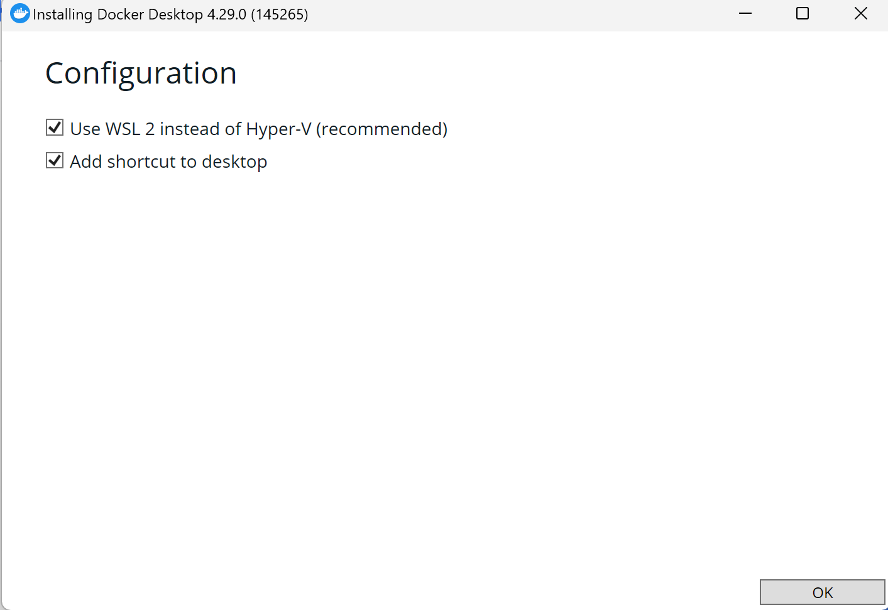
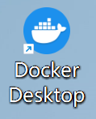

# Dify入门
## 1.1 什么是Dify？
Dify 是一款开源的大语言模型（LLM）应用开发平台，融合了后端即服务（Backend as Service）和 [LLMOps](https://docs.dify.ai/v/zh-hans/learn-more/extended-reading/what-is-llmops) 的理念，使开发者可以快速搭建生产级的生成式 AI 应用。

Dify 内置了构建 LLM 应用所需的关键技术栈，包括对数百个模型的支持、直观的 Prompt 编排界面、高质量的 RAG 引擎以及灵活的 Agent 框架，并同时提供了一套易用的界面和 API。在使用 Dify 开发大语言模型应用时，只需简单地拖拉拽各种组件，**无需编写复杂代码**，即使没有代码基础也能轻松上手。

同时，Dify 是开源的，你可以基于任何大语言模型打造专属自己的智能体（Agent）或 GPTs，并保持对数据的完全控制。

## 1.2 课程内容
通过本次课程，我们将带大家如何快速上手 Dify，并且创建自己的大语言模型智能体，帮助各行业的小伙伴推进开发大语言模型应用的速度。以下为本课程主要内容：
1. Dify 安装与部署
2. Dify 单智能体搭建及api调用
3. Dify with WordPress
4. Dify 知识库
5. Dify workflow 设计与实现
6. Dify 多智能体

## 1.3 Dify 使用方法
Dify 提供了2种使用方式，一种是使用 Dify 官方提供的[云服务](https://cloud.dify.ai/apps)，无需自己部署即可使用 Dify 的完整功能。注意使用 Dify 云服务需要你有一个 Github 或 Google 账号；另一种是自己部署 Dify 社区版（即开源版本）。

如无本地部署需求，建议大家使用 Dify 云服务更加方便快捷。若需要在本地部署 Dify 社区版，Dify 提供了以下两种方式：
- [Docker Compose部署](https://docs.dify.ai/v/zh-hans/getting-started/install-self-hosted/docker-compose)
- [本地源码启动](https://docs.dify.ai/v/zh-hans/getting-started/install-self-hosted/local-source-code)

这里推荐 Docker Compose 方式进行部署，能避免许多环境配置上的坑。

## 1.4 使用 Docker 部署 Dify （可选）
[Docker](https://www.docker.com/#) 是一种容器化平台，可以帮助开发者将应用程序及其所有依赖项打包到一个标准化的单元中，称为容器。这使得应用程序在不同的环境中能够快速、可靠地部署和运行，提高了开发、交付和运维的效率。

点击[Docker官网链接](https://www.docker.com/products/docker-desktop/)，然后选择适合自己电脑系统的版本进行下载安装。这里以 Windows 系统为例：


点击选择**Download for Windows**，下载 docker 桌面版，然后按照提示一步步安装即可。


这一步需要用到 WSL 2，一种在 Windows 操作系统上运行 Linux 环境的技术。如果你的电脑不支持的话可以网上搜索相关教程或博客进行安装。


然后即可在电脑桌面发现 docker 的图标：


双击运行：


点击 `Accept` 同意用户协议，然后会出现一个注册登录界面：


如果你之前已经注册过 docker 账号可以点击`Sign in`登录，或者点击`Sign up`注册账号。当然，没有 docker 账号也没关系，可以直接点击`Continue without signing in`跳过这一步骤。

接着会有一个调查问卷：


这个问卷和使用关系不大，随便选或者点击下方`Skip survey`跳过即可。


当出现以上界面时即代表 docker 安装成功。

下一步，我们来使用 docker 部署dify。

首先，克隆 Dify 源代码至本地：
```bash
git clone https://github.com/langgenius/dify.git
```


然后，复制以下命令一键部署 Dify：
```bash
docker compose up -d
```
>注意：如果您的系统安装了 Docker Compose V2 而不是 V1，请使用 docker compose 而不是 docker-compose。通过$ docker compose version检查这是否为情况。在[这里](https://docs.docker.com/compose/#compose-v2-and-the-new-docker-compose-command)阅读更多信息。

运行结果：


踩坑记录：
报错： Error response from daemon: Get "https://registry-1.docker.io/v2/": EOF 
可能原因：docker未响应，docker还没启动。
解决方案：打开docker，然后重新运行一遍命令`docker compose up -d`即可。


## 参考资料：
[1] [Dify官方文档](https://docs.dify.ai/v/zh-hans)